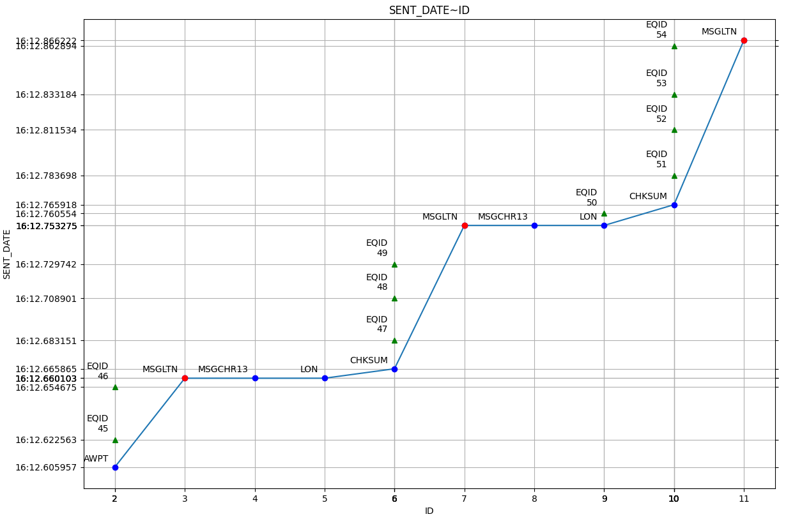

.. _data-analysis:

Data Analysis
*************

Each data you send and all the related information (the way the data has been built,
the feedback from the target, and so on) are stored within the ``fuddly`` database
(an SQLite database located at ``<fuddly data folder>/fmkdb.db``). They all get a unique ID,
starting from 1 and increasing by 1 each time a data is sent.

FmkDB Toolkit
=============

To interact with the database a convenient toolkit is provided (``<root of fuddly>/tools/fmkdb.py``).

Usage Examples
--------------

Let's say you want to look at all the information
that have been recorded for one of the data you sent, with the ID 4. The following
command will display a synthesis of what you want::

  ./tools/fmkdb.py -i 4

And if you want to get all information, issue the following::

  ./tools/fmkdb.py -i 4 --with-data --with-fbk

You can also request information on all data sent between two dates. For instance the
following command will display all data information that have been recorded between
25th January 2016 (11:30) and 26th January 2016::

  ./tools/fmkdb.py --info-by-date 2016/01/25-11:30 2016/01/26

For further information refer to the help by issuing::

  ./tools/fmkdb.py -h

Fmkdb Toolkit Manual
--------------------

Hereunder is shown the output of ``<root of fuddly>/tools/fmkdb.py -h``.

.. code-block:: none

    usage: fmkdb.py [-h] [--fmkdb PATH] [--no-color] [-v] [--page-width WIDTH]
                    [--fbk-src FEEDBACK_SOURCES] [--project PROJECT_NAME]
                    [--fbk-status-formula STATUS_REF] [-s] [-i DATA_ID]
                    [--info-by-date START END] [-ids FIRST_DATA_ID LAST_DATA_ID] [-wf] [-wd] [-wa]
                    [--without-fmkinfo] [--without-analysis] [--limit LIMIT] [--raw] [-dd]
                    [-df] [--data-atom ATOM_NAME] [--fbk-atom ATOM_NAME]
                    [--force-fbk-decoder DATA_MODEL_NAME]
                    [--export-data FIRST_DATA_ID LAST_DATA_ID] [-e DATA_ID]
                    [--remove-data FIRST_DATA_ID LAST_DATA_ID] [-r DATA_ID]
                    [--data-with-impact] [--data-with-impact-raw] [--data-without-fbk]
                    [--data-with-specific-fbk FEEDBACK_REGEXP] [-a IMPACT COMMENT]
                    [--disprove-impact FIRST_ID LAST_ID]

    Argument for FmkDB toolkit script

    optional arguments:
      -h, --help            show this help message and exit

    Miscellaneous Options:
      --fmkdb PATH          Path to an alternative fmkDB.db
      --no-color            Do not use colors
      -v, --verbose         Verbose mode
      --page-width WIDTH    Width hint for displaying information

    Configuration Handles:
      --fbk-src FEEDBACK_SOURCES
                            Restrict the feedback sources to consider (through a regexp).
                            Supported by: --data-with-impact, --data-without-fbk, --data-with-
                            specific-fbk
      --project PROJECT_NAME
                            Restrict the data to be displayed to a specific project. Supported
                            by: --info-by-date, --info-by-ids, --data-with-impact, --data-
                            without-fbk, --data-with-specific-fbk
      --fbk-status-formula STATUS_REF
                            Restrict the data to be displayed to specific feedback status.
                            This option provides the formula to be used for feedback status
                            filtering (the character "?" should be used in place of the status
                            value that will be checked). Supported by: --data-with-impact

    Fuddly Database Visualization:
      -s, --all-stats       Show all statistics

    Fuddly Database Information:
      -i DATA_ID, --data-id DATA_ID
                            Provide the data ID on which actions will be performed. Without
                            any other parameters the default action is to display information
                            on the specified data ID.
      --info-by-date START END
                            Display information on data sent between START and END (date
                            format 'Year/Month/Day' or 'Year/Month/Day-Hour' or
                            'Year/Month/Day-Hour:Minute')
      -ids FIRST_DATA_ID LAST_DATA_ID, --info-by-ids FIRST_DATA_ID LAST_DATA_ID
                            Display information on all the data included within the specified
                            data ID range
      -wf, --with-fbk       Display full feedback (expect --data-id)
      -wd, --with-data      Display data content (expect --data-id)
      -wa, --with-async-data
                            Display any related async data (expect --data-id)
      --without-fmkinfo     Do not display fmkinfo (expect --data-id)
      --without-analysis    Do not display user analysis (expect --data-id)
      --limit LIMIT         Limit the size of what is displayed from the sent data and the
                            retrieved feedback (expect --with-data or --with-fbk).
      --raw                 Display data and feedback in raw format

    Fuddly Decoding:
      -dd, --decode-data    Decode sent data based on the data model used for the selected
                            data ID or the atome name provided by --atom
      -df, --decode-fbk     Decode feedback based on the data model used for the selected data
                            ID or the atome name provided by --fbk-atom
      --data-atom ATOM_NAME
                            Atom of the data model to be used for decoding the sent data. If
                            not provided, the name of the sent data will be used.
      --fbk-atom ATOM_NAME  Atom of the data model to be used for decoding feedback. If not
                            provided, the default data model decoder will be used (if one
                            exists), or the name of the first registered atom in the data
                            model
      --force-fbk-decoder DATA_MODEL_NAME
                            Decode feedback with the decoder of the data model specified

    Fuddly Database Operations:
      --export-data FIRST_DATA_ID LAST_DATA_ID
                            Extract data from provided data ID range
      -e DATA_ID, --export-one-data DATA_ID
                            Extract data from the provided data ID
      --remove-data FIRST_DATA_ID LAST_DATA_ID
                            Remove data from provided data ID range and all related
                            information from fmkDB
      -r DATA_ID, --remove-one-data DATA_ID
                            Remove data ID and all related information from fmkDB

    Fuddly Database Analysis:
      --data-with-impact    Retrieve data that negatively impacted a target. Analysis is
                            performed based on feedback status and user analysis if present
      --data-with-impact-raw
                            Retrieve data that negatively impacted a target. Analysis is
                            performed based on feedback status
      --data-without-fbk    Retrieve data without feedback
      --data-with-specific-fbk FEEDBACK_REGEXP
                            Retrieve data with specific feedback provided as a regexp
      -a IMPACT COMMENT, --add-analysis IMPACT COMMENT
                            Add an impact analysis to a specific data ID (expect --data-id).
                            IMPACT should be either 0 (no impact) or 1 (impact), and COMMENT
                            provide information
      --disprove-impact FIRST_ID LAST_ID
                            Disprove the impact of a group of data present in the outcomes of
                            '--data-with-impact-raw'. The group is determined by providing the
                            smaller data ID (FIRST_ID) and the bigger data ID (LAST_ID).

Plotty
======

Plotty is a tool used to vizualize data from the fmkDB.
To interact with the database a convenient toolkit is provided (``<root of fuddly>/tools/plotty/*``).

Usage Examples
--------------

A very common usage is just to plot the data relatively to the date it was sent at. 
To do that, you can use the plotty CLI, at ``<root of fuddly>/tools/plotty/plotty.py``::

  ./tools/plotty.py -ids '0..100|2'

Plots the SEND_DATE in function of the ID of every message which has en even ID beetween 0 and 100. 
A lot of display and formatting options are available to build your own plotting experience ♥‿♥

For further information refer to the help by issuing::

  ./tools/plotty/plotty.py -h

Plotty Manual
-------------

Hereunder is shown the output of ``<root of fuddly>/tools/plotty/plotty.py -h``

.. code-block:: none

      usage: plotty.py [-h] -ids ID_RANGE [-df DATE_FORMAT] [-db PATH [PATH ...]] [-f FORMULA] [-poi POINTS_OF_INTEREST] [-gm {all,poi,auto}] [-hp]
                 [-l ANNOTATIONS [ANNOTATIONS ...]] [-al ASYNC_ANNOTATIONS [ASYNC_ANNOTATIONS ...]] [-o OTHER_ID_RANGE] [-s VERTICAL_SHIFT]

      Arguments for Plotty

      options:
        -h, --help            show this help message and exit

      Main parameters:
        -ids ID_RANGE, --id-range ID_RANGE
                              The ID range to take into account should be: either <id_start>..<id_stop>[|<step>], or <id_start_1>..<id_stop_1>[|<step_1>], ...,
                              <id_start_n>..<id_stop_n>[|<step_n>]
        -df DATE_FORMAT, --date-format DATE_FORMAT
                              Wanted date format, in a strftime format (1989 C standard). Default is %H:%M:%S.%f
        -db PATH [PATH ...], --fmkdb PATH [PATH ...]
                              Path to any fmkDB.db files. There can be many if using the --other_id_range option. Default is fuddly/data/directory/fmkDB.db

      Display Options:
        -f FORMULA, --formula FORMULA
                              The formula to plot, in the form "y ~ x"
        -poi POINTS_OF_INTEREST, --points-of-interest POINTS_OF_INTEREST
                              How many point of interest the plot should show. Default is none
        -gm {all,poi,auto}, --grid-match {all,poi,auto}
                              Should the plot grid specifically match some element. Possible options are 'all', 'poi' and 'auto'. Default is 'all'
        -hp, --hide-points    Should the graph display every point above the line, or just the line. Default is to display the points

      Labels Configuration:
        -l ANNOTATIONS [ANNOTATIONS ...], --labels ANNOTATIONS [ANNOTATIONS ...]
                              Display the specified labels for each Data ID represented in the curve. ('t' for TYPE, 'g' for TARGET, 's' for SIZE, 'a' for
                              ACK_DATE)
        -al ASYNC_ANNOTATIONS [ASYNC_ANNOTATIONS ...], --async-labels ASYNC_ANNOTATIONS [ASYNC_ANNOTATIONS ...]
                              Display the specified labels for each Async Data ID represented in the curve. ('i' for 'ID', 't' for TYPE, 'g' for TARGET, 's' for
                              SIZE)

      Multiple Curves Options:
        -o OTHER_ID_RANGE, --other-id-range OTHER_ID_RANGE
                              Other ranges of IDs to plot against the main one. All other options apply to it
        -s VERTICAL_SHIFT, --vertical-shift VERTICAL_SHIFT
                              When --other-id-range is used, specify the spacing between the curves. The shift is computed as the multiplication between the
                              original curve height and this value

Concrete output example
-----------------------

.. _plotty_example:

   Example of curve comparison using Plotty

Given a simple command line::
    
  ./tools/plotty/plotty.py -id '2..12' -l t -al t i -df "%M:%S.%f" -poi 3

It is already possible to vizualize trends, behaviors and anomalies. Comparison becomes easier !