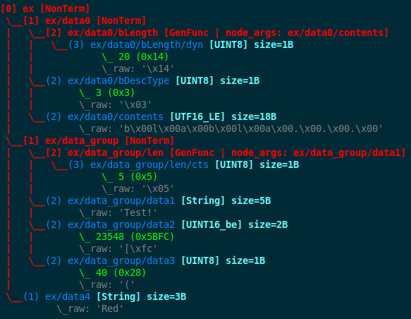

.. _data-manip:

Data Manipulation
*****************

The following section will provide you with an understanding on how to manipulate modeled data
with ``fuddly`` primitives. Data manipulation is what *disruptors* perform (refer to :ref:`tuto:disruptors`).
This chapter will enable you to write your own *disruptors* or to simply perform custom
manipulation of a data coming from a file, retrieved from the network (thanks to data
absorption---refer to :ref:`tuto:dm-absorption`), or even generated from scratch.

Overview
========

To guide you over what is possible to perform, let's consider the following data model:

.. code-block:: python
   :linenos:

    from framework.node import *
    from framework.value_types import *
    from framework.node_builder import *

     example_desc = \
     {'name': 'ex',
      'contents': [
          {'name': 'data0',
           'contents': String(values=['Plip', 'Plop']) },

          {'name': 'data_group',
           'contents': [

              {'name': 'len',
               'mutable': False,
               'contents': LEN(vt=UINT8, after_encoding=False),
               'node_args': 'data1',
               'absorb_csts': AbsFullCsts(contents=False)},

              {'name': 'data1',
               'contents': String(values=['Test!', 'Hello World!']) },

              {'name': 'data2',
               'qty': (1,3),
               'semantics': ['sem1', 'sem2'],
               'contents': UINT16_be(min=10, max=0xa0ff),
               'alt': [
                    {'conf': 'alt1',
                     'contents': SINT8(values=[1,4,8])},
                    {'conf': 'alt2',
                     'contents': UINT16_be(min=0xeeee, max=0xff56)} ]},

              {'name': 'data3',
               'semantics': ['sem2'],
               'sync_qty_with': 'data2',
               'contents': UINT8(values=[30,40,50]),
               'alt': [
                    {'conf': 'alt1',
                     'contents': SINT8(values=[1,4,8])}]},
             ]},

          {'name': 'data4',
           'contents': String(values=['Red', 'Green', 'Blue']) }
      ]}

This is what we call a data descriptor. It cannot be used directly, it should first be
transformed to ``fuddly`` internal representation based on :class:`framework.node.Node`.
The code below shows how to perform that:

.. code-block:: python
   :linenos:

    nb = NodeBuilder()
    rnode = nb.create_graph_from_desc(example_desc)
    rnode.set_env(Env())

``fuddly`` models data as directed acyclic graphs whose terminal
nodes describe the different parts of a data format (refer to :ref:`data-model`). In order to
enable elaborated manipulations it also creates a specific object to share between all the nodes
some common information related to the graph: the :class:`framework.node.Env` object. You should
note that we create this *environment* object and setup the root node with it. Actually it
provides all the nodes of the graph with this environment. From now on it is possible to access
the environment from any node, and ``fuddly`` is now able to deal with this graph.

.. note:: The method :meth:`framework.node_builder.NodeBuilder.create_graph_from_desc` return a
   :class:`framework.node.Node` which is the root of the graph.

.. note:: When you instantiate a modeled data from a model through
   :meth:`framework.data_model.DataModel.get_atom` as illustrated in :ref:`fuddly-advanced`,
   the environment object is created for you. Likewise, when you register a data descriptor through
   :meth:`framework.data_model.DataModel.register` (refer to :ref:`dm:mydf`), no need to worry
   about the environment.

.. note:: The :class:`framework.node_builder.NodeBuilder` object which is used to create a
   graph from a data descriptor is bound to the graph and should not be used for creating another
   graph. It contains some information on the created graph such as a dictionary of all its
   nodes ``mb.node_dico``.

.. _dmanip:freeze:

Generate Data a.k.a. Freeze a Graph
-----------------------------------

If you want to get a data from the graph you have to freeze it first as it represents many
different potential data at once (actually it acts like a template). To do so, just call the method
:meth:`framework.node.Node.freeze` on the root node. It will provide you with a nested set of
lists containing the frozen value for each node selected within the graph to provide you with a data.

What is way more interesting in the general case is obtaining a byte string of the data. For
this you just have to call :meth:`framework.node.Node.to_bytes` on the root node which will
first freeze the graph and then flatten the nested list automatically to provide you with
the byte string.

If you want to get another data from the graph you should first unfreeze it because otherwise any
further call to the previous methods will give you the same value. To do that you can call the
method :meth:`framework.node.Node.unfreeze`. You will then be able to get a new data by
freezing it again. Actually doing so will produce the next data by cycling over the possible
node values (described in the graph) in a random or a determinist way (refer to :ref:`dmanip:prop`).
If you look at getting data from the graph by walking over each of its nodes independently then
you should look for instance at the generic disruptor ``tWALK`` (refer to :ref:`dis:generic-disruptors`)
and also to the model walker infrastructure :ref:`tuto:modelwalker`).

By default, ``unfreeze`` will act recursively and will affect every nodes reachable from the calling
one. You can unfreeze only the node on which the method is called by switching its ``recursive``
parameter.

You may want to unfreeze the graph without changing its state, just because you performed some
modifications locally and want it to be taken into account when getting a new data from the graph.
(refer to :ref:`dmanip:conf` for a usage example). For that purpose, you may use the
``dont_change_state`` parameter of :meth:`framework.node.Node.unfreeze` which allows
to unfreeze without cycling.

Another option you may want is to unfreeze only the constraints of your graph which based on
existence conditions (refer to :ref:`dm:pattern:existence-cond`), *generator*  and *func* nodes.
To do so, set the ``reevaluate_constraints`` parameter to ``True``.

To cycle over the possible node values or shapes (for non terminal nodes) a state is kept.
This state is normally reset automatically when the node is exhausted in order to cycle again.
can be reset thanks to the method :meth:`framework.node.Node.reset_state`. In
addition to resetting the node state it also unfreezes it.

.. note:: When a cycle over the possible node values or shapes is terminated, a notification is
   raised (through the linked environment object). Depending on the ``Finite`` node attribute
   generic disruptors will recycle the node or change to another one. Setting the ``Finite``
   property on all the graph will enable you to have an end on data generation, and to avoid
   the generation of duplicated data.

Finally if you want to unfreeze all the node configurations (refer to :ref:`dmanip:conf`) at
once, you should call the method :meth:`framework.node.Node.unfreeze_all`.

.. _dmanip:node:

Create Nodes with Low-Level Primitives
--------------------------------------

Instead of using the high-level API for describing a graph you can create it by using ``fuddly``
low-level primitives. Generally, you don't need to go through that, but for specific
complex situations it could provide you with what you need. To create a graph or a single node,
you always have to instantiate the class :class:`framework.node.Node` which enables you to set
the type of content for the main node configuration (refer to :ref:`dmanip:conf`).

Depending on the content type the constructor will call the following methods to do the
job:

- :meth:`framework.node.Node.set_values`: for *typed-value* nodes.
- :meth:`framework.node.Node.set_subnodes_basic`: for *non-terminal* nodes without specifying a
  grammar.
- :meth:`framework.node.Node.set_subnodes_with_csts`: for *non-terminal* nodes constrained by
  a grammar.
- :meth:`framework.node.Node.set_generator_func`: for *generator* nodes.
- :meth:`framework.node.Node.set_func`: for *function* nodes.

.. note::
   Methods specific to the node content (:class:`framework.node.NodeInternals`) can be
   called directly on the node itself and it will be *forwarded* to the content (if the method name
   does not match one the :class:`framework.node.Node` class).

.. seealso::
   If you want to learn more about the specific operations that can be performed on each kind of
   content (whose base class is :class:`framework.node.NodeInternals`), refer to the related
   class, namely:

   - :class:`framework.node.NodeInternals_TypedValue`
   - :class:`framework.node.NodeInternals_NonTerm`
   - :class:`framework.node.NodeInternals_GenFunc`
   - :class:`framework.node.NodeInternals_Func`

Cloning a Node
--------------

A graph or any node within can be cloned in order to be used anywhere else independently from the
original node. To perform such an operation you should use
:meth:`framework.node.Node.get_clone` like in the following example:

.. code-block:: python
   :linenos:

    rnode_copy = rnode.get_clone('mycopy')

``rnode_copy`` is a clone of the root node of the previous graph example, and as such it is a
clone of the graph. The same operation can be achieved by creating a new node and passing as a
parameter the node to copy:

.. code-block:: python
   :linenos:

    rnode_copy = Node('mycopy', base_node=rnode, new_env=True)

When you clone a node you may want to keep its current state or ignore it (that is, cloning
an unfrozen graph as if it was reset). For doing so, you have to use the parameter
``ignore_frozen_state`` of the method :meth:`framework.node.Node.get_clone`. By default it is
set to ``False`` which means that the state is preserved during the cloning process.

Display a Frozen Graph
----------------------

If you want to display a frozen graph (representing one data) in ASCII-art you have to call the
method :meth:`framework.node.Node.show` on it. For instance the following::

    rnode.show()

will display a frozen graph that looks the same as the one below:

.. figure::  images/ex_show.png
   :align:   center
   :scale:   100 %

The Node Environment
--------------------

The environment which should normally be the same for all the nodes of a same graph are handled
by the following methods:

- :meth:`framework.node.Node.set_env`
- :meth:`framework.node.Node.get_env`

.. _dmanip:search:

Search for Nodes in a Graph
===========================

Searching a graph for specific nodes can be performed in basically two ways. Depending on the
criteria based on which you want to perform the search, you should use:

- :meth:`framework.node.Node.get_node_by_path`: will retrieve the first node that match the
  *graph path*---you provide as a parameter---from the node on which the method is called (or
  ``None`` if nothing is found). The syntax defined to represent paths is similar to the one of
  filesystem paths. Each path are represented by a python string, where node names are
  separated by ``/``'s. For instance the path from the root node of the previous data model to
  the node named ``len`` is::

      'ex/data_group/len'

  You can also use a regexp to describe a path. Also, if you need to retrieve all the nodes
  matching a path regexp you should use the following method.

- :meth:`framework.node.Node.get_reachable_nodes`: It is the more flexible primitive that
  enables to perform a search based on syntactic and/or semantic criteria. It can take several
  optional parameters to define your search like a *graph path* regexp. Unlike the previous method
  it always returns a list, either filled with the nodes that has been found or with nothing.
  You can use other kinds of criteria to be passed through the following parameters:

  + ``internals_criteria``: To be provided with a :class:`framework.node.NodeInternalsCriteria`
    object. This object enable you to describe the syntactic properties you look for, such as:

     - The node kind (refer to :ref:`dmanip:prop`) and/or subkind (for a typed terminal node, a
       subkind is the class of its embedded typed value);

     - The node attributes (refer to :ref:`dmanip:prop`)

     - The node constraints such as: *existence* or *quantity synchronization*. Usable
       constraints are defined by :class:`framework.node.SyncScope`.

  + ``semantics_criteria``: To be provided with a :class:`framework.node.NodeSemanticCriteria`
    object. This object enable you to describe the semantic properties you look for. They are
    currently limited to a list of python strings.

  + ``owned_conf``: The name of a node configuration (refer to :ref:`dmanip:conf`) that
    the targeted nodes own.

  The following code snippet illustrates the use of such criteria for retrieving all the nodes
  coming from the ``data2`` description (refer to :ref:`dmanip:entangle`):

  .. code-block:: python
     :linenos:

     from framework.plumbing import *
     from framework.node import *
     from framework.value_types import *

     fmk = FmkPlumbing()
     fmk.start()

     fmk.run_project(name='tuto')

     ex_node = fmk.dm.get_atom('ex')
     ex_node.freeze()

     ic = NodeInternalsCriteria(mandatory_attrs=[NodeInternals.Mutable],
                                node_kinds=[NodeInternals_TypedValue],
                                negative_node_subkinds=[String],
                                negative_csts=[SyncScope.Qty])

     sc = NodeSemanticsCriteria(mandatory_criteria=['sem1', 'sem2'])

     ex_node.get_reachable_nodes(internals_criteria=ic, semantics_criteria=sc,
                                 owned_conf='alt2')

  Obviously, you don't need all these criteria for retrieving such node. It's only for
  exercise.

  .. note:: For abstracting away the data model from the rest of the framework, ``fuddly`` uses the
     specific class :class:`framework.data.Data` which acts as a data container.
     Thus, while interacting with the different part of the framework, Node-based data
     (or string-based data) should be encapsulated
     in a :class:`framework.data.Data` object.

     For instance ``Data(ex_node)`` will create an object that encapsulate ``ex_node``.
     Accessing the node again is done through the property :attr:`framework.data.Data.content`

The Node Dictionary Interface
=============================

The :class:`framework.node.Node` implements the dictionary interface, which means the
following operation are possible on a node:

.. code-block:: python
   :linenos:

   node[key]           # reading operation

   node[key] = value   # writing operation

As a ``key``, you can provide:

- A *path regexp* (where the node on which the method is called is considered as the root) to the
  node you want to reach. If multiple nodes match the path regexp, the first one will be returned
  (or ``None`` if the path match nothing). It is equivalent to calling
  :meth:`framework.node.Node.get_node_by_path` on the node and providing the parameter
  ``path_regexp`` with your path.

  The following python code snippet illustrate the access to the node named ``len`` to
  retrieve its byte string representation:

   .. code-block:: python
      :linenos:

      rnode['ex/data_group/len'].to_bytes()

      # same as:
      rnode.get_node_by_path('ex/data_group/len').to_bytes()

- A :class:`framework.node.NodeInternalsCriteria` that match the internal
  attributes of interest of the nodes you want to retrieve and which are reachable from the
  current node. It is equivalent to calling :meth:`framework.node.Node.get_reachable_nodes`
  on the node and providing the parameter ``internals_criteria`` with your criteria object. A
  list will always be returned, either empty or containing the nodes of interest.

- A :class:`framework.node.NodeSemanticsCriteria` that match the internal
  attributes of interest of the nodes you want to retrieve and which are reachable from the
  current node. It is equivalent to calling :meth:`framework.node.Node.get_reachable_nodes`
  on the node and providing the parameter ``semantics_criteria`` with the criteria object. A list
  will always be returned, either empty or containing the nodes of interest.

.. seealso:: To learn how to create criteria objects refer to :ref:`dmanip:search`.

As a ``value``, you can provide:

- A :class:`framework.node.Node`: In this case the method
  :meth:`framework.node.Node.set_contents` will be called on the node with the *node* as
  parameter.

- A :class:`framework.node.NodeSemantics`: In this case the method
  :meth:`framework.node.Node.set_semantics` will be called on the node with the *semantics* as
  parameter.

- A python integer: In this case the method :meth:`framework.value_types.INT.set_raw_values` of the
  *INT* object embedded in the targeted node will be called with the *integer* as parameter.
  (Have to be only used with typed-value nodes embedding an ``INT``.)

- A byte string: In this case the method :meth:`framework.node.Node.absorb` will be called
  on the node with the *byte string* as parameter.

.. warning:: These methods should generally be called on a frozen graph.

Change a Node
=============

You can change the content of a specific node by absorbing a new content (refer to
:ref:`dmanip:abs`).

You can also temporarily change the node value of a terminal node (until the next time
:meth:`framework.node.Node.unfreeze` is called on it) with the method
:meth:`framework.node.Node.set_frozen_value` (refer to :ref:`dmanip:freeze`).

But if you want to make some more disruptive change and change a terminal
node to a non-terminal node for instance, you have two options.
Either you do it from scratch and you leverage the function described in the section
:ref:`dmanip:node`. For instance:

.. code-block:: python
   :linenos:

   node_to_change.set_values(value_type=String(max_sz=10))

Or you can do it by replacing the content of one node with another one. That allows you for
instance to add a data from a model to another model. To illustrate this possibility
let's consider the following code that change the node ``data0`` of our data
model example with an USB ``STRING`` descriptor (yes, that does not make sense, but you can do
it if you like ;).

.. code-block:: python
   :linenos:
   :emphasize-lines: 10

    from framework.plumbing import *

    fmk = FmkPlumbing()
    fmk.run_project(name='tuto')

    usb_str = fmk.dm.get_external_atom(dm_name='usb', data_id='STR')

    ex_node = fmk.dm.get_atom('ex')

    ex_node['ex/data0'] = usb_str  # Perform the substitution

    ex_node.show()                      # Data.show() will call .show() on the embedded node

The result is shown below:

.. note:: Releasing constraints (like a CRC, an offset, a length, ...) of an altered
   data can be useful if you want ``fuddly`` to automatically recomputes the constraint for you and
   still comply to the model. Refer to :ref:`dmanip:freeze`.

You can also add subnodes to non-terminal nodes through the usage of :meth:`framework.node.NodeInternals_NonTerm.add()`.
For instance the following code snippet will add a new node after the node ``data2``.

.. code-block:: python
   :linenos:

   data2_node = ex_node['ex/data_group/data2']
   ex_node['ex/data_group$'].add(Node('my_node', values=['New node added']),
                                 after=data2_node)

Thus, if ``ex_node`` before the modification is::

   [0] ex [NonTerm]
    \__(1) ex/data0 [String] size=4B
    |        \_ codec=iso8859-1
    |        \_raw: b'Plip'
    \__[1] ex/data_group [NonTerm]
    |   \__[2] ex/data_group/len [GenFunc | node_args: ex/data_group/data1]
    |   |   \__(3) ex/data_group/len/cts [UINT8] size=1B
    |   |            \_ 5 (0x5)
    |   |            \_raw: b'\x05'
    |   \__(2) ex/data_group/data1 [String] size=5B
    |   |        \_ codec=iso8859-1
    |   |        \_raw: b'Test!'
    |   \__(2) ex/data_group/data2 [UINT16_be] size=2B
    |   |        \_ 10 (0xA)
    |   |        \_raw: b'\x00\n'
    |   \__(2) ex/data_group/data3 [UINT8] size=1B
    |            \_ 30 (0x1E)
    |            \_raw: b'\x1e'
    \__(1) ex/data4 [String] size=3B
             \_ codec=iso8859-1
             \_raw: b'Red'

After the modification it will be::

   [0] ex [NonTerm]
    \__(1) ex/data0 [String] size=4B
    |        \_ codec=iso8859-1
    |        \_raw: b'Plip'
    \__[1] ex/data_group [NonTerm]
    |   \__[2] ex/data_group/len [GenFunc | node_args: ex/data_group/data1]
    |   |   \__(3) ex/data_group/len/cts [UINT8] size=1B
    |   |            \_ 5 (0x5)
    |   |            \_raw: b'\x05'
    |   \__(2) ex/data_group/data1 [String] size=5B
    |   |        \_ codec=iso8859-1
    |   |        \_raw: b'Test!'
    |   \__(2) ex/data_group/data2 [UINT16_be] size=2B
    |   |        \_ 10 (0xA)
    |   |        \_raw: b'\x00\n'
    |   \__(2) ex/data_group/my_node [String] size=14B
    |   |        \_ codec=iso8859-1
    |   |        \_raw: b'New node added'
    |   \__(2) ex/data_group/data3 [UINT8] size=1B
    |            \_ 30 (0x1E)
    |            \_raw: b'\x1e'
    \__(1) ex/data4 [String] size=3B
             \_ codec=iso8859-1
             \_raw: b'Red'

.. _dmanip:prop:

Operations on Node Properties and Attributes
--------------------------------------------

The following methods enable you to retrieve the kind of content of the node. The provided answer is
for the current configuration (refer to :ref:`dmanip:conf`) if the ``conf`` parameter is not
provided:

+ :meth:`framework.node.Node.is_nonterm`
+ :meth:`framework.node.Node.is_typed_value`
+ :meth:`framework.node.Node.is_genfunc`
+ :meth:`framework.node.Node.is_func`

Checking if a node is frozen (refer to :ref:`dmanip:freeze`) can be done thanks to the method:

+ :meth:`framework.node.Node.is_frozen`

The following methods enable you to change specific node properties or attributes:

+ Methods related to the keyword ``fuzz_weight`` described in the section :ref:`dm:keywords`:

   - :meth:`framework.node.Node.set_fuzz_weight`
   - :meth:`framework.node.Node.get_fuzz_weight`

+ Methods related to the keywords ``determinist``, ``random``, ``finite`` and ``infinite``
  described in the section :ref:`dm:keywords`:

   - :meth:`framework.node.Node.make_determinist`
   - :meth:`framework.node.Node.make_random`
   - :meth:`framework.node.Node.make_finite`
   - :meth:`framework.node.Node.make_infinite`

+ Methods to deal with node attributes and related to the keywords ``set_attrs`` and
  ``clear_attrs`` described in the section :ref:`dm:keywords`:

   - :meth:`framework.node.Node.set_attr`
   - :meth:`framework.node.Node.clear_attr`
   - :meth:`framework.node.Node.is_attr_set`

You can test the compliance of a node with syntactic and/or semantic criteria with the method
:meth:`framework.node.Node.compliant_with`. Refer to the section :ref:`dmanip:search` to
learn how to specify criteria.

Any object can be added to a node as a private attribute. The private object should support the
``__copy__`` interface. To set and retrieve a private object the following methods are provided:

- :meth:`framework.node.Node.set_private`
- :meth:`framework.node.Node.get_private`

Node semantics can be defined to view the data model in a specific way, which boils down to
be able to search for nodes based on semantic criteria (refer to :ref:`dmanip:search`).
To set semantics on nodes or to retrieve them the following methods have to be used:

- :meth:`framework.node.Node.set_semantics`: Take a list of strings (that capture the
  semantic) or a :class:`framework.node.NodeSemantics`
- :meth:`framework.node.Node.get_semantics`: Returns a :class:`framework.node.NodeSemantics`

.. _dmanip:conf:

Node Configurations
-------------------

Alternative node content can be added dynamically to any node of a graph. This is called a *node
configuration* and everything that characterize a node---its type: non-terminal, terminal,
generator; its attributes; its links with other nodes; and so on---are included within. A node is
then a receptacle for an arbitrary number of *configurations*.

.. note:: When a node is created it gets a default configuration named ``MAIN``.

Configuration management is based on the following methods:

- :meth:`framework.node.Node.add_conf`: To add a new configuration.
- :meth:`framework.node.Node.remove_conf`: To remove a configuration based on its name.
- :meth:`framework.node.Node.is_conf_existing`: To check a configuration existence based on
  its name.
- :meth:`framework.node.Node.set_current_conf`: To change the current configuration of a node
  with the one whose the name is provided as a parameter.
- :meth:`framework.node.Node.get_current_conf`: To retrieve the name of the current node
  configuration.
- :meth:`framework.node.Node.gather_alt_confs`: to gather all configuration names defined in
  the subgraph where the root is the node on which the method is called.

In what follows, we illustrate some node configuration change based on our data model example

.. code-block:: python
   :linenos:

    rnode.freeze()   # We consider there is at least 2 'data2' nodes

    # We change the configuration of the second 'data2' node
    rnode['ex/data_group/data2:2'].set_current_conf('alt1', ignore_entanglement=True)
    rnode['ex/data_group/data2:2'].unfreeze()

    rnode.show()

    # We change back 'data2:2' to the default configuration
    rnode['ex/data_group/data2:2'].set_current_conf('MAIN', ignore_entanglement=True)
    # We change the configuration of the first 'data2' node
    rnode['ex/data_group/data2'].set_current_conf('alt1', ignore_entanglement=True)
    # This time we unfreeze directly the parent node
    rnode['ex/data_group$'].unfreeze(dont_change_state=True)

    rnode.show()

.. seealso:: Refer to :ref:`dmanip:entangle` about the parameter ``ignore_entanglement``.

If you want to act on a specific configuration of a node without changing first its configuration,
you can leverage the ``conf`` parameter of the methods that support it. For instance, all the
methods used for setting the content of a node (refer to :ref:`dmanip:node`) are *configuration
aware*.

.. note::
   If you need to access to the node internals (:attr:`framework.node.NodeInternals`) the
   following attributes are provided:

   - :attr:`framework.node.Node.cc`: to access to the node internals of the current
     configuration.
   - :attr:`framework.node.Node.c`: dictionary to access to the node internals of
     any configuration based on their name.

Node Corruption Infrastructure
------------------------------

You can also leverage the *Node-corruption Infrastructure* (based on hooks within the code) for
handling various corruption types easily. This infrastructure is especially used by the
generic disruptor ``tSTRUCT`` (refer to :ref:`dis:generic-disruptors`).
This infrastructure is based on the following primitives:

- :meth:`framework.node.Env.add_node_to_corrupt`

- :meth:`framework.node.Env.remove_node_to_corrupt`

The typical way to perform a corruption with this infrastructure is illustrated in what follows.
This example performs a corruption that changes from the model the allowed amount for a specific
node (``targeted_node``) of a graph (referenced by ``rnode``) that can be created during the data
generation from the graph.

.. code-block:: python
   :linenos:

    mini = 8
    maxi = 10
    rnode.env.add_node_to_corrupt(targeted_node, corrupt_type=Node.CORRUPT_NODE_QTY,
                                  corrupt_op=lambda x, y: (mini, maxi))

    corrupt_rnode = Node(rnode.name, base_node=rnode, ignore_frozen_state=False,
                         new_env=True)
    rnode.env.remove_node_to_corrupt(targeted_node)

From now on, you have still a clean graph referenced by ``rnode``, and a corrupted one referenced
by ``corrupt_rnode``. You can now instantiate some data from ``corrupt_rnode`` that complies to an
altered data model (because we change the grammar that constrains the data generation).

The corruption operations currently defined are:

- :attr:`framework.node.Node.CORRUPT_NODE_QTY`
- :attr:`framework.node.Node.CORRUPT_QTY_SYNC`
- :attr:`framework.node.Node.CORRUPT_EXIST_COND`

.. _dmanip:abs:

Byte String Absorption
----------------------

This feature is described in the tutorial. Refer to :ref:`tuto:dm-absorption` to learn about it.
The methods which are involved in this process are:

- :meth:`framework.node.Node.absorb`
- :meth:`framework.node.Node.set_absorb_helper`
- :meth:`framework.node.Node.enforce_absorb_constraints`

Miscellaneous Primitives
========================

- :meth:`framework.node.Node.get_path_from`: if it exists, return the first path to this
  node from the node provided as parameter; otherwise return None.

- :meth:`framework.node.Node.get_all_paths_from`: similar as the previous method, except it
  returns a list of all the possible paths.

.. _dmanip:entangle:

Entangled Nodes
===============

Node descriptors that contain the ``qty`` attribute may trigger the creation of multiple nodes
based on the same description. These nodes are created in a specific way to make them react as a
group. We call the nodes of such a group: ``entangled nodes``. If you perform a modification on
any one node of the group (by calling a *setter* on the node for instance), all the other
nodes will be affected the same way.

Some node methods are immune to the entanglement, especially all the *getters*, others enable you to
temporarily break the entanglement through the parameter ``ignore_entanglement``.
