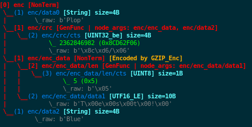

Data Modeling
*************

.. _vt:value-types:

Value Types
===========

The current types usable within a terminal node are listed in this
section. Each category (``Integer``, ``String``, ``BitField``)
supports different parameters that allows to more accurately specify a
data model, which enables ``fuddly`` to perform more enhanced fuzzing.

.. note:: These parameters will be especially leveraged by the generic
   disruptor ``tTYPE``
   (:class:`framework.generic_data_makers.d_fuzz_typed_nodes`). Refer to
   :ref:`dis:generic-disruptors` for more information on it, and to
   :ref:`tuto:disruptors`, for how to create your own *disruptors*.

.. _vt:integer:

Integer
-------

All integer types listed below provide the same interface
(:class:`framework.value_types.INT`). Their constructor take the
following parameters:

``int_list`` [optional, default value: **None**]
  List of the integers that are considered valid for the node backed
  by this *Integer object*. The default value is the first element of the list.

``mini`` [optional, default value: **None**]
  Minimum valid value for the node backed by this *Integer object*.

``maxi`` [optional, default value: **None**]
  Maximum valid value for the node backed by this *Integer object*.

``default`` [optional, default value: **None**]
  If ``int_list`` is not provided, this value if provided will be used as the default one.

``determinist`` [default value: **True**]
  If set to ``True`` generated values will be in a deterministic
  order, otherwise in a random order.

  This parameter is for internal usage and will always follow the *hosting*
  node instructions. If you want to change the deterministic order you have
  to do it at the node level by using the data model keyword ``determinist``
  (refer to :ref:`dm:node_prop_keywords`).

All these parameters are optional. If you don't specify all of them
the constructor will let more freedom within the data model. But if
you have accurate information, don't hesitate to add them in the data
model, as it does not weaken the test cases that will be generated by
the generic disruptors, quite the opposite.

Below the different currently defined integer types, and the
corresponding outputs for a data generated from them:

- :class:`framework.value_types.UINT8`: unsigned integer on 8 bit
- :class:`framework.value_types.SINT8`: signed integer on 8 bit (2's complement)
- :class:`framework.value_types.UINT16_be`: unsigned integer on 16 bit, big endian
- :class:`framework.value_types.UINT16_le`: unsigned integer on 16 bit, little endian
- :class:`framework.value_types.SINT16_be`: signed integer on 16 bit (2's complement), big endian
- :class:`framework.value_types.SINT16_le`: signed integer on 16 bit (2's complement), little endian
- :class:`framework.value_types.UINT32_be`: unsigned integer on 32 bit, big endian
- :class:`framework.value_types.UINT32_le`: unsigned integer on 32 bit, little endian
- :class:`framework.value_types.SINT32_be`: signed integer on 32 bit (2's complement), big endian
- :class:`framework.value_types.SINT32_le`: signed integer on 32 bit (2's complement), little endian
- :class:`framework.value_types.UINT64_be`: unsigned integer on 64 bit, big endian
- :class:`framework.value_types.UINT64_le`: unsigned integer on 64 bit, little endian
- :class:`framework.value_types.SINT64_be`: signed integer on 64 bit (2's complement), big endian
- :class:`framework.value_types.SINT64_le`: signed integer on 64 bit (2's complement), little endian
- :class:`framework.value_types.INT_str`: ASCII encoded integer

String
------

All string types listed below provide the same interface
(:class:`framework.value_types.String`). Their constructor take the
following parameters:

``val_list`` [optional, default value: **None**]
  List of the character strings that are considered valid for the node
  backed by this *String object*. The default string is the first element of the list.

``size`` [optional, default value: **None**]
  Valid character string size for the node backed by this *String
  object*.

``min_sz`` [optional, default value: **None**]
  Minimum valid size for the character strings for the node backed by
  this *String object*. If not set, this parameter will be
  automatically inferred by looking at the parameter ``val_list``
  whether this latter is provided.

``max_sz`` [optional, default value: **None**]
  Maximum valid size for the character strings for the node backed by this *String
  object*. If not set, this parameter will be
  automatically inferred by looking at the parameter ``val_list``
  whether this latter is provided.

``deteterminist`` [default value: **True**]
  If set to ``True`` generated values will be in a deterministic
  order, otherwise in a random order.

  This parameter is for internal usage and will always follow the *hosting*
  node instructions. If you want to change the deterministic order you have
  to do it at the node level by using the data model keyword ``determinist``
  (refer to :ref:`dm:node_prop_keywords`).

``ascii_mode`` [default value: **False**]
  If set to ``True``, it will enforce the string to comply with ASCII
  7 bits.

``extra_fuzzy_list`` [optional, default value: **None**]
  During data generation, if this parameter is specified with some
  specific values, they will be part of the test cases generated by
  the generic disruptor tTYPE.

``absorb_regexp`` [optional, default value: **None**]
  You can specify a regular expression in this parameter as a
  supplementary constraint for data absorption operation (refer to
  :ref:`tuto:dm-absorption` for more information on that topic).

``alphabet`` [optional, default value: **string.printable**]
  The alphabet to use for generating data, in case no ``val_list`` is
  provided. Also use during absorption to validate the contents. It is
  checked if there is no ``val_list``.

``max_encoded_sz`` [optional, default value: **None**]
  Only relevant for subclasses that leverage the encoding infrastructure.
  Enable to provide the maximum legitimate size for an encoded string.

``encoding_arg`` [optional, default value: **None**]
  Only relevant for subclasses that leverage the encoding infrastructure and that
  allow their encoding scheme to be configured. This parameter is directly provided to
  :meth:`framework.value_types.String.init_encoding_scheme`.

Some String subclasses leverage the ``String`` encoding infrastructure,
that enables to handle transparently any encoding scheme:

- The input values are the same as for the ``String`` type.
- Fuzzing test cases are generated based on the raw values, and then are encoded properly.
- Some test cases may be defined on the encoding scheme itself.

.. note::
   To define a ``String`` subclass handling a specific encoding, you have to overload
   the methods: :meth:`framework.value_types.String.encode` and :meth:`framework.value_types.String.decode`.
   You may optionally overload: :meth:`framework.value_types.String.encoding_test_cases` if you want
   to define encoding-related test cases. And if you need to initialize the encoding scheme you
   should overload the method :meth:`framework.value_types.String.init_encoding_scheme`.

   Alternatively and preferably, you should define a subclass of :class:`framework.encoders.Encoder`
   and then create a subclass of String decorated by :func:`framework.value_types.from_encoder`
   with the your encoder subclass in parameter. By doing so, you enable your encoder to be also
   usable by a non-terminal node.

Below the different currently defined string types:

- :class:`framework.value_types.String`: General purpose character string.
- :class:`framework.value_types.Filename`: Filename. Similar to the type
  ``String``, but some disruptors like ``tTYPE`` will generate more specific
  test cases.
- :class:`framework.value_types.UTF8`: ``String`` encoded in ``UTF8``.
- :class:`framework.value_types.UTF16_LE`: ``String`` encoded in ``UTF16`` little-endian.
  Note that some test cases on the encoding scheme are defined.
- :class:`framework.value_types.UTF16_BE`: ``String`` encoded in ``UTF16`` big-endian.
  Note that some test cases on the encoding scheme are defined.
- :class:`framework.value_types.Codec`: ``String`` encoded in any standard encoding
  supported by Python. You have to provide the parameter ``encoding_arg`` with the
  codec you want to use. If no codec is provided, this class will behave the same as the class
  :class:`framework.value_types.String`, that is, the ``latin_1`` codec will be used.
- :class:`framework.value_types.GZIP`: ``String`` compressed with ``zlib``. The parameter
  ``encoding_arg`` is used to specify the level of compression (0-9).
- :class:`framework.value_types.GSM7bitPacking`: ``String`` encoded in conformity
  with ``GSM 7-bits`` packed format.
- :class:`framework.value_types.Wrapper`: to be used as a mean to wrap a ``String`` with
  a prefix and/or a suffix, without defining specific *nodes* for that (meaning you
  don't need to model that part and want to simplify your data description).

BitField
--------

The type :class:`framework.value_types.BitField` takes the following
parameters:

``subfield_limits`` [optional, default value: **None**]
  List of the limits of each sub-fields (mutually exclusive with
  ``subfield_sizes``), expressed in increasing order. For instance a
  limit list ``[2, 6]`` defines the sub-fields ``0..1`` (2 bits size)
  and ``2..5`` (4 bits size), for a total ``BitField`` size of 6 bits.
  Note that the list begin from the least significant sub-field to the
  more significant sub-field.

``subfield_sizes`` [optional, default value: **None**]
  List of the size of each sub-fields (mutually exclusive with
  ``subfield_limits``), beginning from the least significant sub-field
  to the more significant sub-field.

``subfield_val_lists`` [optional, default value: **None**]
  List of valid values for each sub-fields. Look at the following
  examples for usage. For each sub-field value list, the first value is the
  default.

``subfield_val_extremums`` [optional, default value: **None**]
  List of minimum and maximum value for each sub-fields. Look at the
  following examples for usage.

``padding`` [default value: **0**]
  Should be either set to ``0`` or ``1`` for completion of the
  ``Bitfield`` to a byte boundary if it is not a byte-multiple. Note
  that the method :func:`framework.value_types.BitField.extend_right`
  allows to merge two ``BitField`` which could result in padding
  deletion.

``lsb_padding`` [default value: **True**]
  If there is a need for padding, it will be added next to the least
  significant bit if this parameter is set to ``True``, otherwise next
  to the most significant bit. This operation is performed *before*
  endianness encoding.

``endian`` [default value: **VT.LittleEndian**]
  Endianness for *encoding* the BitField.

``determinist`` [default value: **True**]
  If set to ``True`` generated values will be in a deterministic
  order, otherwise in a random order.  Note that in *determinist
  mode*, all the values such a ``BitField`` should be able to generate
  are not covered but only a subset of them (i.e., all combinations
  are not computed). It has been chosen to only keep the value based
  on the following algorithm: "exhaust each subfield one at a
  time". The rationale is that in most cases, computing all
  combinations does not make sense, especially for fuzzing
  purpose. Additionally, note that such nominal generation are not the
  one used by the generic disruptor ``tTYPE`` which rely on
  ``BitField`` *fuzzy mode* (reachable through
  :func:`framework.value_types.VT_Alt.switch_mode`).

  This parameter is for internal usage and will always follow the *hosting*
  node instructions. If you want to change the deterministic order you have
  to do it at the node level by using the data model keyword ``determinist``
  (refer to :ref:`dm:node_prop_keywords`).

``defaults`` [optional, default value: **None**]
  List of default value for each sub-field. Used only when the related sub-field is
  not described through ``subfield_val_lists``. If ``subfield_val_lists`` describes the related
  sub-field, then a ``None`` item should be inserted at the corresponding position in the list.

``subfield_descs`` [optional, default value: **None**]
  List of descriptions (character strings) for each sub-field. To
  describe only part of the sub-fields, put a ``None`` item for the
  others. This parameter is used for display purpose. Look at the
  following examples for usage.

Let's take the following examples to make ``BitField`` usage
obvious. On the first one, we specify the sub-fields of the
``BitField`` by their limit, and for each sub-field we give either a
list of valid values, or a tuple expressing the minimum and maximum
values. For the purpose of this example we use it directly, without
going through the definition of a data model (for this topic refer to
:ref:`data-model` and :ref:`dm:mydf`):

.. code-block:: python
   :linenos:
   :emphasize-lines: 8-10

    t = BitField(subfield_limits=[2,6,10,12],
	         subfield_val_lists=[[4,2,1], [2,15,16,3], None, [1]],
		 subfield_val_extremums=[None, None, [3,11], None],
		 padding=0, lsb_padding=True, endian=VT.LittleEndian)

    t.pretty_print()

    # output of the previous call:
    #
    #     (+|3: 01 |2: 0100 |1: 1111 |0: 10 |padding: 0000 |-) 19616

Note that the output is the first generated value from your
description. To get another one you will have to call
:func:`framework.value_types.BitField.get_value()` on it. Obviously,
this kind of stuff is done automatically for you during a fuzzing
session.

On the second example we specify the sub-fields of the ``BitField`` by
their sizes. And the other parameters are described in the same way as
the first example. We additionally specify the parameter
``subfield_descs``. Look at the output for the differences.

.. code-block:: python
   :linenos:
   :emphasize-lines: 9-11

    t = BitField(subfield_sizes=[4,4,4],
		 subfield_val_lists=[[4,2,1], None, [10,13]],
		 subfield_val_extremums=[None, [14, 15], None],
		 padding=0, lsb_padding=False, endian=VT.BigEndian,
		 subfield_descs=['first', None, 'last'])

    t.pretty_print()

    # output of the previous call:
    #
    #     (+|padding: 0000 |2(last): 1101 |1: 1111 |0(first): 0100 |-) 2788

.. seealso:: Methods are defined to help for modifying a
             :class:`framework.value_types.BitField`. If you want to
             deal with ``BitField`` in your specific disruptors, take
             a look especially at:

             - :func:`framework.value_types.BitField.set_subfield`, :func:`framework.value_types.BitField.get_subfield`
             - :func:`framework.value_types.BitField.extend_right`
             - :func:`framework.value_types.BitField.reset_state`, :func:`framework.value_types.BitField.rewind`
             - :func:`framework.value_types.VT_Alt.switch_mode` (used currently by the disruptor ``tTYPE``)

.. _dm:generators:

Generator Node Templates
========================

Here under the currently implemented *generator templates* (they are
all defined as static methods of
:class:`framework.data_model_helpers.MH`):

:meth:`framework.data_model_helpers.MH.LEN()`
      Return a *generator* that returns the length of a node parameter.

:meth:`framework.data_model_helpers.MH.QTY()`
      Return a *generator* that returns the quantity of child node
      instances (referenced by name) of the node parameter provided to
      the *generator*.

:meth:`framework.data_model_helpers.MH.TIMESTAMP()`
      Return a *generator* that returns the current time (in a String node).

:meth:`framework.data_model_helpers.MH.CRC()`
      Return a *generator* that returns the CRC (in the chosen type) of
      all the node parameters.

:meth:`framework.data_model_helpers.MH.WRAP()`
      Return a *generator* that returns the result (in the chosen
      type) of the provided function applied on the concatenation of
      all the node parameters.

:meth:`framework.data_model_helpers.MH.CYCLE()`
      Return a *generator* that iterates other the provided value list
      and returns at each step a node corresponding to the
      current value.

:meth:`framework.data_model_helpers.MH.OFFSET()`
      Return a *generator* that computes the offset of a child node
      within its parent node.

:meth:`framework.data_model_helpers.MH.COPY_VALUE()`
      Return a *generator* that retrieves the value of another node,
      and then return a `vt` node with this value.

.. _dm:keywords:

Data Model Keywords
===================

This section describe the *keywords* that you could use within the
frame of the :class:`framework.data_model_helpers.ModelHelper`
infrastructure. This infrastructure enables you to describe a data
format in a JSON-like fashion, and will automatically translate this
description to ``fuddly``'s internal data representation.

Generic Description Keywords
----------------------------

name
  Within ``fuddly``'s data model every node has a name that should be
  unique only within its siblings. But when it comes to use the
  :class:`framework.data_model_helpers.ModelHelper` infrastructure to
  describe your data format, if you want to use the same name in a
  data model description, you have to add an extra key to keep it
  unique within the description, and thus allowing you to refer to
  this node anywhere in the description. The following example result
  in giving the same name to different nodes::
    
    'my_name'
    ('my_name', 2)
    ('my_name', 'of the command')

  These names serve as *node references* during data description.

contents
  Every node description has at least a ``name`` and a ``contents``
  attributes (except if you refer to an already existing node, and in
  this case you have to use only the name attribute with the targeted
  node reference). The type of the node you describe will directly
  depends on what you provide in this field:

  - a python ``list`` will be considered as a non-terminal node;
  - a *Value Type* (refer to :ref:`vt:value-types`) will define a
    terminal node
  - a python ``function`` (or everything with a ``__call__`` method)
    will be considered as a generator.

  Note that for defining a *function node* and not a generator node,
  you have to state the type attribute to ``MH.Leaf``.

qty
  Specify the amount of nodes to generate from the description, or a
  tuple ``(min, max)`` specifying the minimum (which can be 0) and the
  maximum of node instances you want ``fuddly`` to generate.

  Note ``-1`` means infinity. It makes only sense for absorption
  operation (refer to :ref:`tuto:dm-absorption`), because for data
  generation, a strict limit
  (:const:`framework.data_model.NodeInternals_NonTerm.INFINITY_LIMIT`)
  is set to avoid getting unintended too big data. If you intend to
  get such kind of data, specify explicitly the maximum, or use a
  disruptor to do so (:ref:`tuto:disruptors`).

clone
  Allows to make a full copy of an existing node by providing its
  reference.

type
  Used only by the :class:`framework.data_model_helpers.ModelHelper`
  infrastructure if there is an ambiguity to determine the node
  type. This attributes accept the following values:

  - ``MH.Leaf``: to specify a terminal node, either a *value type* or a
    *function*.
  - ``MH.NonTerminal``: to specify a *non terminal* node.
  - ``MH.Generator``: to specify a *generator* node.

alt
  Allows to specify alternative contents, by providing a list of
  descriptors like here under:

  .. code-block:: python

     'alt': [ {'conf': 'config_n1',
	       'contents': SINT8(int_list=[1,4,8])},
	      {'conf': 'config_n2',
	       'contents': UINT16_be(mini=0xeeee, maxi=0xff56),
	       'determinist': True} ]

conf
  Used within the scope of the description of an alternative
  configuration. It set the name of the alternative configuration.

custo_set, custo_clear
  These attributes are used to customize the behavior of the described node.
  ``custo_set`` is to enable some behavior modes, whereas ``custo_clear`` allows to
  disable them. What is expected is either a single mode or a list of modes.
  The available modes depend on the kind of node.

  For non-terminal node, the customizable behavior modes are:

  - ``MH.Custo.NTerm.MutableClone``: By default, this mode is *enabled*.
    When enabled, it means that for child nodes which can be instantiated many times
    (refer to ``qty`` attribute), all instances will be set as *mutable*.
    If it is disabled, when a child node is instantiated more
    than once, only the first instance is set *mutable*, the others
    have this attribute cleared to prevent generic disruptors from
    altering them. This mode aims at limiting the number of test
    cases, by pruning what is assumed to be redundant.
  - ``MH.Custo.NTerm.FrozenCopy``: By default, this mode is *enabled*.
    When enabled, it means that for child nodes which can be instantiated many times
    (refer to ``qty`` attribute), the instantiation process will make a frozen copy
    of the node, meaning that it will be the exact copy of the original one at
    the time of the copy. If disabled, the instantiation process will ignore the frozen
    state, and thus will release all the constraints.
  - ``MH.Custo.NTerm.CollapsePadding``: By default, this mode is *disabled*.
    When enabled, every time two adjacent BitFields (within its scope) are found, they
    will be merged in order to remove any padding in between. This is done
    "recursively" until any inner padding is removed.

  For *generator* node, the customizable behavior modes are:

  - ``MH.Custo.Gen.ForwardConfChange``: By default, this mode is *enabled*.
    If enabled, a
    call to :meth:`framework.data_model.Node.set_current_conf()` will be
    called on the generated node (default behavior).
  - ``MH.Custo.Gen.CloneExtNodeArgs``: By default, this mode is *disabled*.
    If enabled, during a cloning operation (e.g., full copy
    of the modeled data containing this node) if the node parameters do
    not belong to the graph representing the data, they will be cloned (full
    copy). Otherwise, they will just be referenced (default
    behavior). Rationale for default behavior: When a *generator* or
    *function* node is duplicated within a non terminal node, the node
    parameters may be unknown to it, thus considered as external, while
    still belonging to the full data.
  - ``MH.Custo.Gen.ResetOnUnfreeze``: By default, this mode is *enabled*.
    If enabled, a
    call to :meth:`framework.data_model.Node.unfreeze()` on the node will
    provoke the reset of the *generator* itself, meaning that the next
    time its value will be asked for, it will be recomputed (default
    behaviour). If unset, a call to the method
    :meth:`framework.data_model.Node.unfreeze()` will provoke the call of
    this method on the already existing generated node (and if it
    didn't exist by this time it would have been computed first).
  - ``MH.Custo.Gen.TriggerLast``: By default, this mode is *disabled*.
    If enabled, the triggering of a generator is postpone until everything else has
    been resolved. It is especially
    useful when you describe a generator that use a node with an
    existence condition and that this condition cannot be resolved at
    the time the generator would normally trigger (which is
    when it is reached while walking through the graph).

  For *function* node, the customizable behaviors mode are:

  - ``MH.Custo.Func.FrozenArgs``: By default, this mode is *enabled*.
    When enabled, the node parameters are frozen before being provided to
    the *function* node. If disabled, the node parameters are directly provided to
    the *function* node (without being frozen first).
  - ``MH.Custo.Func.CloneExtNodeArgs``: By default, this mode is *disabled*.
    Refer to the description of the corresponding *generator node* mode.

Keywords to Describe Non Terminal Node
--------------------------------------

shape_type
  Allows to choose the order to be enforce by a non-terminal node to
  its children. ``MH.Ordered`` specifies that the children should be
  kept strictly in the order of the description. ``MH.Random``
  specifies there is no order to enforce between any *node descriptor*
  (which can expand to several nodes), except if the parent node has the
  ``determinist`` attribute. ``MH.FullyRandom`` specifies there is no
  order to enforce between every single nodes. ``MH.Pick`` specifies
  that only one node among the children should be kept at a time---the
  choice is randomly performed except if the parent has the
  ``determinist`` attribute---as per the weight associated to each
  child node.

weight
  Used within the scope of a shape description for a non-terminal
  node. A non-terminal node can organize all its child nodes in
  various way by describing different shapes. Each shape has a weight
  which is used either---when the non-terminal node is random---as a
  way to determine the chance that ``fuddly`` we use it during the data
  generation process, or as a mean to order the shape---when the node
  is put in determinist mode. Let's look at the example here under:

  .. code-block:: python

        {'name': 'test',
         'contents': [

	      # SHAPE 1
	      {'weight': 20,
	       'contents': [
		   {'section_type': MH.Random,
		    'contents': [
			{'contents': String(max_sz=10),
			 'name': 'val1',
			 'qty': (1, 5)},
			 
	       ...

	      # SHAPE 2
	      {'weight': 10,
	       'contents': [
		   {'section_type': MH.FullyRandom,
		    'contents': [
			{'name': 'val1'},

	       ...

  .. note:: A *shape description* is composed of the two attributes
	    ``weight`` and ``contents``.

section_type
  Similar to ``shape_type`` keyword. But only valid for describing a
  section within a non-terminal node, and limited to this section. The
  following example illustrates that:

  .. code-block:: python

     {'name': 'test',
      'shape_type': MH.Random
      'contents': [
      
	     {'name': 'val1',
	      'contents': String(val_list=['OK', 'KO']),
	      'qty': (0, 5)},

             {'section_type': MH.Ordered,
              'contents': [

		     {'name': 'val2',
		      'contents': UINT16_be(int_list=[10, 20, 30])},

		     {'name': 'val3',
		      'contents': String(min_sz=2, max_sz=10, alphabet='XYZ')},

		     {'name': 'val4',
		      'contents': UINT32_le(int_list=[0xDEAD, 0xBEEF])},

	      ]}

	     {'name': 'val5',
	      'contents': String(val_list=['OPEN', 'CLOSE']),
	      'qty': 3}
     ]}

duplicate_mode
  Modify the behavior of the instantiating procedure when a child node
  is instantiated more than once. This can be set to:
  
  - ``MH.Copy``: A new instance corresponds to a full copy operation.
  - ``MH.ZeroCopy``: A new instance corresponds to a new reference of
    the child node.

weights
  To be used optionally in the frame of a non-terminal node along with
  a ``MH.Pick`` type. If used this attribute shall contains an integer
  tuple describing the weight for each one of the subsequent nodes to
  be picked. Can be used within a section description, or directly in
  the non-terminal nodes, if it has a ``MH.Pick`` type.

separator
  When specified, the non-terminal will add a separator between each
  one of its children. This attribute has to be filled with a
  *separator descriptor* such as what is illustrated below:

  .. code-block:: python

     'separator': {'contents': {'name': 'sep',
				'contents': String(val_list=['\n'])},
		   'prefix': False,
		   'suffix': False,
		   'unique': True},

  The keys ``prefix``, ``suffix`` and ``unique`` are optional. They are
  described below.

  .. seealso:: Refer to :ref:`dm:pattern:separator` for an example using
	       separators.

prefix
  Used optionally within a *separator descriptor*. If set to ``True``,
  a separator will be placed just before the first child.

suffix
  Used optionally within a *separator descriptor*. If set to ``True``,
  a separator will be placed just after the last child.

unique
  Used optionally within a *separator descriptor*. If set to ``True``,
  the inserted separators will be independent from each other (full
  node copy). Otherwise, the separators will be references to a
  unique node (zero copy).

encoder
  If specified, an encoder instance should be provided. The *encoding* will be applied
  transparently when the binary value of the non terminal node will be retrieved
  (:meth:`framework.data_model.Node.to_bytes`). Additionally, during an absorption
  (refer to :ref:`tuto:dm-absorption`), the *decoding* will also be performed automatically.

  Several generic encoders are defined within ``framework/encoders.py``. But if they
  don't match your need, you can define your own encoder by inheriting from
  :class:`framework.encoders.Encoder` and implementing its interface.

  .. seealso:: Refer to :ref:`dm:pattern:encoder` for an example on how to use this keyword.

  .. note:: Depending on your needs, you could also choose to implement a disruptor
     to perform your encoding (refer to :ref:`tuto:disruptors`).

Keywords to Describe Generator Node
-----------------------------------

node_args
  List of node parameters to be provided to a *generator* node or a
  *function* node.

other_args
  List of parameters (which are not a
  :class:`framework.data_model.Node`) to be provided to a *generator*
  node or a *function* node.

provide_helpers
  (Optional) If set to `True`, a special object will be provided to
  the user-defined function (last parameter) of the *generator* node
  or the *function* node. Otherwise, this object won't be passed
  (default behavior). This object is an instance of the class
  :class:`framework.data_model.DynNode_Helpers`, which enable the
  user-defined function to have some insight on the current structure
  of the modeled data.

trigger_last
  This keyword is a shortcut for the related node customization mode.
  Refer to ``custo_set`` and ``custo_clear``.

Keywords to Import External Data Description
--------------------------------------------

import_from
  Name of the data model to import a data description from.

data_id
  Name of the data description to import.

.. _dm:node_prop_keywords:

Keywords to Describe Node Properties
------------------------------------

determinist
  Make the node behave in a deterministic way.

random
  Make the node behave in a random way.

finite
  Make the node *finite*, meaning that it will exhaust at some point
  (meaning that it has cycled over all its possible values or shapes)
  When the situation occurs, a notification is posted in the node
  environment (refer to :ref:`data-manip`)

infinite
  Make the node *infinite*, meaning that it will always provide values.

mutable
  Make the node mutable. It is a shortcut for the node attribute
  ``MH.Attr.Mutable``.

set_attrs
  List of attributes to set on the node. The current generic
  attributes are:

  - ``MH.Attr.Freezable``: If set, the node will be freezable (default
    behavior), which means that once the node has provided a value
    (through for instance :meth:`framework.data_model.Node.to_bytes()`),
    the method :meth:`framework.data_model.Node.unfreeze()` need to be
    called on it to get new values, otherwise it won't change. If
    unset, the node will always be recomputed. Can be useful for
    *function* node, if it needs to be recomputed each time a
    modification has been performed on its associated graph (e.g., CRC
    function).
  - ``MH.Attr.Mutable``: If set, generic disruptors will consider the
    node as being mutable, meaning that it can be altered (default
    behavior). Otherwise, it will be ignored.
  - ``MH.Attr.Determinist``: This attribute can be set directly
    through the keywords ``determinist`` or ``random``. Refer to them
    for details. By default, it is set.
  - ``MH.Attr.Finite``: If set, a node will provide a finite number of
    values and then will notify it has exhausted. Otherwise,
    exhaustion will never be notified (default behavior).
  - ``MH.Attr.Abs_Postpone``: Used to postpone absorption by the
    node. Refer to :ref:`tuto:dm-absorption` for more information on
    that topic.
  - ``MH.Attr.Separator``: Used to distinguish a separator. Some
    disruptors can leverage this attribute to perform their
    alteration.

  .. note::
     Most of the generic stateful disruptors will recursively
     set the attributes ``MH.Attr.Determinist`` and ``MH.Attr.Finite``
     on the provided data before performing any alteration.

  .. note:: *Generator* node will transfer the generic attributes to
            the generated node, except for ``MH.Attr.Freezable``, and
            ``MH.Attr.Mutable`` which are used to change the
            *generator* behavior. (If such attributes need to be set
            or cleared on the generated node, it has to be done
            directly on it and not on its generator.) Specific
            attributes related to generators won't be passed to the
            generated node.

  .. seealso:: The attributes are defined within
               :class:`framework.data_model.NodeInternals`.

clear_attrs
  List of attributes to clear on the node. The current attributes are
  the same than for the ``set_attrs`` keyword.

absorb_csts
  Used to specify some absorption constraints on the node. Refer to
  :ref:`tuto:dm-absorption` for more information on that topic.

absorb_helper
  Used to specify an absorption helper function for the node. Refer to
  :ref:`tuto:dm-absorption` for more information on that topic.

semantics
  Used to specify semantics to the node, by way of a list of
  meaningful strings. Nodes can be searched for and selected based on
  semantics. Refer to :ref:`data-manip` for more information on that
  topic.

fuzz_weight
  Used by some stateful disruptors to order their test cases. The
  heavier the weight, the higher the priority of handling the node.

sync_qty_with
  Allow to synchronize the number of node instances to generate or to
  absorb with the one specified by reference.

qty_from
  Allow to synchronize the number of node instances to generate or to
  absorb with the *value* of the one specified by reference. You can also specify
  an optional *base quantity* that will be added to the retrieved value. In this case, you
  shall provide a ``list``/``tuple`` with first the node reference then the *base quantity*.

  This keyword is the counterpart of the *generator template* :class:`framework.data_model_helpers.MH.QTY`.
  It is preferable to this *generator* when the node from which the quantity is retrieved
  is already resolved at retrieval time. In this case *generation* and *absorption* operations
  will be handled transparently.

sync_size_with, sync_enc_size_with
  Allow to synchronize the length of the described node (the one where this keyword is used)
  with the *value* of the node specified by reference (which should be an
  :class:`framework.value_types.INT`-based typed-node). These keywords are useful for size-variable
  node types. They are currently supported for typed-nodes which are
  :class:`framework.value_types.String`-based with or without an encoding (e.g.,
  :class:`framework.value_types.UTF8`, ...). Non-terminal nodes are not supported (for absorption).
  The distinction between ``sync_size_with`` and ``sync_enc_size_with`` is that the synchronization
  will be performed either with respect to the length of the data retrieved from the node
  (or the decoded data for encoded node), or with respect to the length of the encoded data
  (only usable in the case of an encoded node).

  Generation and absorption deal with these keywords differently, in order to achieve the expected
  behavior. For generation, the synchronization goes from the described node to the referenced node
  (meaning that the data is first pulled from the size-variable node, then the referenced node is
  set with the length of the pulled data). Whereas for the absorption it goes the other way around.

  Note also that you can provide an optional *base size* that will be added to the length
  before synchronization in the case of generation, and removed from the length in the case
  of absorption. In this case, you shall provide a ``list``/``tuple`` with first the node reference
  then the *base size*.

  These keywords are the counterpart of the *generator template* :class:`framework.data_model_helpers.MH.LEN`.
  They are preferable to this *generator* (when the size-variable node is not a non-terminal),
  because *generation* and *absorption* operations will be handled transparently thanks to them.

exists_if
  Enable to determine the existence of this node based on a given
  condition.

  .. seealso:: Refer to :ref:`dm:pattern:existence-cond` for how to use existence
	       conditions.

exists_if/and, exists_if/or
    Extend the ``exists_if`` keyword by allowing to specify a list or a tuple
    of conditions. The operator ``and`` (respectively ``or``) will be used to generate
    the desired behaviour.

    .. code-block:: python

        {'name': 'test',
         'contents': [
            {'name': 'opcode',
             'contents': String(val_list=['A3', 'A2'])},
            {'name': 'subopcode',
             'contents': BitField(subfield_sizes=[15,2,4],
                                  subfield_val_lists=[[500], [1,2], [5,6,12]])},
            {'name': 'and_condition',
             'exists_if/and': [(RawCondition('A2'), 'opcode'),
                               (BitFieldCondition(sf=2, val=[5]), 'subopcode')],
             'contents': String(val_list=['and_condition_true'])}
         ]}

exists_if_not
  Enable to determine the existence of this node based on the
  non-existence of another one.

post_freeze
  To be filled with a function. If specified, the function will be
  called just after the node has been frozen. It takes the node
  internals as argument (:class:`framework.data_model.NodeInternals`).

.. _dm:patterns:

Data Model Patterns
===================

How to Describe Different Shapes for Some Parts of Data
-------------------------------------------------------

To describe different forms for a non-terminal node, you can define
it in terms of shapes like illustrated by the example below:

.. code-block:: python
   :linenos:
   :emphasize-lines: 6, 20-22, 30

        {'name': 'shape',
         'separator': {'contents': {'name': 'sep',
                                    'contents': String(val_list=[' [!] '])}},
         'contents': [

	     ### SHAPE 1 ####
             {'weight': 20,
              'contents': [
                  {'name': 'prefix1',
                   'contents': String(size=10, alphabet='+')},

                  {'name': 'body_top',
                   'contents': [

                       {'name': 'body',
                        'separator': {'contents': {'name': 'sep2',
                                                   'contents': String(val_list=['::'])}},
                        'shape_type': MH.Random,
                        'contents': [
                            {'contents': String(val_list=['AAA']),
                             'qty': (0, 4),
                             'name': 'str1'},
                            {'contents': String(val_list=['42']),
                             'name': 'str2'}
                        ]}
                   ]}

              ]},

	     ### SHAPE 2 ###
             {'weight': 20,
              'contents': [
                  {'name': 'prefix2',
                   'contents': String(size=10, alphabet='>')},

                  {'name': 'body'}
              ]}
         ]}

The shapes are ordered by their weight. In *deterministic* mode (refer
to :ref:`dm:keywords`) that means a non terminal-node will be
sequentially resolved from its heavier shape to its lighter shape. In
*random* mode, the weight are used in a probabilistic way.

The example above also illustrates how to represent an *optional part*
in the description of a data format (within the first shape of the
example, line 20-22). You only have to set the minimum quantity of a
node to ``0`` (line 21), and it will be considered as an optional
part.

If you iterate over this data model with ``tWALK(nt_ony=True)`` (refer
to :ref:`dis:generic-disruptors`) you will see the various data forms
understood by ``fuddly`` which would be leveraged by most of the
generic stateful disruptors.

.. code-block:: none

   # First Form
   [!] ++++++++++ [!] ::42:: [!] 

   # Second Form
   [!] ++++++++++ [!] ::AAA::AAA::42:: [!] 

   # Third Form
   [!] >>>>>>>>>> [!] ::AAA::AAA::42:: [!]

As you can see, the first and second forms are from ``SHAPE 1``. The
differences between them comes from the optional part: the first form
does not have the optional part while the second one includes it.
Finally, the third form is from the ``SHAPE 2``.

.. seealso:: Refer to :ref:`tuto:modelwalker` for more information on
             the *Model Walker* infrastructure which makes really easy
             the implementation of stateful disruptors leveraging the
             different forms of a data.

.. seealso:: Refer to :ref:`dm:pattern:existence-cond` if you need
             to change the data format depending on the existence of
             optional parts.

.. _dm:pattern:separator:

How to Describe the Separators of a Data Format
-----------------------------------------------

The example below shows how to define the separators for delimiting
lines of an imaginary data model (line 2-7), and for delimiting
parameters with space characters (line 12-14).

.. code-block:: python
   :linenos:
   :emphasize-lines: 2-7, 12-14

    {'name': 'separator_test',
     'separator': {'contents': {'name': 'sep',
				'contents': String(val_list=['\n'], absorb_regexp=b'[\r\n|\n]+'),
				'absorb_csts': AbsNoCsts(regexp=True)},
		   'prefix': False,
		   'suffix': False,
		   'unique': True},
     'contents': [
	 {'section_type': MH.FullyRandom,
	  'contents': [
	      {'name': 'parameters',
	       'separator': {'contents': {'name': ('sep',2),
					  'contents': String(val_list=[' '], absorb_regexp=b' +'),
					  'absorb_csts': AbsNoCsts(regexp=True)}},
	       'qty': 3,
	       'contents': [
		   {'section_type': MH.FullyRandom,
		    'contents': [
			{'name': 'color',
			'contents': [
			    {'name': 'id',
			     'contents': String(val_list=['color='])},
			    {'name': 'val',
			     'contents': String(val_list=['red', 'black'])}
			]},
			{'name': 'type',
			 'contents': [
			     {'name': ('id', 2),
			      'contents': String(val_list=['type='])},
			     {'name': ('val', 2),
			      'contents': String(val_list=['circle', 'cube', 'rectangle'], determinist=False)}
			]},
		    ]}]},
	      {'contents': String(val_list=['AAAA', 'BBBB', 'CCCC'], determinist=False),
	       'qty': (4, 6),
	       'name': 'str'}
	  ]}
     ]}

From this data model you could get a data like that:

.. code-block:: none

   CCCC
   BBBB
    type=circle color=red 
    type=rectangle color=red 
   BBBB
   AAAA
   CCCC
    color=red type=cube

.. note:: Note this data model can be used to absorb data samples
          (refer to :ref:`tuto:dm-absorption`) that may use more than
          one empty line as first-level separator (thanks to the
          ``absorb_regexp`` parameter in line 3), and more than one
          space character as second-level separators (thanks to the
          ``absorb_regexp`` parameter in line 13).

.. note:: You can also perform specific *separator mutation* within a
          disruptor (refer to :ref:`tuto:disruptors`), as separator nodes have
          the specific attribute
          :const:`framework.data_model.NodeInternals.Separator` set.

.. _dm:pattern:existence-cond:

How to Describe a Data Format Whose Parts Change Depending on Some Fields
-------------------------------------------------------------------------

The example below shows how to define a data format based on *opcodes*
and *sub-opcodes* which change the form of the data itself. We use for
that purpose the keyword ``exists_if`` with some subclasses of
:class:`framework.data_model.NodeCondition` and node references.

.. note:: The keyword ``exists_if`` can directly take a node
          reference. In such case, the condition is the existence of
          this node itself.

.. code-block:: python
   :linenos:
   :emphasize-lines: 9, 14, 17, 29, 33, 39, 43

    {'name': 'exist_cond',
     'shape_type': MH.Ordered,
     'contents': [
	 {'name': 'opcode',
	  'contents': String(val_list=['A1', 'A2', 'A3'], determinist=True)},

	 {'name': 'command_A1',
	  'contents': String(val_list=['AAA', 'BBBB', 'CCCCC']),
	  'exists_if': (RawCondition('A1'), 'opcode'),
	  'qty': 3},

	 {'name': 'command_A2',
	  'contents': UINT32_be(int_list=[0xDEAD, 0xBEEF]),
	  'exists_if': (RawCondition('A2'), 'opcode')},

	 {'name': 'command_A3',
	  'exists_if': (RawCondition('A3'), 'opcode'),
	  'contents': [
	      {'name': 'A3_subopcode',
	       'contents': BitField(subfield_sizes=[15,2,4], endian=VT.BigEndian,
				    subfield_val_lists=[None, [1,2], [5,6,12]],
				    subfield_val_extremums=[[500, 600], None, None],
				    determinist=False)},

	      {'name': 'A3_int',
	       'contents': UINT16_be(int_list=[10, 20, 30], determinist=False)},

	      {'name': 'A3_deco1',
	       'exists_if': (IntCondition(10), 'A3_int'),
	       'contents': String(val_list=['*1*0*'])},

	      {'name': 'A3_deco2',
	       'exists_if': (IntCondition([20, 30]), 'A3_int'),
	       'contents': String(val_list=['+2+0+3+0+'])}
	  ]},

	 {'name': 'A31_payload',
	  'contents': String(val_list=['$ A31_OK $', '$ A31_KO $'], determinist=False),
	  'exists_if': (BitFieldCondition(sf=2, val=[6,12]), 'A3_subopcode')},

	 {'name': 'A32_payload',
	  'contents': String(val_list=['$ A32_VALID $', '$ A32_INVALID $'], determinist=False),
	  'exists_if': (BitFieldCondition(sf=[0, 1, 2], val=[[500, 501], [1, 2], 5]), 'A3_subopcode')}
     ]}

.. note:: Existence condition does not have to be located after the
          node you want to check, it can also be located
          before. Fuddly will postpone the condition checking in this
          case.

Example of data generated by such a data model are presented below (in ASCII art):

.. code-block:: none

   [0] exist_cond [NonTerm]
    \__(1) exist_cond/opcode [String] size=2B
    |        \_raw: 'A3'
    \__[1] exist_cond/command_A3 [NonTerm]
    |   \__(2) exist_cond/command_A3/A3_subopcode [BitField] size=3B
    |   |        \_ (+|2: 0110 |1: 01 |0: 000001001001001 |padding: 000 |-) 6558280
    |   |        \_raw: 'd\x12H'
    |   \__(2) exist_cond/command_A3/A3_int [UINT16_be] size=2B
    |   |        \_ 10 (0xA)
    |   |        \_raw: '\x00\n'
    |   \__(2) exist_cond/command_A3/A3_deco1 [String] size=5B
    |            \_raw: '*1*0*'
    \__(1) exist_cond/A31_payload [String] size=10B
	     \_raw: '$ A31_OK $'

   [0] exist_cond [NonTerm]
    \__(1) exist_cond/opcode [String] size=2B
    |        \_raw: 'A1'
    \__(1) exist_cond/command_A1 [String] size=3B
    |        \_raw: 'AAA'
    \__(1) exist_cond/command_A1:2 [String] size=3B
    |        \_raw: 'AAA'
    \__(1) exist_cond/command_A1:3 [String] size=3B
	     \_raw: 'AAA'

   [0] exist_cond [NonTerm]
    \__(1) exist_cond/opcode [String] size=2B
    |        \_raw: 'A2'
    \__(1) exist_cond/command_A2 [UINT32_be] size=4B
	     \_ 48879 (0xBEEF)
	     \_raw: '\x00\x00\xbe\xef'

.. note:: Note this data model can be used for generating data and
          also (without modification) for absorbing data samples that
          comply to its grammar (refer to :ref:`tuto:dm-absorption`)

How to Generate Nodes Dynamically (for length, counter, ...)
------------------------------------------------------------

The example below shows how to describe a node that will dynamically
generate a node containing the length of another one, a variable
character string in our case.

.. code-block:: python
   :linenos:
   :emphasize-lines: 5-6

    {'name': 'len_gen',
     'contents': [
	 {'name': 'len',
	  'type': MH.Generator,
	  'contents': lambda x: Node('cts', value_type= \
                                     UINT32_be(int_list=[len(x.to_bytes())])),
	  'node_args': 'payload'},

	 {'name': 'payload',
	  'contents': String(min_sz=10, max_sz=100, determinist=False)},
     ]}

Note the *generator* is just a specific kind of node
(:class:`framework.data_model.NodeInternals_GenFunc`) that embeds a
function that returns a node (:class:`framework.data_model.Node`). In
the previous description, the function is provided through the keyword
``contents``, and it's a simple lambda function taking a node as
parameter, on which is called
:meth:`framework.data_model.Node.to_bytes()` to get its bytes
representation and then the ``len()`` function. The result is used for
defining a terminal node of type
:class:`framework.value_types.UINT32_be` (refer to section :ref:`vt:integer`).

This use case can be described by using the specific *generator
template* :meth:`framework.data_model_helpers.MH.LEN()` which will basically
return the previous lambda function. The following example makes use
of it.

.. note:: Generator templates are defined as static methods of
          :class:`framework.data_model_helpers.MH`. They make the description
          of some generic use cases simpler.

.. code-block:: python
   :linenos:
   :emphasize-lines: 5

    {'name': 'len_gen',
     'contents': [
	 {'name': 'len',
	  'type': MH.Generator,
	  'contents': MH.LEN(UINT32_be),
	  'node_args': 'payload'},

	 {'name': 'payload',
	  'contents': String(min_sz=10, max_sz=100, determinist=False)},
     ]}

To conclude on this use case, note that the previous description can
be used for data generation, but it won't be usable as-is for data
absorption (refer to :ref:`tuto:dm-absorption`). Indeed, the way
absorption works is by walking through the graph and it will reach the
generator first. This one will freeze the string contents by getting
its bytes representation and will create an ``UINT32_be`` node with
only one value, the length of the arbitrarily generated string. This
value will be used for validating the corresponding data part within
the raw data to absorb, as the absorption operation will by default
enforce contents equality. Hence, it will fail. To solve this problem,
the simplest solution is to release some local constraints during
absorption, namely we need to release the ``Contents`` constraint for
the ``len`` node. More simply, we can release all the absorption
constraints for this node, as shown in the following example:

.. code-block:: python
   :linenos:
   :emphasize-lines: 7

    {'name': 'len_gen',
     'contents': [
	 {'name': 'len',
	  'type': MH.Generator,
	  'contents': MH.LEN(UINT32_be),
	  'node_args': 'payload',
	  'absorb_csts': AbsNoCsts()  # or more accurately AbsCsts(contents=False)
	  },

	 {'name': 'payload',
	  'contents': String(min_sz=10, max_sz=100, determinist=False)},
     ]}

Another solution can be to define an alternate configuration that will
be used only for absorption:

.. code-block:: python
   :linenos:
   :emphasize-lines: 7-9

    {'name': 'len_gen',
     'contents': [
	 {'name': 'len',
	  'type': MH.Generator,
	  'contents': MH.LEN(UINT32_be),
	  'node_args': 'payload',
	  'alt': [
	      {'conf': 'ABS',
	       'contents': UINT32_be(maxi=100)} ]},

	 {'name': 'payload',
	  'contents': String(min_sz=10, max_sz=100, determinist=False)},
     ]}

This solution is more complex, but can revealed itself to be useful
for more complex situation.

.. seealso:: Look at the example :ref:`ex:zip-mod` to see how to
   change the node configuration before absorption. And for more
   insights on that topic refer to :ref:`data-model` and
   :ref:`tuto:disruptors`.

Finally, let's take the following example that illustrates other
*generator templates*, namely
:meth:`framework.data_model_helpers.MH.QTY()`,
:meth:`framework.data_model_helpers.MH.CRC()` and
:meth:`framework.data_model_helpers.MH.TIMESTAMP()`.

.. code-block:: python
   :linenos:
   :emphasize-lines: 16, 21, 26, 31

    {'name': 'misc_gen',
     'contents': [
	 {'name': 'integers',
	  'contents': [
	      {'name': 'int16',
	       'qty': (2, 10),
	       'contents': UINT16_be(int_list=[16, 1, 6], determinist=False)},

	      {'name': 'int32',
	       'qty': (3, 8),
	       'contents': UINT32_be(int_list=[32, 3, 2], determinist=False)}
	  ]},

	 {'name': 'int16_qty',
	  'type': MH.Generator,
	  'contents': MH.QTY(node_name='int16', vt=UINT8),
	  'node_args': 'integers'},

	 {'name': 'int32_qty',
	  'type': MH.Generator,
	  'contents': MH.QTY(node_name='int32', vt=UINT8),
	  'node_args': 'integers'},

	 {'name': 'tstamp',
	  'type': MH.Generator,
	  'contents': MH.TIMESTAMP("%H%M%S"),
	  'absorb_csts': AbsCsts(contents=False)},

	 {'name': 'crc',
	  'type': MH.Generator,
	  'contents': MH.CRC(UINT32_be),
	  'node_args': ['tstamp', 'int32_qty'],
	  'absorb_csts': AbsCsts(contents=False)}
     ]}

.. note:: Note this data model is compatible for *data absorption*.

Here under an example of data generated by such a data model (in ASCII art):

.. code-block:: none

   [0] misc_gen [NonTerm]
    \__[1] misc_gen/integers [NonTerm]
    |   \__(2) misc_gen/integers/int16 [UINT16_be] size=2B
    |   |        \_ 6 (0x6)
    |   |        \_raw: '\x00\x06'
    |   \__(2) misc_gen/integers/int16:2 [UINT16_be] size=2B
    |   |        \_ 1 (0x1)
    |   |        \_raw: '\x00\x01'
    |   \__(2) misc_gen/integers/int16:3 [UINT16_be] size=2B
    |   |        \_ 1 (0x1)
    |   |        \_raw: '\x00\x01'
    |   \__(2) misc_gen/integers/int16:4 [UINT16_be] size=2B
    |   |        \_ 6 (0x6)
    |   |        \_raw: '\x00\x06'
    |   \__(2) misc_gen/integers/int16:5 [UINT16_be] size=2B
    |   |        \_ 6 (0x6)
    |   |        \_raw: '\x00\x06'
    |   \__(2) misc_gen/integers/int16:6 [UINT16_be] size=2B
    |   |        \_ 1 (0x1)
    |   |        \_raw: '\x00\x01'
    |   \__(2) misc_gen/integers/int16:7 [UINT16_be] size=2B
    |   |        \_ 1 (0x1)
    |   |        \_raw: '\x00\x01'
    |   \__(2) misc_gen/integers/int32 [UINT32_be] size=4B
    |   |        \_ 2 (0x2)
    |   |        \_raw: '\x00\x00\x00\x02'
    |   \__(2) misc_gen/integers/int32:2 [UINT32_be] size=4B
    |   |        \_ 3 (0x3)
    |   |        \_raw: '\x00\x00\x00\x03'
    |   \__(2) misc_gen/integers/int32:3 [UINT32_be] size=4B
    |            \_ 2 (0x2)
    |            \_raw: '\x00\x00\x00\x02'
    \__[1] misc_gen/int16_qty [GenFunc | node_args: misc_gen/integers]
    |   \__(2) misc_gen/int16_qty/cts [UINT8] size=1B
    |            \_ 7 (0x7)
    |            \_raw: '\x07'
    \__[1] misc_gen/int32_qty [GenFunc | node_args: misc_gen/integers]
    |   \__(2) misc_gen/int32_qty/cts [UINT8] size=1B
    |            \_ 3 (0x3)
    |            \_raw: '\x03'
    \__[1] misc_gen/tstamp [GenFunc | node_args: None]
    |   \__(2) misc_gen/tstamp/cts [String] size=6B
    |            \_raw: '170140'
    \__[1] misc_gen/crc [GenFunc | node_args: misc_gen/tstamp, misc_gen/int32_qty]
	\__(2) misc_gen/crc/cts [UINT32_be] size=4B
		 \_ 110906314 (0x69C4BCA)
		 \_raw: '\x06\x9cK\xca'

Which correspond to the following data::

  '\x00\x06\x00\x01\x00\x01\x00\x06\x00\x06\x00\x01\x00\x01\x00\x00\x00\x02\x00\x00\x00\x03\x00\x00\x00\x02\x07\x03170140\x06\x9cK\xca'

.. seealso:: You may delay the triggering of a generator, until
             everything else has been resolved. It is especially
             useful when you describe a generator that use a node with
             an existence condition and when this condition cannot be
             resolved at the time the generator will normally be
             triggered (that is when it is reached during the nominal
             graph traversal). To postpone this triggering, you have
             to set the generator-specific keyword ``trigger_last`` to
             `True`. Refer to :ref:`dm:keywords` for more information
             on the available keywords.

.. _dm:pattern:encoder:

How to Describe a Data Format With Some Encoded Parts
-----------------------------------------------------

The example below shows how to describe a data format with some parts encoded in different ways.

The non-terminal node named ``enc`` (lines 9-19) has the attribute ``encoder``
(refer to :ref:`dm:keywords`) which means that it will be encoded following the scheme of the
specified encoder. In this case it is the :class:`framework.encoders.GZIP_Enc` with a level
of compression of 6. Within this node is also defined a typed node (lines 17-18) named
``data1`` which is encoded in *UTF16 little endian* thanks to the type
:class:`framework.value_types.UTF16_LE` (which inherit from :class:`framework.value_types.String`)
that leverages the encoder :class:`framework.encoders.UTF16LE_Enc`.

Note also the parameter ``after_encoding=False`` (lines 6 and 14), which is supported by every
relevant generator node templates (refer to :ref:`dm:generators`) and enable them to act either
on the encoded form or the decoded form of their node parameters.

.. code-block:: python
   :linenos:
   :emphasize-lines: 6, 10, 14, 18

    {'name': 'enc',
     'contents': [
         {'name': 'data0',
          'contents': String(val_list=['Plip', 'Plop']) },
         {'name': 'crc',
          'contents': MH.CRC(vt=UINT32_be, after_encoding=False),
          'node_args': ['enc_data', 'data2'],
          'absorb_csts': AbsFullCsts(contents=False) },
         {'name': 'enc_data',
          'encoder': GZIP_Enc(6),
          'set_attrs': [NodeInternals.Abs_Postpone],
          'contents': [
             {'name': 'len',
              'contents': MH.LEN(vt=UINT8, after_encoding=False),
              'node_args': 'data1',
              'absorb_csts': AbsFullCsts(contents=False)},
             {'name': 'data1',
              'contents': UTF16_LE(val_list=['Test!', 'Hello World!']) },
          ]},
         {'name': 'data2',
          'contents': String(val_list=['Red', 'Green', 'Blue']) }
     ]}

This data description will enable you to produce data compliant to the specified encoding schemes
in a transparent way. Additionally, any fuzzing operations (:ref:`tuto:disruptors`) you want to
perform on any data parts will be done *before* any encoding takes place.

If you want to perform some fuzzing on the encoding scheme itself you will have first to
describe its format. Then it boils down to run some generic disruptors on them or some of your own.
However, note that some value types that support encoding (refer to :ref:`vt:value-types`) embed
specific test cases on the encoding scheme (which is the case of
:class:`framework.value_types.UTF16_LE` for instance).

Finally, absorption (refer to :ref:`tuto:dm-absorption`) is also supported when encoding is used
within your data description. For instance, the following data will be absorbed by the previous
data model::

   b'Plop\x8c\xd6/\x06x\x9cc\raHe(f(aPd\x00\x00\x0bv\x01\xc7Blue'

To perform that operation you can write the following python code:

.. code-block:: python
   :linenos:
   :emphasize-lines: 10, 12

   from framework.plumbing import *
   from framework.data_model import AbsorbStatus

   raw_data = b'Plop\x8c\xd6/\x06x\x9cc\raHe(f(aPd\x00\x00\x0bv\x01\xc7Blue'

   fmk = FmkPlumbing()
   fmk.run_project(name="tuto")
   enc_dm = fmk.dm.get_data('enc')

   status, off, size, name = enc_dm.absorb(raw_data, constraints=AbsFullCsts())
   if status == AbsorbStatus.FullyAbsorbed:
      enc_dm.show()

The following picture displays the result of the previous code (triggered by line 12):

.. note:: The ``content`` absorption constraint is released for the generator nodes ``crc``
   (line 8) and ``len`` (line 16) in order to allow any value to be absorbed and not limit them to
   the value generated the last time the generators triggered (which occurs during node freezing).
   Indeed, generators based on these templates will dynamically generate a typed node that contains
   only one value---based on the current value their node parameters have while the generator is
   triggered.

.. note:: Line 11 is to make the absorption operation work correctly. Indeed because of the
   encoding, constraints are not rigid enough to make fuddly work out the absorption
   without some help.
