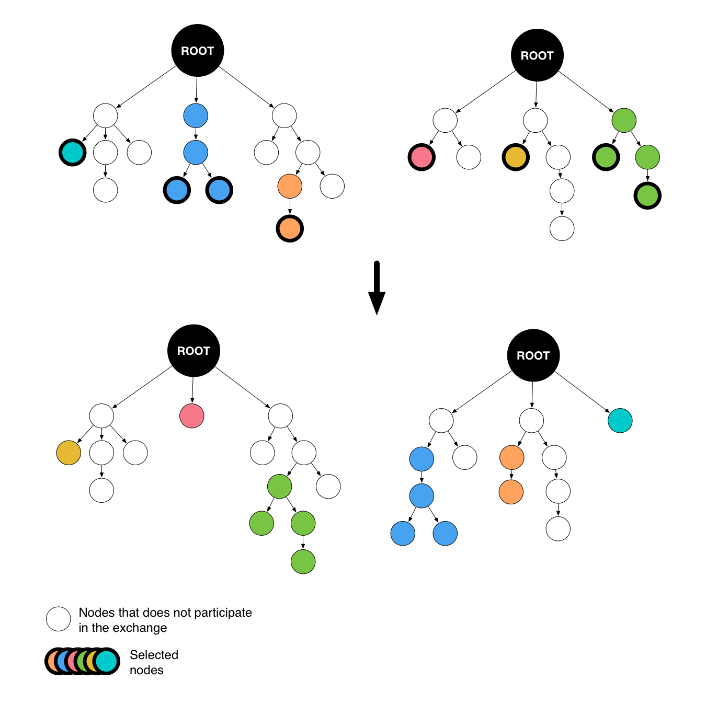

Evolutionary Fuzzing
********************

.. _ef:overview:

Overview
========

Evolutionary fuzzing is a search technique inspired by evolutionary biology (Darwin) which aims at converging
towards the discovery of weaknesses. It uses genetic algorithms in order to produce successive generations
of test cases populations. The test cases creation is not only based on
classic methods but also on the feedback retrieved from the targets. In this context, the first population
is the only one instantiated the traditional way. The ones that follow are spawned using five steps:

#. **Fitness score computation**: each test case, member of the current population, is given a
   score which is function of some metrics (impact on the target, diversity, and so on). These
   features are calculated by the element in charge of the monitoring aspects.

#. **Probabilities of survival association**: depending on the score computed in the previous step, a probability
   of survival is associated to each individual.

#. **Dice are rolled**: using the probabilities of survival: weakest test cases are killed.

#. **Mutation**: aims to modify a little bit each individuals (flip some bits for instance) to find local optimums.

#. **Cross-over**: on the contrary, involves huge changes in order to find other optimums. It combines the test cases
   that are still alive in order to generate even better solutions. This process can be used to compensate the kills
   done in step 3.

.. _evolutionary-process-image:
.. figure::  images/evolutionary_process.png
   :align:   center
   :scale:   70 %

   Evolutionary process

The implementation within Fuddly can be divided into three main components:

* A :class:`framework.evolutionary_helpers.Population` class that is composed of
  :class:`framework.evolutionary_helpers.Individual` instances. Each individual represents a data to be sent.
  The population, on the other hand, contains all the evolutionary logic. More details about these classes are
  given in the next section.
* The :class:`framework.generic_data_makers.g_population` generator that loops through the population members
  and triggers an evolution when necessary.
* A scenario only used for one of its callback. It is in charge of retrieving the feedback after each sending.

.. _ef:user-interface:

User interface
==============

An evolutionary process can be configurable by extending the
:class:`framework.evolutionary_helpers.Population` and :class:`framework.evolutionary_helpers.Individual`
abstract classes. These elements describe the contract that needs to be satisfied in order for the evolutionary process
to get running. In general, the methods :meth:`_initialize()` and :meth:`reset()` can be
used to initialize the first population, :meth:`evolve()` to get the population to the next generation
and :meth:`is_final()` to specify a stop criteria.

As these are very generic, they bring a lot of flexibility but require some work.
To address this issue, ``fuddly`` also proposes a default implementation that describes the classic approach
introduced in the previous section. Each step is expressed using one of the
:class:`framework.evolutionary_helpers.DefaultPopulation` methods. The evolution stops when the population extincts
or if a maximum number of generation exceeds.

* :meth:`_compute_scores()`: computes the *individuals* fitness scores, which is, in the default
  implementation, a random score between 0 and 100. This implementation have to be overridden to match the context.
  Indeed, this method is used to characterize the *adaptation* of each test case to the target, meaning the
  negative impact it had on the target. Besides, it also deals with the diversity of the population
  in order to avoid its premature extinction.
* :meth:`_compute_probability_of_survival()`: simply normalize fitness scores between 0 and 1.
* :meth:`_kill()`: rolls the dices !
* :meth:`_mutate()`: operates three bit flips on each individual using the stateless disruptor ``C``.
* :meth:`_crossover()`: compensates the kills through the use of the stateful disruptor ``tCOMB``. Of course, any
  other disruptor could have been chosen (those introduced by the evolutionary fuzzing are described in
  the next section).

Finally, to make an evolutionary scenario available, it needs to be registered inside a ``*_strategy.py`` file.
To do so, an ``evolutionary_scenarios`` variable has to be created. This variable is an array that
contains 3-tuples. Each one has to provide:

* a name for the evolutionary scenario that will be created;
* a class that inherits from :class:`framework.evolutionary_helpers.Population`;
* and parameters that will be passed to the
  :class:`framework.evolutionary_helpers.EvolutionaryScenariosFactory` in order to instantiate the appropriate
  population object.

Here under is provided an example to setup an evolutionary scenario:

.. code-block:: python

   from framework.evolutionary_helpers import *
   from framework.tactics_helpers import *

   tactics = Tactics()
   evolutionary_scenarios = [("EVOL",
                             DefaultPopulation,
                             {'model': 'SEPARATOR', 'size': 10, 'max_generation_nb': 10})]

.. _ef:crossover-disruptors:

Specific disruptors
===================

The evolutionary fuzzing introduces two stateful disruptors that can be used within the crossover operation.

tCROSS - Randomly swap some leaf nodes
--------------------------------------

Description:
  Produce two children by making two graphs swap a given percentages of their leaf nodes.

.. _sd-crossover-image:

   tCROSS example

Reference:
  :class:`framework.generic_data_makers.sd_crossover`

Parameters:
  .. code-block:: none

   generic args:
     |_ clone_node
     |      | desc: if True the dmaker will always return a copy of the node. (for
     |      |       stateless diruptors dealing with big data it can be usefull
     |      |       to it to False)
     |      | default: True [type: bool]
     |_ init
     |      | desc: make the model walker ignore all the steps until the provided
     |      |       one
     |      | default: 1 [type: int]
     |_ max_steps
     |      | desc: maximum number of steps (-1 means until the end)
     |      | default: -1 [type: int]
     |_ runs_per_node
     |      | desc: maximum number of test cases for a single node (-1 means until
     |      |       the end)
     |      | default: -1 [type: int]
   specific args:
     |_ node
     |      | desc: node to crossover with
     |      | default: None [type: Node]
     |_ percentage_to_share
     |      | desc: percentage of the base node to share
     |      | default: 0.50 [type: float]

tCOMB - Randomly swap some root nodes' children
-----------------------------------------------

Description:
  Produce two nodes by swapping some of the children of two given graphs roots.

.. _sd-combine-image:
.. figure::  images/sd_combine.png
   :align:   center
   :scale:   50 %

   tCOMB example

Reference:
  :class:`framework.generic_data_makers.sd_combine`

Parameters:
  .. code-block:: none

   generic args:
     |_ clone_node
     |      | desc: if True the dmaker will always return a copy of the node. (for
     |      |       stateless diruptors dealing with big data it can be usefull
     |      |       to it to False)
     |      | default: True [type: bool]
     |_ init
     |      | desc: make the model walker ignore all the steps until the provided
     |      |       one
     |      | default: 1 [type: int]
     |_ max_steps
     |      | desc: maximum number of steps (-1 means until the end)
     |      | default: -1 [type: int]
     |_ runs_per_node
     |      | desc: maximum number of test cases for a single node (-1 means until
     |      |       the end)
     |      | default: -1 [type: int]
   specific args:
     |_ node
     |      | desc: node to combine with
     |      | default: None [type: Node]
