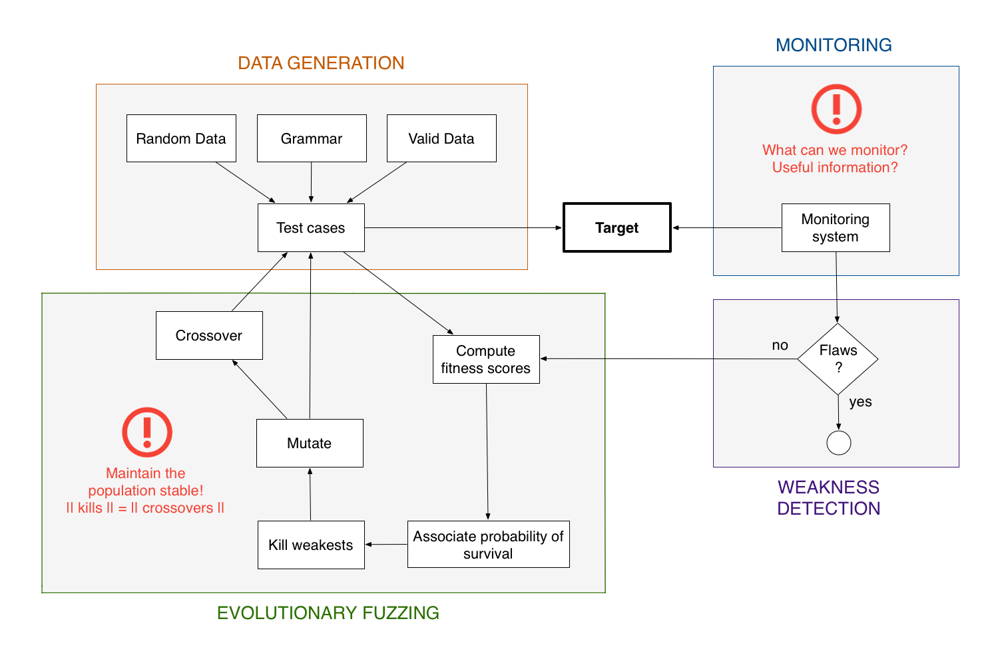
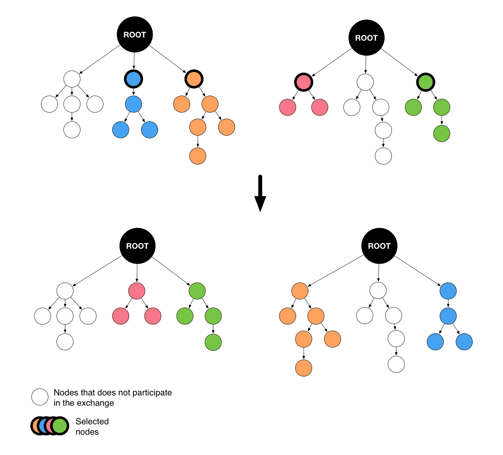

Evolutionary Fuzzing
********************

.. _ef:overview:

Overview
========

Evolutionary fuzzing is a search technique inspired by evolutionary biology (Darwin) which aims at converging
towards the discovery of weaknesses. It uses genetic algorithms in order to produce successive generations
of test cases populations. The test cases creation is not only based on
classic methods but also on the feedback retrieved from the targets. In this context, the first population
is the only one instantiated the traditional way. The ones that follow are spawned using five steps:

#. **Fitness score computation**: each test case, member of the current population, is given a
   score which is function of some metrics (impact on the target, diversity, and so on), which are
   calculated by the entity in charge of the monitoring aspects.

#. **Probabilities of survival association**: depending on the score computed in the previous step, a probability
   of survival is associated to each individual.

#. **Dice are rolled**: using the probabilities of survival: weakest test cases are killed.

#. **Mutation**: aims to modify a little bit each individuals (flip some bits for instance) to find local optimums.

#. **Cross-over**: on the contrary, involves huge changes in order to find other optimums. It combines the test cases
   that are still alive in order to generate even better solutions. This process is also used to compensate the kills
   done in step 3.

.. _evolutionary-process-image:

   Evolutionary process

The implementation within ``Fuddly`` is divided into three main components:

* A :class:`fuddly.framework.evolutionary_helpers.Population` class that is composed of
  :class:`fuddly.framework.evolutionary_helpers.Individual` instances. Each individual represents a data to be sent.
  The population, on the other hand, contains all the evolutionary logic. More details about these classes are
  given in the next section.
* The :class:`fuddly.framework.generic_data_makers.g_population` generator that loops through the population members
  and triggers an evolution when necessary.
* A scenario only used for one of its callback. It is in charge of retrieving the feedback after each sending.

.. _ef:user-interface:

User interface
==============

An evolutionary process can be configured by extending the
:class:`fuddly.framework.evolutionary_helpers.Population` and :class:`fuddly.framework.evolutionary_helpers.Individual`
abstract classes. These elements describe the contract that needs to be satisfied in order for the evolutionary process
to get running. Basically, the methods :meth:`_initialize()` and :meth:`reset()` can be
used to initialize the first population, :meth:`evolve()` to get the population to the next generation
and :meth:`is_final()` to specify a stop criteria.

As these are very generic, they bring a lot of flexibility but require some work.
To address this issue, ``Fuddly`` also proposes a default implementation that describes the classic approach
introduced in the previous section. Each step is expressed using one of the
:class:`fuddly.framework.evolutionary_helpers.DefaultPopulation` methods. The evolution stops when the population extincts
or if a maximum number of generation exceeds.

* :meth:`_compute_scores()`: computes the *individuals* fitness scores, which is, in the default
  implementation, a random score between 0 and 100. This implementation have to be overridden to match the context.
  Indeed, this method is used to characterize the *adaptation* of each test case to the target, meaning the
  negative impact it had on the target. Besides, it also deals with the diversity of the population
  in order to avoid its premature extinction.
* :meth:`_compute_probability_of_survival()`: simply normalize fitness scores between 0 and 1.
* :meth:`_kill()`: rolls the dices !
* :meth:`_mutate()`: operates three bit flips on each individual using the stateless disruptor ``C``.
* :meth:`_crossover()`: compensates the kills through the use of a crossover algorithm which
  is configurable.

Finally, to make an evolutionary process available to the framework, it has to be registered at project
level (meaning inside a ``*_proj.py`` file), through :meth:`fuddly.framework.Project.register_evolutionary_process`.
This method expects processes in the form of 3-tuples containing:

* a name for the scenario that will implement the evolutionary process;
* a class that inherits from :class:`fuddly.framework.evolutionary_helpers.Population`;
* and parameters that will be passed to the
  :class:`fuddly.framework.evolutionary_helpers.EvolutionaryScenariosFactory` in order to instantiate the appropriate
  population object.

Here under is provided an example to register an evolutionary process (defined in ``tuto_proj.py``):

.. code-block:: python

    from fuddly.framework.evolutionary_helpers import DefaultPopulation

    init_dp1 = DataProcess([('tTYPE', UI(fuzz_mag=0.2))], seed='exist_cond')
    init_dp1.append_new_process([('tSTRUCT', UI(deep=True))])

    project.register_evolutionary_processes(
        ('evol1',
         DefaultPopulation,
         {'init_process': init_dp1,
          'max_size': 80,
          'max_generation_nb': 3,
          'crossover_algo': CrossoverHelper.crossover_algo1})
    )

Once loaded from ``Fuddly``, ``Scenario`` are created from registered evolutionary processes, which are callable
(like any other scenarios) through their associated ``Generator``. In our example, only one process is
registered and will lead to the creation of the generator ``SC_EVOL1``.
After each call to it, the evolutionary process will progress and a new test case will be produced.

Note that the :class:`fuddly.framework.evolutionary_helpers.DefaultPopulation` is used with this scenario.
It expects the following parameters:

- The first one describe the process to follow to generate the data in the initial population
  (refer to the API documentation for more information). In the example,
  the process enables to generate altered data from the data type ``exist_cond`` thanks to the
  the disruptors ``tTYPE`` and ``tSTRUCT``.
- The second specify the maximum size of the population.
- The third is a criteria to stop the evolutionary process. It provides the maximum number of generation to reach
- The fourth is the crossover algorithm to be used. You can either provide your own implementation
  or use the ones available in :class:`fuddly.framework.evolutionary_helpers.CrossoverHelper`. Refer to
  :ref:`ef:crossover-algos` for more information.

.. _ef:crossover-algos:

Crossover Algorithms
====================

The evolutionary fuzzing introduces two crossover algorithms that can be used within the crossover operation.

Algo1 - Randomly swap some root nodes' children
-----------------------------------------------

Description:
  Produce two nodes by swapping some of the children of two given graphs roots.

.. _algo1-image:

   Algo1 example

Reference:
  :meth:`fuddly.framework.evolutionary_helpers.CrossoverHelper.crossover_algo1`

Algo2 - Randomly swap some leaf nodes
-------------------------------------

Description:
  Produce two children by making two graphs swap a given percentages of their leaf nodes.

.. _algo2-image:
.. figure::  images/crossover_algo2.png
   :align:   center
   :scale:   50 %

   Algo2 example

Reference:
  :meth:`fuddly.framework.evolutionary_helpers.CrossoverHelper.get_configured_crossover_algo2`
