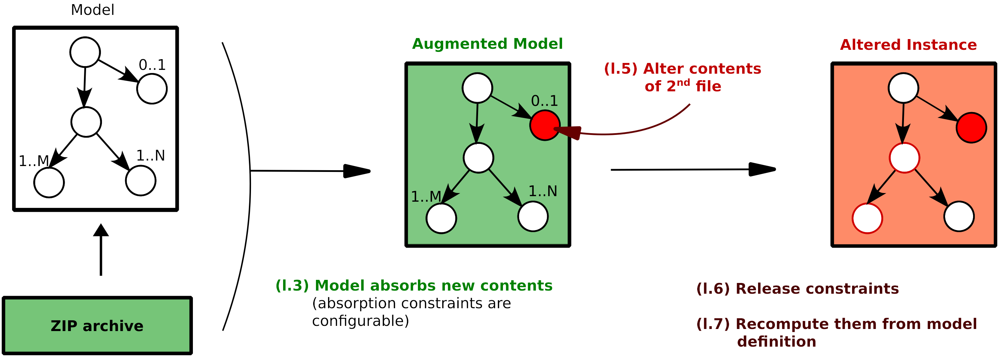

.. _useful-examples:

Useful Examples
***************

ZIP archive modification
========================

The following example (refer to the figure `below <#zip-example>`_)
illustrates how to modify the second file contents of a ZIP archive,
and let *fuddly* recalculate every constraints for you.

.. highlight:: python
   :linenothreshold: 5

.. code-block:: python
   :linenos:

    abszip = dm.get_data('ZIP')
    abszip.set_current_conf('ABS', recursive=True)
    abszip.absorb(zip_buff, constraints=AbsNoCsts(size=True,struct=True)

    abszip['ZIP/file_list/file:2/data'].absorb(b'TEST', constraints=AbsNoCsts())
    abszip.unfreeze(only_generators=True)
    abszip.get_value()

.. _zip_example:

   ZIP archive second file contents modification
