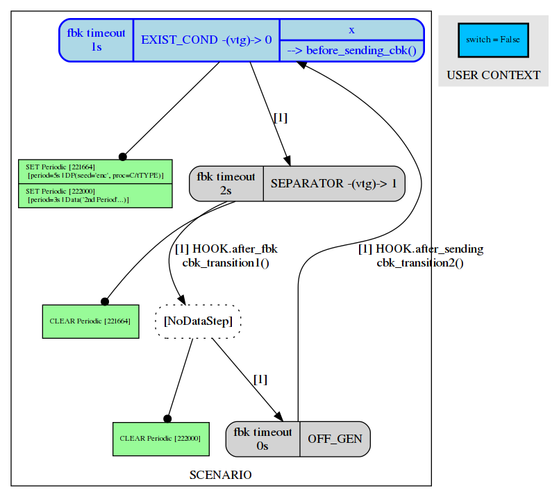
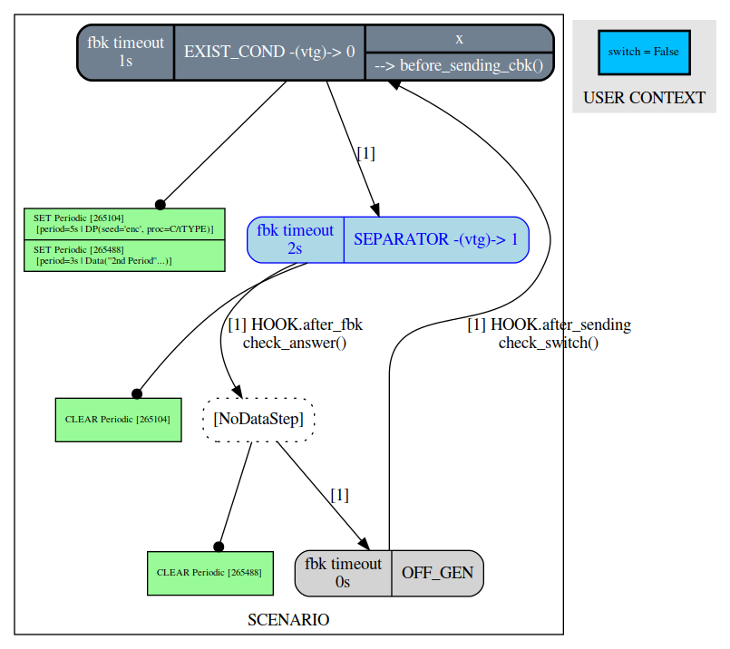
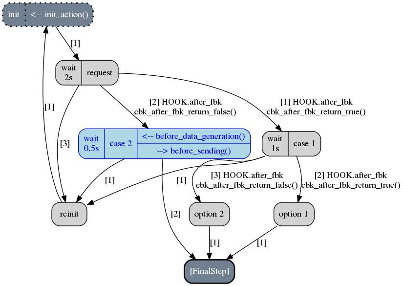

.. _scenario-infra:

Scenario Infrastructure
***********************

Overview
========

The `Scenario Infrastructure` enables you to describe protocols which are based on the data
described in a data model. You can do whatever you want, either by following a standard
or playing around it.

Once a `scenario` has been defined and registered (refer to :ref:`scenario-desc`),
``Fuddly`` will automatically create a specific `Generator` that comply to what you described.

.. note:: The ``Fuddly`` shell command ``show_dmaker_types`` displays all the data maker,
  `Generators` and `Disruptors`. The Generators which are backed by a scenario are prefixed by
  ``SC_``.

A `scenario` is a state-machine. Its description follows an oriented graph where the nodes, called
`steps`, define the data to be sent to the target. The transitions that interconnect these steps
can be guarded by different kinds of callbacks that trigger at different moment (e.g., after
sending the data, or after having retrieved any feedback from the target or any probes registered
to monitor the target).

Finally, once a scenario has been described, some automatic alterations can be performed on it.
It is especially useful in the case of protocol fuzzing to assess the robustness of the target
regarding protocol sequencing, timing, and so on. This is described in the section :ref:`scenario-fuzz`.

.. _scenario-desc:

Scenario Description
====================

.. _sc:example:

A First Example
---------------

Let's begin with a simple example that interconnect 3 steps in a loop without any callback.

.. note:: All the examples (or similar ones) of this chapter are provided in the file
  ``<fuddly_root>/data_models/tutorial/tuto_strategy.py``.

.. code-block:: python
   :linenos:
   :emphasize-lines: 4, 9, 20, 22

    from framework.tactics_helpers import Tactics
    from framework.scenario import *

    tactics = Tactics()

    periodic1 = Periodic(Data('Periodic (5s)\n'), period=5)
    periodic2 = Periodic(Data('One Shot\n'), period=None)

    step1 = Step('exist_cond', fbk_timeout=1, set_periodic=[periodic1, periodic2],
                 do_before_sending=before_sending_cbk, vtg_ids=0)
    step2 = Step('separator', fbk_timeout=2, clear_periodic=[periodic1], vtg_ids=1)
    step3 = NoDataStep(clear_periodic=[periodic2])
    step4 = Step('off_gen', fbk_timeout=0)

    step1.connect_to(step2)
    step2.connect_to(step3, cbk_after_fbk=check_answer)
    step3.connect_to(step4)
    step4.connect_to(step1, cbk_after_sending=check_switch)

    sc1 = Scenario('ex1', anchor=step1, user_context=UI(switch=False))

    tactics.register_scenarios(sc1)

Note that scenarios can be described:

- either in a ``*_strategy.py`` file that matches the data model you base your scenarios on;
- or in a project file, if your scenarios use different data models involved in your project or
  the scenarios are agnostic to any data model but have a meaning only at project level.

In what follows we illustrate how to describe scenarios in the context of the data model ``mydf`` defined in
``tuto.py`` (refer to :ref:`dm:mydf` for further explanation on file organization). Describing scenarios
in the context of a project will be the same except for the scenarios registration step, where the method
:meth:`framework.project.Project.register_scenarios` will have to be used to make them
available within the framework.

In our example, the registration goes through the special object ``tactics`` (line 4) of ``tuto_strategy.py``
which is usually used to register the data makers (`disruptors` or
`generators`) specific to a data model (refer to :ref:`tuto:disruptors` for details), but also used
to register scenarios as shown in line 20.

From line 9 to 13 we define 4 :class:`framework.scenario.Step`:

- The first one commands the framework to send a data of type ``exist_cond`` (which is the name of a data registered
  in the data model ``mydf``) as well as starting 2 periodic tasks (threaded entities of the framework) that
  will emit each one a specific data. The first one will send the specified string every 5 seconds
  while the other one will send another string only once.
  Additionaly, the callback ``before_sending_cbk`` is set and will be triggered when the framework
  will reach this step (callbacks are discussed in a later section).
  Note that the step sets also the maximum
  time duration that ``Fuddly`` should respect for collecting the feedback from the target (feedback
  timeout). This timeout is actually handled by the ``Target`` object, which may decide to respect it
  or not. For instance the ``NetworkTarget`` respect it while the ``EmptyTarget`` (default target)
  do not. Note that the feedback mode (refer to :ref:`targets`) is also supported and can be set
  through the parameter ``fbk_mode``.
  Finally, the parameter ``vtg_ids`` is used to allows interacting in a multi-targets environment
  (this topic is detailed in :ref:`multi-target-scenario`). In this case it asks to send the data to the target
  referenced by the virtual ID 0.

- The second step commands the framework to send a data of type ``separator`` and change the
  feedback timeout to 2. Additionally, it requests the framework to stop the first periodic task, and
  asks it to send its data to the target referenced by the virtual ID 1.

- The third step do nothing except requesting the framework to stop the second periodic task.

- The fourth step requests to send a data of type ``off_gen`` and change back the feedback timeout to
  0. Additionally it commands the framework to stop the periodic task which is currently running.

.. note:: The feedback timeout will directly influence the time that seperates the execution of
   each step

The linking of these steps is carried out from the line 15 to 18. Some callbacks are defined and are
explained in a later section. Then in line 20,
a :class:`framework.scenario.Scenario` object is created with the name ``ex1`` which is used by ``Fuddly``
for naming the `generator` that implements this scenario. It prefixes it with the string ``SC_`` leading to
the name ``SC_EX1``. The `scenario` is then linked to the initial `step` in line 18.

.. note::
   The ``user_context`` parameter of the Scenario class used in line 20 allows to provide parameters
   to Steps and callbacks of
   the scenario (through the ``ScenarioEnv`` object shared between them and described in a later section).

   This parameter can be filled with any object. Anyway, the preferable object class to use is
   :class:`framework.global_resources.UI` which is the container class also used to pass parameters
   to ``Generators`` and ``Disruptors``.

The execution of this scenario will follow the pattern::

  step1 --------------------> step2 ---------> step3 -------> step1 ---------> ...
    |                           |                |              |
    \--> periodic1 ...  [periodic1 stopped]      |              \--> periodic1 ...
    \--> periodic2 ...                   [periodic2 stopped]    \--> periodic2 ...

You can play with this scenario by loading the ``tuto`` project with the ``TestTarget`` 7 and 8 (useful
to provide arbitrary feedback)::

  [fuddly term]>> run_project tuto 7 8
  [fuddly term]>> send_loop 10 SC_EX1

If you want to visualize your scenario, you can issue the following command
(``[FMT]`` is optional and can be ``xdot``, ``pdf``, ``png``, ...)::

  [fuddly term]>> show_scenario SC_EX1 [FMT]

If you want to monitor the current step of the scenario each time you trigger the generator that runs
through it, you have to set the generic parameter ``graph`` to ``True``. Then, each time you trigger
the generator the current step will be shown in blue::

  [fuddly term]>> send SC_EX1(graph=True:graph_format=xdot)

Then after another call::

  [fuddly term]>> send SC_EX1(graph=True:graph_format=xdot)

.. note:: All available parameters can be consulted by issuing the following command
   (like any data generators)::

      [fuddly term]>> show_generators SC_EX1

.. _sc:steps:

Steps
-----

The main objective of a :class:`framework.scenario.Step` is to command the generation and sending
of one or multiple data to targets selected in the framework. The data generation depends on
what has been provided to the parameter ``data_desc`` of a :class:`framework.scenario.Step`. This
is described in the section :ref:`sc:dataprocess`.

Note that the data generated in one step will be sent by default to the first loaded target. If the
scenario you describe involve different targets, you could then refer to them by specifying virtual
target IDs in the step constructor thanks to the parameter ``vtg_ids``. Virtual target IDs are then
to be mapped to real targets within the project file. Refer to :ref:`multi-target-scenario`.

A step can also modify the way the feedback is handled after the data have been emitted by the
framework. The parameters ``fbk_timeout``, and ``fbk_mode`` (refer to :ref:`targets`) are used
for such purpose and are applied to the current target (by the framework) when the step is reached.

A step can additionally triggers the execution of periodic tasks that will emit some user-specified
data (note the execution will trigger after feedback retrieval from the framework). This is done by
providing a list of :class:`framework.scenario.Periodic`
to the parameter ``set_periodic``. And, in order to stop previously started periodic tasks,
the parameter ``clear_periodic`` have to be filled with a list of references on the relevant
periodic tasks.

.. seealso:: Refer to the section :ref:`sc:example` for practical information on how to use
  such features.

A step can also start a periodic or a one-shot task whose content could be entirely specified by
the user. This is done by providing a list of :class:`libs.utils.Task`
to the parameter ``start_tasks``. And, in order to stop previously started periodic tasks,
the parameter ``stop_tasks`` have to be filled with a list of references on the relevant
periodic tasks. Details on tasks are provided here :ref:`tuto:tasks`.

In addition to the features provided by a step, some user-defined callbacks can be associated to a
step and executed while the framework is handling the step (that is generating data as specified
by the step and sending it):

- If some code need to be executed when a step is reached and before any data is processed
  from it, you can leverage the parameter ``do_before_data_processing`` of the :class:`framework.scenario.Step` class.
  It has to be provided with a function satisfying the following signature:

      .. code-block:: python
         :linenos:

          def before_data_generation_cbk(env, step)

  where ``step`` is a reference to the :class:`framework.scenario.Step` on which the action is
  executed, and ``env`` is a reference to the scenario environment :class:`framework.scenario.ScenarioEnv`.

- And if some code need to be executed within a step after data has been processed and just before
  its sending, you can leverage the parameter ``do_before_sending`` of the :class:`framework.scenario.Step` class.
  It has to be provided with a function satisfying the following signature:

      .. code-block:: python
         :linenos:

         def before_sending_cbk(env, step)

  where the parameters have the same meaning as previously.

Note also that a step once executed will display a description related to what it did. You can override
this description by providing the ``step_desc`` parameter of a :class:`framework.scenario.Step`
constructor with a python string.

Finally, some subclasses of :class:`framework.scenario.Step` have been defined to make a scenario description
easier:

- :class:`framework.scenario.FinalStep`: When such kind of step is reached, it terminates the execution
  of the scenario. It is equivalent to a ``Step`` with its ``final`` attribute set to ``True``.

- :class:`framework.scenario.NoDataStep`: This kind of step should be used when the purpose is not to
  generate and send data but only to use other step features (e.g., feedback timeout or mode).
  Besides, the step callback ``do_before_data_processing`` will still be triggered if some
  code need to be executed (but ``do_before_sending`` will not). And all the transitions from
  this step would only trigger their callback ``cbk_after_fbk`` to evaluate their condition.

.. _sc:transitions:

Transitions
-----------

When two steps are connected together thanks to the method :meth:`framework.scenario.Step.connect_to`
some callbacks can be specified to perform any user-relevant action before crossing the
transition that links up the two steps, but also to decide if this transition can be crossed.
They act as transition conditions.

Indeed, a callback has to return `True` if it wants the framework to cross the transition, otherwise
it should return `False`. If no callback is defined the transition is considered to be not
guarded and thus can be crossed without restriction. Besides, only one transition is chosen at
each step. It is the first one, by order of registration, that can be activated (at least one
callback that returns `True`, or no callback at all). It is worth noting that the transitions are
executed in a minimalistic way, meaning that if a callback return `True`, the associated transition
will be chosen and no other callback will be executed (except all the callbacks from the
selected transition) before a next step need to be selected.

Two types of callback can be associated to a transition through the parameters
``cbk_after_sending`` and ``cbk_after_fbk`` of the method :meth:`framework.scenario.Step.connect_to`.
A brief explanation is provided below:

``cbk_after_sending``
  To provide a function that will be executed before the execution of the next step, and just after
  the sending of the data from the current step. Its signature is as follows::

     def callback(scenario_env, current_step, next_step)

  The ``current_step`` is the one that is in progress and which is connected to ``next_step`` by
  the transition containing the current callback. The ``scenario_env`` parameter is a reference to the
  scenario environment :class:`framework.scenario.ScenarioEnv`, which is shared
  between all the steps and transitions of a scenario.

  .. note:: A scenario environment :class:`framework.scenario.ScenarioEnv` provides some information like
       an attribute ``dm`` which is initialized with the :class:`framework.data_model.DataModel`
       related to the scenario; or an attribute ``target`` which is initialized with the current target
       in use (a subclass of :class:`framework.target.Target`).

       A scenario environment can also be used as a shared memory for all the steps and transitions of a
       scenario.

``cbk_after_fbk``
  To provide a function that will be executed before the execution of the next step, and just after
  ``Fuddly`` retrieved the feedback of the target (and/or any registered probes). Its signature
  is as follows::

     def callback(scenario_env, current_step, next_step, feedback)

  This type of callback takes the additional parameter ``feedback`` filled by the framework with
  the target and/or probes feedback further to the current step data sending. It is an object
  :class:`framework.database.FeedbackGate` that provides the handful method
  :meth:`framework.database.FeedbackGate.iter_entries` which returns a generator that iterates
  over:

    - all the feedback entries associated to a specific feedback ``source`` provided as a
      parameter---and for each entry the triplet ``(status, timestamp, content)`` is provided;
    - all the feedback entries if the ``source`` parameter is ``None``---and for each entry the 4-uplet
      ``(source, status, timestamp, content)`` is provided. Note that for such kind of iteration, the
      :class:`framework.database.FeedbackGate` object can also be directly used as
      an iterator---avoiding a call to :meth:`framework.database.FeedbackGate.iter_entries`.

  This object can also be tested as a boolean object, returning False if there is no feedback at all.

Note that a callback can modify a step. For instance, considering an imaginary protocol, and
after sending a registration request to a network service (initial step), feedback from the target are
provided to the callbacks registered on the next transitions. These callbacks could then look
for an identifier within the feedback and then update the next step to make it sending
a message with the right identifier.

A step has a property ``node`` that provides the root node (:class:`framework.node.Node`)
of the modeled data it contains or `None` if the data associated to the step is a raw data
(like ``Data('raw data')``). Any callback can then alter the ``node`` of a step in order to update it
with usefull information. In our example, the ``node`` is updated with the identifier (refer to
line 10-11 of the following code snippet).

.. note:: Accessing to ``next_step.content`` from a callback will provide `None` in the case the next
   step include a raw data. In the case it includes a ``DataProcess``, ``next_step.content`` will
   provide the :class:`framework.node.Node` corresponding to the ``DataProcess``'s ``seed`` or
   ``None`` (if no seed is available or the seed is raw data). In the latter case, the data process would
   not have been carried out at the time of the callback execution, hence the ``None`` value.
   (Refer to the section :ref:`sc:dataprocess`)

.. note:: You can leverage the dissection/absorption mechanism of ``Fuddly`` to deal with the feedback
   if you have modeled the responses of the target. Refer to :ref:`tuto:dm-absorption` for further
   explanation on that matter.

Another aspect of callbacks is the ability to prevent the framework from going on (that is
sending further data, and walking through the scenario) until a condition has been reached
(related to the target feedback for instance). For that purpose, the callback needs to call the
method ``make_blocked()`` on the current step and to return `False`. In this case, the callback
``cbk_after_fbk`` will be (re)called after the feedback gathering time has elapsed once again.
Note that you can `block` from any callback, but only ``cbk_after_fbk`` will be called further on
and will be able to `unblock` the situation.

Such ability can be useful if you are not sure about the time to wait for the answer of a network
service for instance. This is illustrated in the following example in the lines 2-4.

.. code-block:: python
   :linenos:
   :emphasize-lines: 1, 4, 10-11, 18, 19, 25

    def feedback_callback(env, current_step, next_step, feedback):
        if not feedback:
            # While no feedback is retrieved we stay at this step
            current_step.make_blocked()
            return False
        else:
            # Extract info from feedback and add an attribute to the scenario env
            env.identifier = handle_fbk(feedback)
            current_step.make_free()
            if next_step.content:
                next_step.content['off_gen/prefix'] = env.identifier
            return True

    periodic1 = Periodic(Data('1st Periodic (5s)\n'), period=5)
    periodic2 = Periodic(Data('2nd Periodic (3s)\n'), period=3)

    step1 = Step('exist_cond', fbk_timeout=2, set_periodic=[periodic1, periodic2])
    step2 = Step('separator', fbk_timeout=5)
    step3 = NoDataStep()
    step4 = Step(DataProcess(process=[('C', UI(nb=1)),'tTYPE'], seed='enc'))

    step1.connect_to(step2)
    step2.connect_to(step3, cbk_after_fbk=feedback_callback)
    step3.connect_to(step4)
    step4.connect_to(FinalStep())

    sc2 = Scenario('ex2', anchor=step1)

In line 25 a :class:`framework.scenario.FinalStep` (a step with its ``final`` attribute set to `True`)
is used to terminate the scenario as well as all the associated periodic tasks that are still running.
Note that if a callback set the ``final`` attribute of the ``next_step`` to `True`,
it will trigger the termination of the scenario if this ``next_step`` is indeed the one that will
be selected next.

.. note:: A step with its ``final`` attribute set to ``True`` will never trigger the sending of the
   data it contains.

Remark also the :class:`framework.scenario.NoDataStep` in line 19 (``step3``) which is a step that
does not provide data. Thus, the framework won't send anything during the execution of this kind
of step. Anyway, it is still possible to set or clear some `periodic` in this step (or changing
feedback timeout, ...)

.. note:: A :class:`framework.scenario.NoDataStep` is actually a step
   on which ``make_blocked()`` has been called on it and where ``make_free()`` do nothing.

The execution of this scenario will follow the pattern::

  step1 --> step2 --> step2 ... step2 --> step3 --> step4 --> FinalStep()
    |              |                   |                          |
    |          No feedback          Feedback                      |
    |                                                             |
    \--> periodic1 ...                                     [periodic1 stopped]
    \--> periodic2 ...                                     [periodic2 stopped]

The last example illustrates a case where one step is connected to two other steps with
a callback that rules the routing decision.

.. code-block:: python
   :linenos:

    def routing_decision(env, current_step, next_step):
        if env.user_context.switch:
            return False
        else:
            env.user_context.switch = True
            return True

    anchor = Step('exist_cond')
    option1 = Step(Data('Option 1'))
    option2 = Step(Data('Option 2'))

    anchor.connect_to(option1, cbk_after_sending=routing_decision)
    anchor.connect_to(option2)
    option1.connect_to(anchor)
    option2.connect_to(anchor)

    sc3 = Scenario('ex3', anchor=anchor, user_context=UI(switch=False))

The execution of this scenario will follow the pattern::

  anchor --> option1 --> anchor --> option2 --> anchor --> option2 --> ...

In addition to the callbacks, a transition can be guarded by booleans linked to specific conditions.
They have to be specified as parameters of the method :meth:`framework.scenario.Step.connect_to`.
The current defined condition is:

 - `DataProcess completed` (parameter is ``dp_completed_guard``): which means, for a step hosting
   a :class:`framework.data.DataProcess`, that if no more data can be issued by it the
   condition is satisfied, and thus the transition can be crossed.
   This is illustrated by the following example:

    .. code-block:: python
       :linenos:

        step1 = Step(DataProcess(process=['tTYPE'], seed='4tg1'))
        step2 = Step(DataProcess(process=['tTYPE#2'], seed='4tg2'))

        step1.connect_to(step2, dp_completed_guard=True)
        step2.connect_to(FinalStep(), dp_completed_guard=True)

        sc_proj3 = Scenario('proj3', anchor=step1)

.. _sc:dataprocess:

Data Generation Process
-----------------------

The data produced by a :class:`framework.scenario.Step` or a :class:`framework.scenario.Periodic`
is described by a `data descriptor` which can be:

- a python string referring to the name of a registered data from a data model;

- a :class:`framework.data.Data`;

- a :class:`framework.data.DataProcess`.

A :class:`framework.data.DataProcess` is composed of a chain of generators and/or disruptors
(with or without parameters) and optionally a ``seed`` on which the chain of disruptor will be applied to (if no
generator is provided at the start of the chain).

A :class:`framework.data.DataProcess` can trigger the end of the scenario if a disruptor in the
chain yields (meaning it has terminated its job with the provided data: it is *exhausted*).
If you prefer that the scenario goes on, then
you have to set the ``auto_regen`` parameter to ``True``. In such a case, when the step embedding
the data process will be reached again, the framework will rerun the chain. This action will reset
the exhausted disruptor and make new data available to it (by pulling data from preceding data makers
in the chain or by using the *seed* again).

Additional *data maker chains* can be added to a :class:`framework.data.DataProcess` thanks to
:meth:`framework.data.DataProcess.append_new_process`. Switching from the current process to the
next one is carried out when the current one is interrupted by a yielding disruptor.
Note that in the case the data process has its
``auto_regen`` parameter set to ``True``, the current interrupted chain won't be rerun until every other
chain has also get a chance to be executed.

.. seealso:: Refer to :ref:`tuto:dmaker-chain` for more information on disruptor chaining.

.. note:: It follows the same pattern as the instructions that can set a virtual operator
   (:ref:`tuto:operator`). It is actually what the method :meth:`framework.plumbing.FmkPlumbing.process_data`
   takes as parameters.

Here under examples of steps leveraging the different ways to describe their data to send.

.. code-block:: python
   :linenos:

   Step( 'exist_cond' )   # 'exist_cond' is the name of a data from `mydf` data model

   Step( Data('A raw message') )

   Step( DataProcess(process=['ZIP', 'tSTRUCT', ('SIZE', UI(sz=100))]) )
   Step( DataProcess(process=['C', 'tTYPE'], seed='enc') )
   Step( DataProcess(process=['C'], seed=Data('my seed')) )

Steps may be configured to change the process of data generation. The following methods are defined
for such purpose:

- :meth:`framework.scenario.Step.make_blocked` and :meth:`framework.scenario.Step.make_free`
- :meth:`framework.scenario.Step.set_dmaker_reset` and :meth:`framework.scenario.Step.clear_dmaker_reset`

Finally, it is possible for a ``Step`` to describe multiple data to send at once;
meaning the framework will be ordered to use :meth:`framework.target.Target.send_multiple_data`
(refer to :ref:`targets-def`). For that purpose, you have to provide the ``Step`` constructor with
a list of `data descriptors` (instead of one).

.. _multi-target-scenario:

Scenario Involving Multiple Targets
-----------------------------------

If you want to define a scenario that involves multiple targets, you will have to refer to the
different targets through virtual target IDs.
To illustrate such case, let's look at the ``ex1`` scenario defined in the ``tuto``
data model (refer to the file ``data_models/tutorial/tuto_strategy.py``). ``step1`` and ``step2`` are defined with
respectively the virtual target ID ``0`` and the virtual target ID ``1``::

  step1 = Step(... vtg_ids=0)
  step2 = Step(... vtg_ids=1)

Then, in order to use this scenario in your project you will have to provide a mapping with real targets
thanks to the method :meth:`framework.project.Project.map_targets_to_scenario`. For instance in the
``tuto`` project (refer to the file ``projects/tuto_proj.py``), a mapping is created for the
scenario ``ex1``::

  project.map_targets_to_scenario('ex1', {0: 8, 1: 9, None: 9})

A mapping is a simple python dictionnary that maps virtual target IDs to real target IDs. In our
case, virtual IDs 0 and 1 have been mapped respectiveley to real IDs 8 and 9. Finally, the last
association with the ``None`` virtual target ID is to cover data generated by steps that did not
specify any virtual IDs at all.

.. _scenario-fuzz:

Scenario Fuzzing
================

Overview
--------

``Fuddly`` implements different approaches to assess the robustness of a target with respect to
its protocol handling, assuming a :class:`framework.scenario.Scenario` has been defined to
describe the protocol:

1. **Invert the transition conditions**: For each scenario step having guarded transitions, a
new scenario is created where transition conditions are inverted.
(Refer to :ref:`sc:cond-fuzz`.)

2. **Ignore the scenario timing constraints**: For each scenario step enforcing a timing constraint, a
new scenario is created where any timeout conditions are removed (i.e., set to 0 second).
(Refer to :ref:`sc:ign-timing`.)

3. **Fuzz the data sent by the scenario**: For each scenario step that generates data, a
new scenario is created where the data generated by the step is fuzzed.
(Refer to :ref:`sc:data-fuzz`.)

4. **Make the protocol stutter**: For each scenario step that generates data, a new scenario is
created where the step is altered to stutter a given number of times, meaning that data-sending
steps would be triggered many times. (Refer to :ref:`sc:stutter`.)

.. note::
  The implemented approaches 1 and 2 can be used together, but they cannot be used in conjunction
  with the approach 3 or approach 4.

Fuzzing by Example
------------------

To illustrate the implemented fuzzing approaches let's take the following scenario representing
an imaginary protocol.

.. figure::  images/sc_ex4.png
    :align:   center
    :scale: 100%

.. note::
    It is described by the following code snippet extracted from ``data_models/tutorial/tuto_strategy.py``:

    .. code-block:: python
       :linenos:

        init = NoDataStep(step_desc='init', do_before_data_processing=init_action)
        request = Step(Data(Node('request', vt=UINT8(values=[1, 2, 3]))),
                       fbk_timeout=2)
        case1 = Step(Data(Node('case 1', vt=String(values=['CASE 1']))),
                     fbk_timeout=1)
        case2 = Step(Data(Node('case 2', vt=String(values=['CASE 2']))),
                     fbk_timeout=0.5,
                     do_before_data_processing=before_data_generation,
                     do_before_sending=before_sending)
        final_step = FinalStep()
        option1 = Step(Data(Node('option 1', vt=SINT16_be(values=[10,15]))))
        option2 = Step(Data(Node('option 2', vt=UINT8(min=3, max=9))))

        init.connect_to(request)
        request.connect_to(case1, cbk_after_fbk=cbk_after_fbk_return_true)
        request.connect_to(case2, cbk_after_fbk=cbk_after_fbk_return_false)
        case1.connect_to(option1, cbk_after_fbk=cbk_after_fbk_return_true)
        case1.connect_to(option2, cbk_after_fbk=cbk_after_fbk_return_false)
        case2.connect_to(final_step)
        option1.connect_to(final_step)
        option2.connect_to(final_step)

        reinit = Step(Data(Node('reinit', vt=String(values=['REINIT']))))
        reinit.connect_to(init)

        sc_tuto_ex4 = Scenario('ex4', anchor=init, reinit_anchor=reinit)

    Note the scenario does not depends on a data model definition, because it defines itself the data
    to send.

.. _sc:cond-fuzz:

Invert Transition Conditions
++++++++++++++++++++++++++++

If you want to invert the transition conditions of this scenario on a step-by-step basis (meaning
that each step where transitions can be inverted will trigger the generation of a scenario altering
the step while the other steps will remain untouched), you can issue the following command::

   [fuddly term]>> send SC_EX4(cond_fuzz=True)

And if you want to display the scenario in ``xdot`` while running through it issue the following
command instead::

   [fuddly term]>> send SC_EX4(cond_fuzz=True:graph=True:graph_format=xdot)

The result will be that the following scenario---altered version of the original one---will begin
to run:

This picture represents the state of the scenario after three calls to the generator ``SC_EX4``
(where the current step is depicted in blue). Note that the first step that has been selected by
``fuddly`` for altering its transition is the ``request`` step (because the
sole transition of the ``init`` step is not guarded). This alteration means that the conditions that
guard the transitions of this step are inverted in order to alter the protocol logic. Practically, it
means in our example that the ``case 2`` is chosen instead of the ``case 1`` because the transition condition
that returns ``False`` on the original scenario, returns ``True`` in the altered one.

Note also that by default, after the alteration outcomes have been triggered (in this case after the
``case 2`` step has run), then a reinitialization sequence is initiated, in order to continue with the
next altered scenario case. The reinitialisation sequence is by default a simple connection
to the anchor of the scenario. But if the scenario has been provided with
a reinitialization sequence (through the ``reinit_anchor`` parameter of :class:`framework.scenario.Scenario`),
this will be used instead. Our scenario example provide such reinitialization sequence
(line 23-24 of the previous code snippet) and the picture depicts the use of it (all steps that
follow the corrupted one are connected to it as well as the corrupted one in last resort if
no transition can be crossed).

But if you don't want ``fuddly`` to perform a reinitialization after each alteration case, you simply
have to set the generator parameter ``reset`` to ``False``. In this case, the next alteration
will trigger whenever the scenario will cross again the initial step (i.e., the scenario
anchor), but only if it cross it (which may never happen depending on the scenario).

The following picture depicts the next altered scenario that will be instantiated if we continue
to run through the generator ``SC_EX4`` (which has been configured with the option ``cond_fuzz``).

.. note:: If you want to change the parameters of the generator while it is not exhausted, you need
   to reset it manually by issuing the following command::

    >> reset_dmaker SC_EX4

   For more details refer to :ref:`tuto:reset-dmaker`

.. figure::  images/sc_ex4_cond_fuzz_tc2.png
    :align:   center
    :scale: 100%

In this next altered scenario, the transition conditions of the ``request`` step are no more inverted.
Thus, we have selected the ``case 1`` step has stated by the original scenario. But then, we choose
the ``option 2`` step instead of the ``option 1`` because we inverted the conditions of the
``case 1`` step outgoing transitions.

.. note:: In some cases, some altered scenario cases may not terminate depending on the
  original scenario and the interaction with the evaluated target. To overcome such situation,
  you can stop a scenario whenever you want and then choose the next altered scenario case manually
  through the ``init`` parameter.

.. _sc:ign-timing:

Ignore Timing Constraints
+++++++++++++++++++++++++

This approach follow the same pattern than (and is compatible with) the approach :ref:`sc:cond-fuzz`,
(meaning that each step to be altered will trigger the generation of a scenario altering that step while
the other steps will remain untouched).
But instead of inverting the transition conditions, it generates cases that ignore timing constraints.
To launch such alterations you can issue the following command:

   [fuddly term]>> send SC_EX4(ignore_timing=True)

.. _sc:data-fuzz:

Fuzz the Data Sent by the Scenario
++++++++++++++++++++++++++++++++++

If you want to fuzz the data generated by the example scenario on a step-by-step basis, you can
issue the following command ::

   [fuddly term]>> send SC_EX4(data_fuzz=True)

This approach follow the same pattern than the approach :ref:`sc:cond-fuzz` (meaning that each step
to be altered will trigger the generation of a scenario altering that step while the other steps
will remain untouched).
The follwing figure depicts the third call to the generator where the scenario run through
the ``request`` step, but, contrary to the original scenario, some disruptors has been added, namely ``tTYPE``
and ``tSTRUCT`` (refer to :ref:`dis:generic-disruptors` for more information on them). Thus, instead
of sending the correct ``request`` data, an altered version (handled firstly by ``tTYPE``) will be sent.
The scenario will then go back to the ``init`` step by taking the reinitialization path,
in order to send the next altered
data that ``tTYPE`` can produce with the ``request`` input. This loop will continue until the ``tTYPE``
disruptor exhausts, then the ``tSTRUCT`` disruptor will take over until exhaustion.

.. figure::  images/sc_ex4_data_fuzz_tc1.png
    :align:   center
    :scale: 100%

And finally, when all the alteration cases with the ``request`` step will be performed,
the next altered scenario will be created. The following picture illustrate this case:

.. figure::  images/sc_ex4_data_fuzz_tc2.png
    :align:   center
    :scale: 100%

.. _sc:stutter:

Make the protocol stutter
+++++++++++++++++++++++++

If you want to make stutter the data-sending steps of the example scenario you can
issue the following command ::

   [fuddly term]>> send SC_EX4(stutter=True)

You can also use the parameter ``stutter_max`` to specify the number of times a step have to stutter.

This approach follow the same pattern than the approach :ref:`sc:cond-fuzz` (meaning that each step
to be altered will trigger the generation of a scenario altering that step while the other steps
will remain untouched).

The following figure depicts the moment where the step which has been altered to stutter is ``option 1``:

.. figure::  images/sc_ex4_stutter.png
    :align:   center
    :scale: 100%
