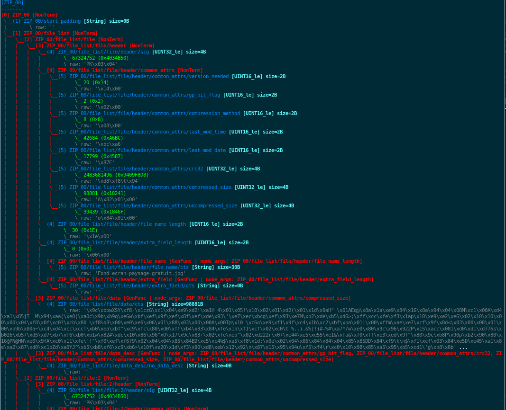

Tutorial
********

In this tutorial we will first see how to use the basic UI of
``fuddly``. Then we will walk through basic steps to create a new data
model and the way to define specific disruptors, and finally we will
see how to use ``fuddly`` directly from an advanced python interpreter
like ``ipython``.

Using ``fuddly`` simple UI: ``FuzzShell``
=========================================

A simple UI---called FuzzShell---allows to interact with fuddly in an
easy way. In this tutorial we present the usual commands that can be
used during a fuzzing session. But first we have to launch it by
running the ``./client.py`` script.

.. note::
   This script basically does the following:

   .. code-block:: python
      :linenos:

       fuzzer = Fuzzer()
       shell = FuzzShell("FuzzShell", fuzzer)
       shell.cmdloop()

.. _tuto:start-fuzzshell:

Start a Fuzzing Session
-----------------------

After running this script you should be prompted with something like
this:

.. code-block:: none
   :linenos:
   :emphasize-lines: 10

   ...
   >>> Look for Data Models within 'data_models/file_formats' directory
   *** Loaded Data Model: 'png' ***
   *** Loaded Data Model: 'jpg' ***
   *** Loaded Data Model: 'pdf' ***
   *** Loaded Data Model: 'zip' ***

   -=[ FuzzShell ]=- (with Fuzzer FmK 0.18)

   >>

.. note:: The ``help`` command shows you every defined command within
   ``FuzzShell``. You can also look at a brief command description and
   syntax by typing ``help <command_name>``

You can first list the available data models:

.. code-block:: none
   :linenos:
   :emphasize-lines: 1

   >> show_data_models

   -=[ Data Models ]=-

   [0] example
   [1] usb
   [2] png
   [3] jpg
   [4] pdf
   [5] zip

Let's say you want to perform ZIP fuzzing. You can select this data
model thanks to the following command:

.. code-block:: none
   :linenos:
   :emphasize-lines: 1

   >> use_data_model zip

Now, you want to choose the target to fuzz among the defined ones:

.. code-block:: none
   :linenos:
   :emphasize-lines: 1

   >> show_targets

   -=[ Available Targets ]=-

   [0] EmptyTarget
   [1] LocalTarget [Program: unzip]

By default, the ``EmptyTarget`` is selected in order to let you
experiment without a real target. But let's say you want to fuzz the
``unzip`` program. You first have to select it, then you can go on
with your fuzzing session:

.. code-block:: none
   :linenos:
   :emphasize-lines: 1

   >> set_target 1

   >> enable_fuzzing
   *** Logger is started
   *** Target initialization
   *** Monitor is started

   *** [ Fuzz delay = 0 ] ***
   *** [ Number of data sent in burst = 1 ] ***
   *** [ Target health-check timeout = 10 ] ***
   >> 

.. seealso::

   In order to define new targets, look at :ref:`targets-def`.

.. seealso::
   
   ``Target`` (\ :class:`fuzzfmk.target.Target`) configuration cannot be changed within ``FuzzShell``, but you
   can do it through any python interpreter, by directly manipulating
   the related ``Target`` object. Look at :ref:`fuddly-advanced`.

.. note::

   If you already know the data model and the target to use, you can
   directly launch your session thanks to the command
   ``enable_data_model``. The previous commands collapse then to
   ``enable_data_model zip 1``.

We see that internal parameters take default values, namely:

- The fuzzing delay, which allows you to set a minimum delay between
  two data emission. (Can be changed through the command
  ``set_delay``).

- The maximum number of data that will be sent in burst, thus
  ignoring the fuzzing delay. (Can be changed through the command
  ``set_burst``)

- The timeout value for checking target's health. (Can be changed
  through the command ``set_timeout``)

Send malformed ZIP files to the target (manually)
-------------------------------------------------

How to send a ZIP file
++++++++++++++++++++++

In order to send a ZIP file to the target, type the following::

>> send ZIP

which will invoke the ``unzip`` program with a ZIP file:

.. code-block:: none

   __ setup generator 'g_zip' __

   ========[ 1 ]==[ 18/08/2015 - 19:24:34 ]=======================
   ### Target ack received at: None
   ### Fuzzing (step 1):
    |- generator type: ZIP | generator name: g_zip | User input: G=[ ], S=[ ]
   ### Data size: 47360 bytes
   ### Emitted data is stored in the file:
   /home/test/Tools/fuddly/exported_data/zip/2015_08_18_192434_00.zip
   ### Target Feedback:
   ...
   >> 

Note that a :class:`fuzzfmk.data_model.DataModel` can define any number of data
types---to model for instance the various atoms within a data format,
or to represent some specific use cases, ...

When a data model is loaded, a dynamic `generator` is built for each
data types registered within this data model. A generator is the basic
block for generating data. In our case, let us consult the generators
available for the ZIP data model:

.. code-block:: none
   :emphasize-lines: 1

   >> show_generators

   -=[ SPECIFIC GENERATORS ]=-

   *** Available generators of type 'ZIP' ***
     name: g_zip (weight: 1, valid: True)
     generic args: 
       |_ random
       |      | desc: make the data model random
       |      | default: False [type: bool]
       |_ determinist
       |      | desc: make the data model determinist
       |      | default: False [type: bool]
       |_ finite
       |      | desc: make the data model finite
       |      | default: False [type: bool]

   *** Available generators of type 'ZIP_00' ***
     name: g_zip_00 (weight: 1, valid: True)
     generic args: 
       |_ random
       |      | desc: make the data model random
       |      | default: False [type: bool]
       |_ determinist
       |      | desc: make the data model determinist
       |      | default: False [type: bool]
       |_ finite
       |      | desc: make the data model finite
       |      | default: False [type: bool]

   ...

You can see that two generators are available for this data model. In
this case---the ZIP data model---the first one will generate modeled
ZIP archive based uniquely on the data model, whereas the other ones
(``ZIP_00``, ``ZIP_01``, ...)  generate modeled ZIP archives based on
the sample files available within the directory
``imported_data/zip/``.

For each one of these generators, some parameters are associated:

- ``random``: Enforce the generator to generate data in a
  random way;

- ``determinist``: Enforce the generator to generate data in a
  deterministic way;

- ``finite``: Enforce the generator to generate a finite number
  of data.

To send in a loop, five ZIP archives generated from the data model in
a deterministic way---that is by walking through the data model---you
can use the following command:

.. code-block:: none

   >> send_loop 5 ZIP<determinist=True> tWALK

We use for this example, the generic disruptor ``tWALK`` whose purpose
is to simply walk through the data model.  Note that disruptors are
chainable, each one consuming what comes from the left.

.. _tuto:dmaker-chain:

How to perform automatic modification on data
+++++++++++++++++++++++++++++++++++++++++++++

In order to perform modification on a generated data, you can use
`disruptors` (look at :ref:`dis:generic-disruptors`), which are the
basic blocks for this task. You can look at the available
disruptors---either specific to the data model or generic--by typing
the command ``show_disruptors``, which will print a brief description
of each disruptor along with their parameters.

.. note::

   The following command allows to briefly look at all the defined
   generators and disruptors (called data makers), usable within the
   frame of the current data model. Note that specific data makers are
   separated from the generic ones by ``...``.

   .. code-block:: none
      :emphasize-lines: 1

      >> show_dmaker_types

      ==[ Generator types ]=====
      ZIP | ZIP_00 | ... | 

      ==[ Disruptor types ]========
      ... | ALT | C | Cp | EXT | SIZE | STRUCT | tALT | tTERM | tTYPE | tWALK |

You can also chain disruptors in order to perform advanced
transformations---kind of dataflow programming. You can mix
generic/specific stateless/stateful disruptors, fuddly will take care
of sequencing everything correctly.

Let's illustrate this with the following example:

.. code-block:: none
   :name: dis-chain-run1
   :linenos:
   :emphasize-lines: 1,16,19,25,30

   >> send ZIP_00 C(nb=2:path="ZIP_00/file_list/.*/file_name") tTYPE<max_steps=50>(order=True) SIZE(sz=256)

   __ setup generator 'g_zip_00' __
   __ setup disruptor 'd_corrupt_node_bits' __
   __ cleanup disruptor 'd_fuzz_typed_nodes' __
   __ setup disruptor 'd_fuzz_typed_nodes' __
   __ setup disruptor 'd_max_size' __

   ========[ 1 ]==[ 20/08/2015 - 15:20:06 ]=======================
   ### Target ack received at: None
   ### Fuzzing (step 1):
    |- generator type: ZIP_00 | generator name: g_zip_00 | User input: G=[ ], S=[ ]
   ### Fuzzing (step 2):
    |- disruptor type: C | disruptor name: d_corrupt_node_bits | User input: G=[ ], S=[nb=2,path='ZIP_00/file_list/.*/file_name']
    |- data info:
       |_ current fuzzed node: ZIP_00/file_list/file:3/header/file_name/cts
       |_ orig data: b'photo-photo-paysage-norvege.png'
       |_ corrupted data: b'photo-\xf8hoto-paysage-norvege.png'
       |_ current fuzzed node: ZIP_00/file_list/file:2/header/file_name/cts
       |_ orig data: b'hello.pdf'
       |_ corrupted data: b'hello.pd\xf6'
   ### Fuzzing (step 3):
    |- disruptor type: tTYPE | disruptor name: d_fuzz_typed_nodes | User input: G=[max_steps=50], S=[order=True]
    |- data info:
       |_ model walking index: 1
       |_  |_ run: 1 / -1 (max)
       |_ current fuzzed node:     ZIP_00/file_list/file/header/common_attrs/version_needed
       |_  |_ value type:         <fuzzfmk.value_types.Fuzzy_INT16 object at 0x7fbf961e5250>
       |_  |_ original node value: b'1400' (ascii: b'\x14\x00')
       |_  |_ corrupt node value:  b'1300' (ascii: b'\x13\x00')
   ### Fuzzing (step 4):
    |- disruptor type: SIZE | disruptor name: d_max_size | User input: G=[ ], S=[sz=256]
    |- data info:
       |_ orig node length: 1054002
       |_ right truncation
       |_ new node length: 256
   ### Data size: 256 bytes
   ### Emitted data is stored in the file:
   /home/test/Tools/fuddly/exported_data/zip/2015_08_20_152006_00.zip
   >> 

After the command is issued, fuddly will ask the generator ``ZIP_00``
to generate a modeled ZIP archive and then will provide the outcomes
to the following disruptor ``C``. At this moment, fuddly will disable
temporarily the generator, as the generated data need to be fully
consumed first.

The disruptor ``C`` will then be executed to consume the generated
data. This disruptor performs basic corruption within the modeled data
(it randomly chooses nodes of the graph-based modeled data and perform
random bit corruption on them). You can see that some parameters are
also given to it, namely: ``nb`` and ``path``. These parameters are
specific to this disruptor. The first one asks it to choose only two
nodes and the second one restrict the set of nodes thanks to a regular
expression that selects the root paths from which the terminal nodes
to corrupt can be chosen.

.. note::

   As the data model of ``fuddly`` is built on directed graphs, we
   call *paths* in ``fuddly`` the graph paths of the graph
   representing the data. For more information on fuddly data model
   refer to :ref:`data-model`.

   In order to select nodes in the graph from the root or another
   node, different criteria (syntactic & semantic) can be provided to
   ``fuddly``'s low-level primitives. One of this criteria is *paths*,
   and the syntax defined to represent paths is similar to the one of
   filesystem paths. Each path are represented by a python string,
   where node identifier are separated by ``/``'s. For instance:
   :code:`'ZIP/file_list/file:2/header'`, is a path from the root of a
   modeled ZIP archive to the *header* of its second file.

In this case we even restricted the nodes to be only the
``file_name`` nodes among all the files of the ZIP archive, as you
can see on lines 16 & 19.

.. seealso:: If you want to see an ASCII representation of the data,
             in order to grasp the way the graph is built, issue the
             command ``show_data`` after the generation process. It
             will depict something like what is presented `there
             <#zip-show-cmd>`_.

.. note:: Generic parameters are given to data makers
   (generators/disruptors) through a tuple wrapped with the characters
   ``<`` and ``>`` and separated with the character ``:``. Syntax::

     data_maker_type<param1=val1:param2=val2>

   Specific parameters are given to data makers
   (generators/disruptors) through a tuple wrapped with the characters
   ``(`` and ``)`` and separated with the character ``:``. Syntax::
   
     data_maker_type(param1=val1:param2=val2)

   Generic and specific parameters can be used together. Syntax::

     data_maker_type<param1=val1>(param2=val2:param3=val3)

After ``C`` has performed its corruption, fuddly gets the result and
provides it to ``tTYPE``. This disruptor is stateful, so it could
outputs many different data from the one provided to it. In this
specific case, it will walk the graph representing the data and
generate new samples each time it encounter a typed terminal node. In
the `previous run <#dis-chain-run1>`_, we see on line 30 that the
original value of the terminal node ``../version_needed`` (a
little-endian UINT16) has been altered to ``1300`` from the original
value ``1400``---which are the hexadecimal encoded representation of
the integer. Basically, the disruptor performed a decrement by one of
this integer. On the `next run <#dis-chain-run2>`_---line 16---you can
see that this disruptor performs an increment by one instead of. And
it will change this integer until he has no more cases---these cases
are based on the syntactic & semantic properties provided within the
ZIP data model. Afterwards, it will go on with the next node.

.. note::

   Stateless disruptors output exactly one data for each data provided
   as input.

   Stateful disruptors can output many data after being fed by only one
   data. When a stateful disruptor is called by ``fuddly``---within a
   *chain* of disruptors---every data makers on its left are
   temporarily disabled. Thus, the next time the *chain* of disruptors
   is issued, the execution will begin directly with this stateful
   disruptor. And when this one has fully consumed its input, that is,
   when it cannot output any new data and handover to ``fuddly``, the
   latter will re-enable the nearest left-side stateful disruptors
   that can provide new data, or the generator otherwise.

.. seealso:: About *model walking* infrastructure of ``fuddly`` refer to
             :ref:`tuto:disruptors`. Insights about how it deals with
             non-terminal changing nodes is provided.

About the parameters given to ``tTYPE``, the generic one
``max_steps=50`` requests this disruptor to stop producing new data
after a maximum of 50 for a unique input. The specific one
``order=True`` request it to strictly follow the data structure for
producing its outcomes. Whether the order is set to ``False`` (or not
given, as ``False`` is its default), the traversal to the data
structure will be guided by other criteria depending on properties
specified within the data model, especially the fuzz weight
attribute that can be changed on any node and which defaults to 1. The
bigger the value the higher the priority to be altered.

.. note:: To consult the help of a specific disruptor you can issue
          the command ``show_disruptors <DISRUPTOR_TYPE>``

Finally, every data produced by ``tTYPE`` is given to the stateless
disruptor ``SIZE`` whose purpose is to truncate the data if its size
exceeds 256---as the parameter ``sz`` is equal to 256.

.. code-block:: none
   :name: dis-chain-run2
   :linenos:
   :emphasize-lines: 1,5-7,11,16,17-18

   >> send ZIP_00 C(nb=2:path="$ZIP/file_list.*") tTYPE<max_steps=50>(order=True) SIZE(sz=256)

   ========[ 2 ]==[ 20/08/2015 - 15:20:08 ]=======================
   ### Target ack received at: None
   ### Initial Generator (currently disabled):
    |- generator type: ZIP_00 | generator name: g_zip_00 | User input: G=[ ], S=[ ]
     ...
   ### Fuzzing (step 1):
    |- disruptor type: tTYPE | disruptor name: d_fuzz_typed_nodes | User input: G=[max_steps=50], S=[order=True]
    |- data info:
       |_ model walking index: 2
       |_  |_ run: 2 / -1 (max)
       |_ current fuzzed node:     ZIP_00/file_list/file/header/common_attrs/version_needed
       |_  |_ value type:         <fuzzfmk.value_types.Fuzzy_INT16 object at 0x7fbf961e5250>
       |_  |_ original node value: b'1400' (ascii: b'\x14\x00')
       |_  |_ corrupt node value:  b'1500' (ascii: b'\x15\x00')
       |_ Data maker [#1] of type 'ZIP_00' (name: g_zip_00) has been disabled by this disruptor taking over it.
       |_ Data maker [#2] of type 'C' (name: d_corrupt_node_bits) has been disabled by this disruptor taking over it.
   ### Fuzzing (step 2):
    |- disruptor type: SIZE | disruptor name: d_max_size | User input: G=[ ], S=[sz=256]
    |- data info:
       |_ orig node length: 1054002
       |_ right truncation
       |_ new node length: 256
   ### Data size: 256 bytes
   ### Emitted data is stored in the file:
   /home/test/Tools/fuddly/exported_data/zip/2015_08_20_152008_00.zip
   >>

On this `second command execution <#dis-chain-run2>`_ you can see on
lines 17-18 that the generator ``ZIP_00`` and the disruptor ``C`` have
been disabled as explained before.

.. code-block:: none
   :name: dis-chain-run50
   :linenos:
   :emphasize-lines: 2, 4-6, 31-32

   ...
   ========[ 50 ]==[ 20/08/2015 - 15:20:11 ]=======================
   ### Target ack received at: None
   ### Initial Generator (currently disabled):
    |- generator type: ZIP_00 | generator name: g_zip_00 | User input: G=[ ], S=[ ]
     ...
   ### Fuzzing (step 1):
    |- disruptor type: tTYPE | disruptor name: d_fuzz_typed_nodes | User input: G=[max_steps=50], S=[order=True]
    |- data info:
       |_ model walking index: 50
       |_  |_ run: 6 / -1 (max)
       |_ current fuzzed node:     ZIP_00/file_list/file/header/common_attrs/uncompressed_size
       |_  |_ value type:         <fuzzfmk.value_types.Fuzzy_INT32 object at 0x7fbfec9e9048>
       |_  |_ original node value: b'6f840100' (ascii: b'o\x84\x01\x00')
       |_  |_ corrupt node value:  b'00000080' (ascii: b'\x00\x00\x00\x80')
       |_ Data maker [#1] of type 'ZIP_00' (name: g_zip_00) has been disabled by this disruptor taking over it.
       |_ Data maker [#2] of type 'C' (name: d_corrupt_node_bits) has been disabled by this disruptor taking over it.
   ### Fuzzing (step 2):
    |- disruptor type: SIZE | disruptor name: d_max_size | User input: G=[ ], S=[sz=256]
    |- data info:
       |_ orig node length: 1054002
       |_ right truncation
       |_ new node length: 256
   ### Data size: 256 bytes
   ### Emitted data is stored in the file:
   /home/test/Tools/fuddly/exported_data/zip/2015_08_20_152011_15.zip
   __ disruptor handover 'd_fuzz_typed_nodes' __
   -------------------
   | ERROR / WARNING |
   -------------------
       (_ FMK [#DataUnusable]: The data maker (tTYPE) has returned unusable data. _)
       (_ FMK [#HandOver]: Disruptor 'd_fuzz_typed_nodes' (tTYPE) has handed over! _)
   >> 

If you go on issuing the same command, you will arrive at a point
where ``tTYPE`` stops producing new data as seen `above
<#dis-chain-run50>`_ on lines 31 & 32. Thus, if you go on, this time
the generator will be re-enabled to produce new data as well as the
disruptor ``C``, as seen `below <#dis-chain-run51>`_ on line 3 & 5.

.. code-block:: none
   :name: dis-chain-run51
   :linenos:
   :emphasize-lines: 1, 3, 5

   ========[ 51 ]==[ 20/08/2015 - 15:26:19 ]=======================
   ### Target ack received at: None
   ### Fuzzing (step 1):
    |- generator type: ZIP_00 | generator name: g_zip_00 | User input: G=[ ], S=[ ]
   ### Fuzzing (step 2):
    |- disruptor type: C | disruptor name: d_corrupt_node_bits | User input: G=[ ], S=[nb=2,path='ZIP_00/file_list/.*/file_name']
    |- data info:
       |_ current fuzzed node: ZIP_00/file_list/file:2/header/file_name/cts
       |_ orig data: b'hello.pdf'
       |_ corrupted data: b'hello\xafpdf'
       |_ current fuzzed node: ZIP_00/file_list/file/header/file_name/cts
       |_ orig data: b'Fond-ecran-paysage-gratuit.jpg'
       |_ corrupted data: b'Fond-ecran-paysage\xafgratuit.jpg'
   ### Fuzzing (step 3):
    |- disruptor type: tTYPE | disruptor name: d_fuzz_typed_nodes | User input: G=[max_steps=50], S=[order=True]
    |- data info:
       |_ model walking index: 1
       |_  |_ run: 1 / -1 (max)
       |_ current fuzzed node:     ZIP_00/file_list/file/header/common_attrs/version_needed
       |_  |_ value type:         <fuzzfmk.value_types.Fuzzy_INT16 object at 0x7fbfec9895f8>
       |_  |_ original node value: b'1400' (ascii: b'\x14\x00')
       |_  |_ corrupt node value:  b'1300' (ascii: b'\x13\x00')
   ### Fuzzing (step 4):
    |- disruptor type: SIZE | disruptor name: d_max_size | User input: G=[ ], S=[sz=256]
    |- data info:
       |_ orig node length: 1054002
       |_ right truncation
       |_ new node length: 256
   ### Data size: 256 bytes
   ### Emitted data is stored in the file:
   /home/test/Tools/fuddly/exported_data/zip/2015_08_20_152619_00.zip

Last, to avoid re-issuing the same command for each time you
want to send a new data, you can use the ``send_loop`` command as
follows::

  >> send_loop <NB> ZIP_00 C(nb=2:path="ZIP_00/file_list/.*") tTYPE<max_steps=50>(order=True) SIZE(sz=256)

where ``<NB>`` shall be replaced by the maximum number of iteration
you want before fuddly return to the prompt. Note that it is a
maximum; in our case it will stop at the 50 :sup:`th` run because of
``tTYPE``.

Resetting & Cloning Disruptors
++++++++++++++++++++++++++++++

Whether you want to use generators or disruptors that you previously
use in a *data maker chain*, you would certainly need to reset it or
clone it. Indeed, every data maker has an internal sequencing state,
that remember if it has been disabled (and for generators it also
keeps the *seeds*). Thus, if you want to reuse it, one way is to reset
it by issuing the following command::

  >> reset_dmaker <dmaker_type>

where ``<dmaker_type>`` is the data maker to reset, for instance:
``ZIP_00``, ``tTYPE``, ...

Another way that can reveal itself to be useful (especially within
:class:`fuzzfmk.tactics_helper.Operator`--- refer to
:ref:`tuto:operator`) is to clone a data maker. By doing so, you have
a new independent data maker that can be used in another *data maker
chain*. To create a clone, just add ``#ID`` (where ``ID`` shall be
replaced by a string up to 20 alphanumeric characters or underscore)
to an existing data maker. For instance, issuing the following command,
after having issuing the commands from the section
:ref:`tuto:dmaker-chain`, won't alter anything regarding the state of
the cloned data makers::

  >> send ZIP_00#new tTYPE#new

.. todo:: Tackle *data seeds* topic, useful for replays (as an
          alternative to replay commands that may consume lots of
          memory).

Reloading Data Models / Targets / ...
+++++++++++++++++++++++++++++++++++++

If during a test session you want to perform a modification within the
data model without restarting ``fuddly``, you can simply edit the data
model with your favorite editor, and after saving it, issue the
command ``reload_data_model`` at the ``FuzzShell`` prompt.

If you also want to modify the target abstraction or operators or
probes, ..., you have to reload every fuddly subsystem. To do so, you
only need to issue the command ``reload_all``.

Now, imagine that you want to switch to a new target already
registered, simply issue the command ``reload_all <target_id>``, where
``<target_id>`` is picked up through the IDs displayed by the command
``show_targets``

Finally, if you want to switch to a new data model while a data model
is already loaded, simply issue the command ``enable_data_model
<data_model_name>`` to let fuddly do the job for you.

Use an Operator to send malformed data
--------------------------------------

``Operators`` (\ :class:`fuzzfmk.tactics_helper.Operator`) are useful
to automate the fuzzing process, that is to automatically collect
target feedback when its worth it, to automatically save test cases
that affect the target and to automatically decide on the following
steps based on thoughtful criteria.

Let's take the example of an already defined operator that
targets programs handling JPG files.

.. seealso:: To define your own operators refer to
             :ref:`tuto:operator`.

First, we need to load the JPG data model and select a target we want
to fuzz, for instance the ``display`` program. You can do it in one
line by issuing the following command::

  >> enable_data_model jpg 1

The last parameter is the identifier of the target. It's a shortcut to
what have been presented in section :ref:`tuto:start-fuzzshell`. If
you issue the command ``show_targets`` you will notice the enabled
target as it is highlighted in the console, like you can see in the
figure `bellow <#target-enabled>`_.

.. _target-enabled:
.. figure::  images/target_enabled.png
   :align:   center

Then, you can look at the available operators and learn about their
parameters by issuing the command::

  >> show_operators

This command will display the `following <#operator-show>`_:

.. _operator-show:
.. figure::  images/operator_show.png
   :align:   center

To launch the operator ``Op1`` and limit to 5 the number of test cases to
run, issue the command::

  >> launch_operator Op1<max_steps=5>

This will trigger the Operator that will execute the ``display``
program with the first generated JPG file. It will look at ``stdout``
and ``stderr`` for error messages, or look for any crashes, and if
such a situation occurs, will save the related JPG file under
``exported_data/jpg/`` and log everything under ``trace/``. It will
also try to avoid saving JPG files that trigger errors whose type has
already been seen. Once the operator is all done with this first test
case, it can plan the next actions it needs ``fuddly`` to perform for
it. In our case, it will go on with the next iteration of a disruptor
chain, basically ``JPG<finite=True> tTYPE``.

Implementing a Data Model and Defining the Associated Fuzzing Environment
=========================================================================

Assuming we want to model an imaginary data format called `myDF`.  Two
files need to be created within ``<root of
fuddly>/data_models/[file_formats|protocol]``:

  - ``mydf.py``
  - ``mydf_strategy.py``

.. note:: Within the file names, ``mydf`` is not really important. However,
   what is important is to use the same prefix for these two
   files, and to conform to the template.

.. _data-model:

Data Modeling
-------------

Overview
++++++++

Defining the Imaginary myDF Data Model
++++++++++++++++++++++++++++++++++++++

.. note:: The implementation of the data model shall reside within
          ``mydf.py``.

.. code-block:: python
   :linenos:

   from fuzzfmk.data_model import *
   from fuzzfmk.value_types import *
   from fuzzfmk.data_model_helpers import *

   class MyDF_DataModel(DataModel):

      file_extension = 'myd'
      name = 'mydf_overload_iyw'

      def dissect(self, data, idx):
         ''' PUT YOUR CODE HERE '''
	 

      def build_data_model(self):
         ''' PUT YOUR CODE HERE '''

   data_model = MyDF_DataModel()

You first need to define a class that inherits from the :class:`fuzzfmk.data_model.DataModel` class.

Visualization of a Data Issued From a Data Model
++++++++++++++++++++++++++++++++++++++++++++++++

.. _zip-show-cmd:

.. todo:: Explain data paths, and how it is used within fuddly (like
          unix file paths)

Initiating the Fuzzing Environment
----------------------------------

.. note:: Defined within ``mydf_strategy.py``

.. code-block:: python
   :linenos:

   from fuzzfmk.plumbing import *
   from fuzzfmk.tactics_helper import *

   tactics = Tactics()

.. _targets-def:

Defining the Targets
--------------------

Generic Targets
+++++++++++++++

Specific Targets
++++++++++++++++

Defining the Logger
-------------------

.. _tuto:disruptors:

Defining Specific Disruptors
----------------------------

.. note:: Also look at :ref:`useful-examples`

.. todo:: Present the ModelWalker class

.. _tuto:operator:

Defining Operators and Probes
-----------------------------

In order to automatize what a human operator could perform to interact
with one or more targets, the abstracted class
:class:`fuzzfmk.tactics_helper.Operator` can be inherited. The purpose
of this class is to give you the opportunity to plan the operations
you want to perform on the target (data type to send, type of
modifications to perform on data before sending it, and so on). Thus,
you could embeds all the protocol logic to be able to adapt the
fuzzing strategy based on various criteria---{\em e.g.}, monitoring
feedback, operator choices, and so on. By default, the operator is
recalled after each data emission to the target, but it can also
provide to fuddly a batch of instructions, that will be executed prior
to its recall. You have also the ability to stimulate the target
through its different I/O interfaces in parallel, while each of the
inputs followed a specific protocol. Obviously, a monitoring
infrastructure is available to support you during the decision
process.

.. seealso:: The monitoring infrastructure enables the creation of
             independent probes to watch or measure any kinds of
             parameters linked to the target or anything else. Refer
             to :ref:`tuto:probes` to learn how to create them.

.. seealso:: To implement complex protocol logic, using a state
             machine library as `toysm
             <https://github.com/willakat/toysm>`_ can be helpful.

Operators
+++++++++

.. _tuto:probes:

Probes & The Monitoring Subsystem
+++++++++++++++++++++++++++++++++

.. _fuddly-advanced:

Using `fuddly` Through Advanced Python Interpreter
==================================================
