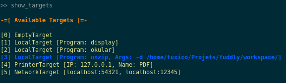
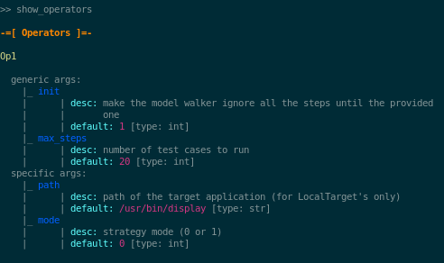
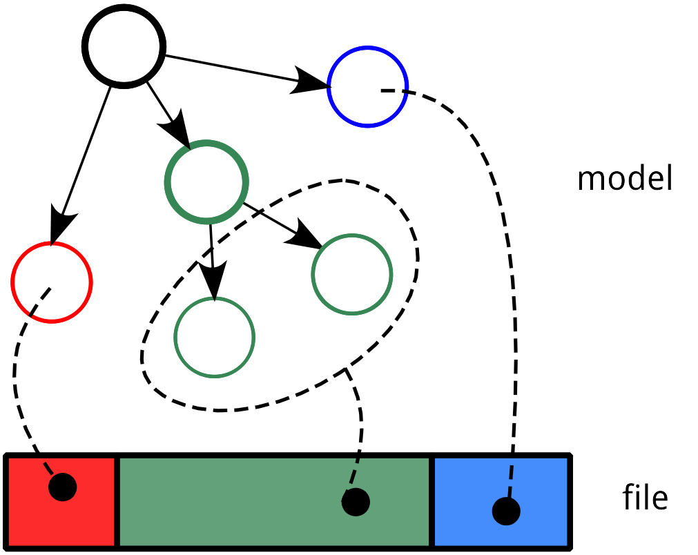
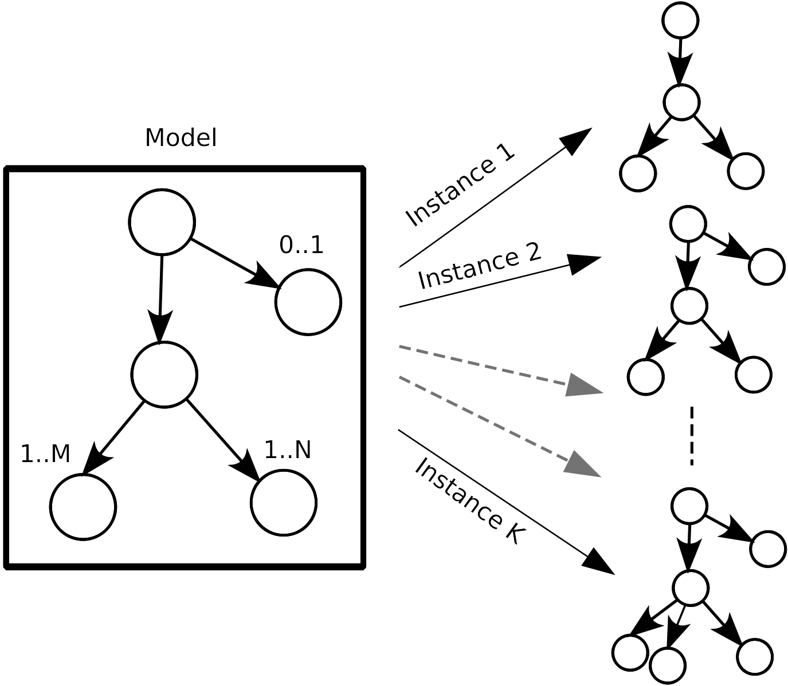
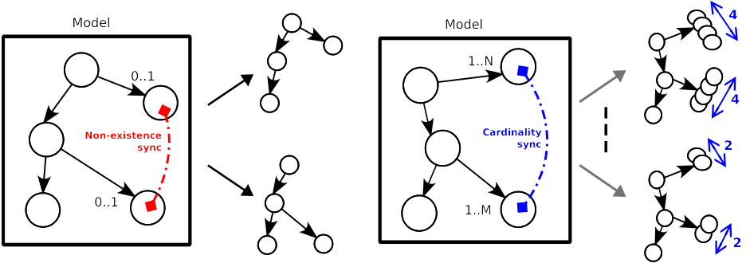
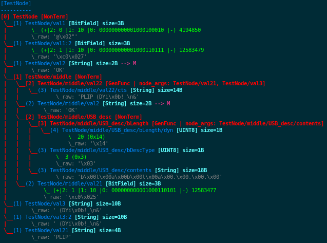

Tutorial
********

In this tutorial we will first see how to use the basic UI of
``fuddly``. Then we will walk through basic steps to create a new data
model and the way to define specific disruptors, and finally we will
see how to use ``fuddly`` directly from an advanced python interpreter
like ``ipython``.

Using ``fuddly`` simple UI: ``FuzzShell``
=========================================

A simple UI---called FuzzShell---allows to interact with ``fuddly`` in
an easy way. In this tutorial we present the usual commands that can
be used during a fuzzing session. But first we have to launch it by
running the ``./client.py`` script.

.. note::
   This script basically does the following:

   .. code-block:: python
      :linenos:

       fuzzer = Fuzzer()
       shell = FuzzShell("FuzzShell", fuzzer)
       shell.cmdloop()

.. _tuto:start-fuzzshell:

Start a Fuzzing Session
-----------------------

After running this script you should be prompted with something like
this:

.. code-block:: none
   :linenos:
   :emphasize-lines: 10

   ...
   >>> Look for Data Models within 'data_models/file_formats' directory
   *** Loaded Data Model: 'png' ***
   *** Loaded Data Model: 'jpg' ***
   *** Loaded Data Model: 'pdf' ***
   *** Loaded Data Model: 'zip' ***

   -=[ FuzzShell ]=- (with Fuzzer FmK 0.18)

   >>

.. note:: The ``help`` command shows you every defined command within
   ``FuzzShell``. You can also look at a brief command description and
   syntax by typing ``help <command_name>``

You can first list the available data models:

.. code-block:: none
   :linenos:
   :emphasize-lines: 1

   >> show_data_models

   -=[ Data Models ]=-

   [0] example
   [1] usb
   [2] png
   [3] jpg
   [4] pdf
   [5] zip

Let's say you want to perform ZIP fuzzing. You can select this data
model thanks to the following command:

.. code-block:: none
   :linenos:
   :emphasize-lines: 1

   >> use_data_model zip

Now, you want to choose the target to fuzz among the defined ones:

.. code-block:: none
   :linenos:
   :emphasize-lines: 1

   >> show_targets

   -=[ Available Targets ]=-

   [0] EmptyTarget
   [1] LocalTarget [Program: unzip]

By default, the ``EmptyTarget`` is selected in order to let you
experiment without a real target. But let's say you want to fuzz the
``unzip`` program. You first have to select it, then you can go on
with your fuzzing session:

.. code-block:: none
   :linenos:
   :emphasize-lines: 1

   >> set_target 1

   >> enable_fuzzing
   *** Logger is started
   *** Target initialization
   *** Monitor is started

   *** [ Fuzz delay = 0 ] ***
   *** [ Number of data sent in burst = 1 ] ***
   *** [ Target health-check timeout = 10 ] ***
   >> 

.. seealso::

   In order to define new targets, look at :ref:`targets-def`.

.. seealso::
   
   ``Target`` (\ :class:`fuzzfmk.target.Target`) configuration cannot be changed within ``FuzzShell``, but you
   can do it through any python interpreter, by directly manipulating
   the related ``Target`` object. Look at :ref:`fuddly-advanced`.

.. note::

   If you already know the data model and the target to use, you can
   directly launch your session thanks to the command
   ``enable_data_model``. The previous commands collapse then to
   ``enable_data_model zip 1``.

We see that internal parameters take default values, namely:

- The fuzzing delay, which allows you to set a minimum delay between
  two data emission. (Can be changed through the command
  ``set_delay``).

- The maximum number of data that will be sent in burst, thus
  ignoring the fuzzing delay. (Can be changed through the command
  ``set_burst``)

- The timeout value for checking target's health. (Can be changed
  through the command ``set_timeout``)

Send malformed ZIP files to the target (manually)
-------------------------------------------------

How to send a ZIP file
++++++++++++++++++++++

In order to send a ZIP file to the target, type the following::

>> send ZIP

which will invoke the ``unzip`` program with a ZIP file:

.. code-block:: none

   __ setup generator 'g_zip' __

   ========[ 1 ]==[ 18/08/2015 - 19:24:34 ]=======================
   ### Target ack received at: None
   ### Fuzzing (step 1):
    |- generator type: ZIP | generator name: g_zip | User input: G=[ ], S=[ ]
   ### Data size: 47360 bytes
   ### Emitted data is stored in the file:
   /home/test/Tools/fuddly/exported_data/zip/2015_08_18_192434_00.zip
   ### Target Feedback:
   ...
   >> 

Note that a :class:`fuzzfmk.data_model_helpers.DataModel` can define any number of data
types---to model for instance the various atoms within a data format,
or to represent some specific use cases, ...

When a data model is loaded, a dynamic `generator` is built for each
data types registered within this data model. A generator is the basic
block for generating data. In our case, let us consult the generators
available for the ZIP data model:

.. code-block:: none
   :emphasize-lines: 1

   >> show_generators

   -=[ SPECIFIC GENERATORS ]=-

   *** Available generators of type 'ZIP' ***
     name: g_zip (weight: 1, valid: True)
     generic args: 
       |_ random
       |      | desc: make the data model random
       |      | default: False [type: bool]
       |_ determinist
       |      | desc: make the data model determinist
       |      | default: False [type: bool]
       |_ finite
       |      | desc: make the data model finite
       |      | default: False [type: bool]

   *** Available generators of type 'ZIP_00' ***
     name: g_zip_00 (weight: 1, valid: True)
     generic args: 
       |_ random
       |      | desc: make the data model random
       |      | default: False [type: bool]
       |_ determinist
       |      | desc: make the data model determinist
       |      | default: False [type: bool]
       |_ finite
       |      | desc: make the data model finite
       |      | default: False [type: bool]

   ...

You can see that two generators are available for this data model. In
this case---the ZIP data model---the first one will generate modeled
ZIP archive based uniquely on the data model, whereas the other ones
(``ZIP_00``, ``ZIP_01``, ...)  generate modeled ZIP archives based on
the sample files available within the directory
``imported_data/zip/``.

For each one of these generators, some parameters are associated:

- ``random``: Enforce the generator to generate data in a
  random way;

- ``determinist``: Enforce the generator to generate data in a
  deterministic way;

- ``finite``: Enforce the generator to generate a finite number
  of data.

To send in a loop, five ZIP archives generated from the data model in
a deterministic way---that is by walking through the data model---you
can use the following command:

.. code-block:: none

   >> send_loop 5 ZIP<determinist=True> tWALK

We use for this example, the generic disruptor ``tWALK`` whose purpose
is to simply walk through the data model.  Note that disruptors are
chainable, each one consuming what comes from the left.

.. _tuto:dmaker-chain:

How to perform automatic modification on data
+++++++++++++++++++++++++++++++++++++++++++++

In order to perform modification on a generated data, you can use
`disruptors` (look at :ref:`dis:generic-disruptors`), which are the
basic blocks for this task. You can look at the available
disruptors---either specific to the data model or generic--by typing
the command ``show_disruptors``, which will print a brief description
of each disruptor along with their parameters.

.. note::

   The following command allows to briefly look at all the defined
   generators and disruptors (called data makers), usable within the
   frame of the current data model. Note that specific data makers are
   separated from the generic ones by ``...``.

   .. code-block:: none
      :emphasize-lines: 1

      >> show_dmaker_types

      ==[ Generator types ]=====
      ZIP | ZIP_00 | ... | 

      ==[ Disruptor types ]========
      ... | ALT | C | Cp | EXT | SIZE | STRUCT | tALT | tTERM | tTYPE | tWALK |

You can also chain disruptors in order to perform advanced
transformations---kind of dataflow programming. You can mix
generic/specific stateless/stateful disruptors, fuddly will take care
of sequencing everything correctly.

Let's illustrate this with the following example:

.. code-block:: none
   :name: dis-chain-run1
   :linenos:
   :emphasize-lines: 1,16,19,25,30

   >> send ZIP_00 C(nb=2:path="ZIP_00/file_list/.*/file_name") tTYPE<max_steps=50>(order=True) SIZE(sz=256)

   __ setup generator 'g_zip_00' __
   __ setup disruptor 'd_corrupt_node_bits' __
   __ cleanup disruptor 'd_fuzz_typed_nodes' __
   __ setup disruptor 'd_fuzz_typed_nodes' __
   __ setup disruptor 'd_max_size' __

   ========[ 1 ]==[ 20/08/2015 - 15:20:06 ]=======================
   ### Target ack received at: None
   ### Fuzzing (step 1):
    |- generator type: ZIP_00 | generator name: g_zip_00 | User input: G=[ ], S=[ ]
   ### Fuzzing (step 2):
    |- disruptor type: C | disruptor name: d_corrupt_node_bits | User input: G=[ ], S=[nb=2,path='ZIP_00/file_list/.*/file_name']
    |- data info:
       |_ current fuzzed node: ZIP_00/file_list/file:3/header/file_name/cts
       |_ orig data: b'photo-photo-paysage-norvege.png'
       |_ corrupted data: b'photo-\xf8hoto-paysage-norvege.png'
       |_ current fuzzed node: ZIP_00/file_list/file:2/header/file_name/cts
       |_ orig data: b'hello.pdf'
       |_ corrupted data: b'hello.pd\xf6'
   ### Fuzzing (step 3):
    |- disruptor type: tTYPE | disruptor name: d_fuzz_typed_nodes | User input: G=[max_steps=50], S=[order=True]
    |- data info:
       |_ model walking index: 1
       |_  |_ run: 1 / -1 (max)
       |_ current fuzzed node:     ZIP_00/file_list/file/header/common_attrs/version_needed
       |_  |_ value type:         <fuzzfmk.value_types.Fuzzy_INT16 object at 0x7fbf961e5250>
       |_  |_ original node value: b'1400' (ascii: b'\x14\x00')
       |_  |_ corrupt node value:  b'1300' (ascii: b'\x13\x00')
   ### Fuzzing (step 4):
    |- disruptor type: SIZE | disruptor name: d_max_size | User input: G=[ ], S=[sz=256]
    |- data info:
       |_ orig node length: 1054002
       |_ right truncation
       |_ new node length: 256
   ### Data size: 256 bytes
   ### Emitted data is stored in the file:
   /home/test/Tools/fuddly/exported_data/zip/2015_08_20_152006_00.zip
   >> 

After the command is issued, fuddly will ask the generator ``ZIP_00``
to generate a modeled ZIP archive and then will provide the outcomes
to the following disruptor ``C``. At this moment, fuddly will disable
temporarily the generator, as the generated data need to be fully
consumed first.

The disruptor ``C`` will then be executed to consume the generated
data. This disruptor performs basic corruption within the modeled data
(it randomly chooses nodes of the graph-based modeled data and perform
random bit corruption on them). You can see that some parameters are
also given to it, namely: ``nb`` and ``path``. These parameters are
specific to this disruptor. The first one asks it to choose only two
nodes and the second one restrict the set of nodes thanks to a regular
expression that selects the root paths from which the terminal nodes
to corrupt can be chosen.

.. note::

   As the data model of ``fuddly`` is built on directed graphs, we
   call *paths* in ``fuddly`` the graph paths of the graph
   representing the data. For more information on fuddly data model
   refer to :ref:`data-model`.

   In order to select nodes in the graph from the root or another
   node, different criteria (syntactic & semantic) can be provided to
   ``fuddly``'s low-level primitives. One of this criteria is *paths*,
   and the syntax defined to represent paths is similar to the one of
   filesystem paths. Each path are represented by a python string,
   where node identifier are separated by ``/``'s. For instance:
   :code:`'ZIP/file_list/file:2/header'`, is a path from the root of a
   modeled ZIP archive to the *header* of its second file.

In this case we even restricted the nodes to be only the
``file_name`` nodes among all the files of the ZIP archive, as you
can see on lines 16 & 19.

.. seealso:: If you want to see an ASCII representation of the data,
             in order to grasp the way the graph is built, issue the
             command ``show_data`` after the generation process. It
             will depict something like what is presented `hereunder
             <#zip-show-cmd>`_.

	     .. _zip-show-cmd:
	     .. figure::  images/zip_show.png
		:align:   center
		:scale: 60%

.. note:: Generic parameters are given to data makers
   (generators/disruptors) through a tuple wrapped with the characters
   ``<`` and ``>`` and separated with the character ``:``. Syntax::

     data_maker_type<param1=val1:param2=val2>

   Specific parameters are given to data makers
   (generators/disruptors) through a tuple wrapped with the characters
   ``(`` and ``)`` and separated with the character ``:``. Syntax::
   
     data_maker_type(param1=val1:param2=val2)

   Generic and specific parameters can be used together. Syntax::

     data_maker_type<param1=val1>(param2=val2:param3=val3)

After ``C`` has performed its corruption, fuddly gets the result and
provides it to ``tTYPE``. This disruptor is stateful, so it could
outputs many different data from the one provided to it. In this
specific case, it will walk the graph representing the data and
generate new samples each time it encounter a typed terminal node. In
the `previous run <#dis-chain-run1>`_, we see on line 30 that the
original value of the terminal node ``../version_needed`` (a
little-endian UINT16) has been altered to ``1300`` from the original
value ``1400``---which are the hexadecimal encoded representation of
the integer. Basically, the disruptor performed a decrement by one of
this integer. On the `next run <#dis-chain-run2>`_---line 16---you can
see that this disruptor performs an increment by one instead of. And
it will change this integer until he has no more cases---these cases
are based on the syntactic & semantic properties provided within the
ZIP data model. Afterwards, it will go on with the next node.

.. note::

   Stateless disruptors output exactly one data for each data provided
   as input.

   Stateful disruptors can output many data after being fed by only one
   data. When a stateful disruptor is called by ``fuddly``---within a
   *chain* of disruptors---every data makers on its left are
   temporarily disabled. Thus, the next time the *chain* of disruptors
   is issued, the execution will begin directly with this stateful
   disruptor. And when this one has fully consumed its input, that is,
   when it cannot output any new data and handover to ``fuddly``, the
   latter will re-enable the nearest left-side stateful disruptors
   that can provide new data, or the generator otherwise.

.. seealso:: About *model walking* infrastructure of ``fuddly`` refer to
             :ref:`tuto:disruptors`. Insights about how it deals with
             non-terminal changing nodes is provided.

About the parameters given to ``tTYPE``, the generic one
``max_steps=50`` requests this disruptor to stop producing new data
after a maximum of 50 for a unique input. The specific one
``order=True`` request it to strictly follow the data structure for
producing its outcomes. Whether the order is set to ``False`` (or not
given, as ``False`` is its default), the traversal to the data
structure will be guided by other criteria depending on properties
specified within the data model, especially the fuzz weight
attribute that can be changed on any node and which defaults to 1. The
bigger the value the higher the priority to be altered.

.. note:: To consult the help of a specific disruptor you can issue
          the command ``show_disruptors <DISRUPTOR_TYPE>``

Finally, every data produced by ``tTYPE`` is given to the stateless
disruptor ``SIZE`` whose purpose is to truncate the data if its size
exceeds 256---as the parameter ``sz`` is equal to 256.

.. code-block:: none
   :name: dis-chain-run2
   :linenos:
   :emphasize-lines: 1,5-7,11,16,17-18

   >> send ZIP_00 C(nb=2:path="$ZIP/file_list.*") tTYPE<max_steps=50>(order=True) SIZE(sz=256)

   ========[ 2 ]==[ 20/08/2015 - 15:20:08 ]=======================
   ### Target ack received at: None
   ### Initial Generator (currently disabled):
    |- generator type: ZIP_00 | generator name: g_zip_00 | User input: G=[ ], S=[ ]
     ...
   ### Fuzzing (step 1):
    |- disruptor type: tTYPE | disruptor name: d_fuzz_typed_nodes | User input: G=[max_steps=50], S=[order=True]
    |- data info:
       |_ model walking index: 2
       |_  |_ run: 2 / -1 (max)
       |_ current fuzzed node:     ZIP_00/file_list/file/header/common_attrs/version_needed
       |_  |_ value type:         <fuzzfmk.value_types.Fuzzy_INT16 object at 0x7fbf961e5250>
       |_  |_ original node value: b'1400' (ascii: b'\x14\x00')
       |_  |_ corrupt node value:  b'1500' (ascii: b'\x15\x00')
       |_ Data maker [#1] of type 'ZIP_00' (name: g_zip_00) has been disabled by this disruptor taking over it.
       |_ Data maker [#2] of type 'C' (name: d_corrupt_node_bits) has been disabled by this disruptor taking over it.
   ### Fuzzing (step 2):
    |- disruptor type: SIZE | disruptor name: d_max_size | User input: G=[ ], S=[sz=256]
    |- data info:
       |_ orig node length: 1054002
       |_ right truncation
       |_ new node length: 256
   ### Data size: 256 bytes
   ### Emitted data is stored in the file:
   /home/test/Tools/fuddly/exported_data/zip/2015_08_20_152008_00.zip
   >>

On this `second command execution <#dis-chain-run2>`_ you can see on
lines 17-18 that the generator ``ZIP_00`` and the disruptor ``C`` have
been disabled as explained before.

.. code-block:: none
   :name: dis-chain-run50
   :linenos:
   :emphasize-lines: 2, 4-6, 31-32

   ...
   ========[ 50 ]==[ 20/08/2015 - 15:20:11 ]=======================
   ### Target ack received at: None
   ### Initial Generator (currently disabled):
    |- generator type: ZIP_00 | generator name: g_zip_00 | User input: G=[ ], S=[ ]
     ...
   ### Fuzzing (step 1):
    |- disruptor type: tTYPE | disruptor name: d_fuzz_typed_nodes | User input: G=[max_steps=50], S=[order=True]
    |- data info:
       |_ model walking index: 50
       |_  |_ run: 6 / -1 (max)
       |_ current fuzzed node:     ZIP_00/file_list/file/header/common_attrs/uncompressed_size
       |_  |_ value type:         <fuzzfmk.value_types.Fuzzy_INT32 object at 0x7fbfec9e9048>
       |_  |_ original node value: b'6f840100' (ascii: b'o\x84\x01\x00')
       |_  |_ corrupt node value:  b'00000080' (ascii: b'\x00\x00\x00\x80')
       |_ Data maker [#1] of type 'ZIP_00' (name: g_zip_00) has been disabled by this disruptor taking over it.
       |_ Data maker [#2] of type 'C' (name: d_corrupt_node_bits) has been disabled by this disruptor taking over it.
   ### Fuzzing (step 2):
    |- disruptor type: SIZE | disruptor name: d_max_size | User input: G=[ ], S=[sz=256]
    |- data info:
       |_ orig node length: 1054002
       |_ right truncation
       |_ new node length: 256
   ### Data size: 256 bytes
   ### Emitted data is stored in the file:
   /home/test/Tools/fuddly/exported_data/zip/2015_08_20_152011_15.zip
   __ disruptor handover 'd_fuzz_typed_nodes' __
   -------------------
   | ERROR / WARNING |
   -------------------
       (_ FMK [#DataUnusable]: The data maker (tTYPE) has returned unusable data. _)
       (_ FMK [#HandOver]: Disruptor 'd_fuzz_typed_nodes' (tTYPE) has handed over! _)
   >> 

If you go on issuing the same command, you will arrive at a point
where ``tTYPE`` stops producing new data as seen `above
<#dis-chain-run50>`_ on lines 31 & 32. Thus, if you go on, this time
the generator will be re-enabled to produce new data as well as the
disruptor ``C``, as seen `below <#dis-chain-run51>`_ on line 3 & 5.

.. code-block:: none
   :name: dis-chain-run51
   :linenos:
   :emphasize-lines: 1, 3, 5

   ========[ 51 ]==[ 20/08/2015 - 15:26:19 ]=======================
   ### Target ack received at: None
   ### Fuzzing (step 1):
    |- generator type: ZIP_00 | generator name: g_zip_00 | User input: G=[ ], S=[ ]
   ### Fuzzing (step 2):
    |- disruptor type: C | disruptor name: d_corrupt_node_bits | User input: G=[ ], S=[nb=2,path='ZIP_00/file_list/.*/file_name']
    |- data info:
       |_ current fuzzed node: ZIP_00/file_list/file:2/header/file_name/cts
       |_ orig data: b'hello.pdf'
       |_ corrupted data: b'hello\xafpdf'
       |_ current fuzzed node: ZIP_00/file_list/file/header/file_name/cts
       |_ orig data: b'Fond-ecran-paysage-gratuit.jpg'
       |_ corrupted data: b'Fond-ecran-paysage\xafgratuit.jpg'
   ### Fuzzing (step 3):
    |- disruptor type: tTYPE | disruptor name: d_fuzz_typed_nodes | User input: G=[max_steps=50], S=[order=True]
    |- data info:
       |_ model walking index: 1
       |_  |_ run: 1 / -1 (max)
       |_ current fuzzed node:     ZIP_00/file_list/file/header/common_attrs/version_needed
       |_  |_ value type:         <fuzzfmk.value_types.Fuzzy_INT16 object at 0x7fbfec9895f8>
       |_  |_ original node value: b'1400' (ascii: b'\x14\x00')
       |_  |_ corrupt node value:  b'1300' (ascii: b'\x13\x00')
   ### Fuzzing (step 4):
    |- disruptor type: SIZE | disruptor name: d_max_size | User input: G=[ ], S=[sz=256]
    |- data info:
       |_ orig node length: 1054002
       |_ right truncation
       |_ new node length: 256
   ### Data size: 256 bytes
   ### Emitted data is stored in the file:
   /home/test/Tools/fuddly/exported_data/zip/2015_08_20_152619_00.zip

Last, to avoid re-issuing the same command for each time you
want to send a new data, you can use the ``send_loop`` command as
follows::

  >> send_loop <NB> ZIP_00 C(nb=2:path="ZIP_00/file_list/.*") tTYPE<max_steps=50>(order=True) SIZE(sz=256)

where ``<NB>`` shall be replaced by the maximum number of iteration
you want before fuddly return to the prompt. Note that it is a
maximum; in our case it will stop at the 50 :sup:`th` run because of
``tTYPE``.

Resetting & Cloning Disruptors
++++++++++++++++++++++++++++++

Whether you want to use generators or disruptors that you previously
use in a *data maker chain*, you would certainly need to reset it or
clone it. Indeed, every data maker has an internal sequencing state,
that remember if it has been disabled (and for generators it also
keeps the *seeds*). Thus, if you want to reuse it, one way is to reset
it by issuing the following command::

  >> reset_dmaker <dmaker_type>

where ``<dmaker_type>`` is the data maker to reset, for instance:
``ZIP_00``, ``tTYPE``, ...

Another way that can reveal itself to be useful (especially within
:class:`fuzzfmk.tactics_helper.Operator`--- refer to
:ref:`tuto:operator`) is to clone a data maker. By doing so, you have
a new independent data maker that can be used in another *data maker
chain*. To create a clone, just add ``#ID`` (where ``ID`` shall be
replaced by a string up to 20 alphanumeric characters or underscore)
to an existing data maker. For instance, issuing the following command,
after having issuing the commands from the section
:ref:`tuto:dmaker-chain`, won't alter anything regarding the state of
the cloned data makers::

  >> send ZIP_00#new tTYPE#new

.. todo:: Tackle *data seeds* topic, useful for replays (as an
          alternative to replay commands that may consume lots of
          memory).

Reloading Data Models / Targets / ...
+++++++++++++++++++++++++++++++++++++

If during a test session you want to perform a modification within the
data model without restarting ``fuddly``, you can simply edit the data
model with your favorite editor, and after saving it, issue the
command ``reload_data_model`` at the ``FuzzShell`` prompt.

If you also want to modify the target abstraction or operators or
probes, ..., you have to reload every fuddly subsystem. To do so, you
only need to issue the command ``reload_all``.

Now, imagine that you want to switch to a new target already
registered, simply issue the command ``reload_all <target_id>``, where
``<target_id>`` is picked up through the IDs displayed by the command
``show_targets``

Finally, if you want to switch to a new data model while a data model
is already loaded, simply issue the command ``enable_data_model
<data_model_name>`` to let fuddly do the job for you.

Use an Operator to send malformed data
--------------------------------------

``Operators`` (\ :class:`fuzzfmk.tactics_helper.Operator`) are useful
to automate the fuzzing process, that is to automatically collect
target feedback when its worth it, to automatically save test cases
that affect the target and to automatically decide on the following
steps based on thoughtful criteria.

Let's take the example of an already defined operator that
targets programs handling JPG files.

.. seealso:: To define your own operators refer to
             :ref:`tuto:operator`.

First, we need to load the JPG data model and select a target we want
to fuzz, for instance the ``display`` program. You can do it in one
line by issuing the following command::

  >> enable_data_model jpg 1

The last parameter is the identifier of the target. It's a shortcut to
what have been presented in section :ref:`tuto:start-fuzzshell`. If
you issue the command ``show_targets`` you will notice the enabled
target as it is highlighted in the console, like you can see in the
figure `bellow <#target-enabled>`_.

.. _target-enabled:

Then, you can look at the available operators and learn about their
parameters by issuing the command::

  >> show_operators

This command will display the `following <#operator-show>`_:

.. _operator-show:

To launch the operator ``Op1`` and limit to 5 the number of test cases to
run, issue the command::

  >> launch_operator Op1<max_steps=5>

This will trigger the Operator that will execute the ``display``
program with the first generated JPG file. It will look at ``stdout``
and ``stderr`` for error messages, or look for any crashes, and if
such a situation occurs, will save the related JPG file under
``exported_data/jpg/`` and log everything under ``trace/``. It will
also try to avoid saving JPG files that trigger errors whose type has
already been seen. Once the operator is all done with this first test
case, it can plan the next actions it needs ``fuddly`` to perform for
it. In our case, it will go on with the next iteration of a disruptor
chain, basically ``JPG<finite=True> tTYPE``.

Implementing a Data Model and Defining the Associated Fuzzing Environment
=========================================================================

.. _data-model:

Data Modeling
-------------

Overview
++++++++

Within fuddly data representation is performed through the description
of a directed acyclic graph whose terminal nodes describe the
different parts of a data format and the arcs---which can be of
different kinds---capture its structure. This graph includes syntactic
and semantic information of the data format. Using a graph as a data
model enables to represent various kind of data format with
flexibility. By flexibility we mean the possibility to mix accurate
representations for certain aspects with much coarser ones for
others---e.g., modeling accurately only the data parts which are
assumed to be complex to handle by the target---and a high-level of
expressiveness.

.. _dm-mapping:

   Data Representation

From this model, data can be generated (look at the figure
:ref:`dm-gen`) and existing raw data can be absorbed. This latter
operation is a projection of the existing raw data within the data
model (see the example :ref:`ex:zip-mod` and also the section
:ref:`tuto:dm-absorption`). Data generation allows to create data that
conforms to the model if we want to iteract correctly with the target,
or to create degenerate data if we want to assess target
robustness. Data absorption can allow to generate data from existing
ones if the model is not accurate enough to generate correct data by
itself; or to understand the target outputs in order to interact
correctly with it or not.

.. _dm-gen:

   Data Generation

Generating data boils down to walk the graph that model the data
format. After each traversal, a data is produced and each traversal
make the graph evolving, in a deterministic or random way depending on
your intent. Graph walking is also a way to perform node alteration on
the fly (through entities called *disruptors*).

.. seealso:: Refer to :ref:`tuto:disruptors` to learn how to perform
             modification of data generated from the model. Refer to
             :ref:`tuto:dmaker-chain` in order to play with existing
             generic disruptors within the frame of the ``fuddly``
             shell.

Different kinds of node are defined within fuddly in order to model
data:

- Terminal nodes with typed-value contents (e.g., ``UINT16``,
  ``BitField``, ``String``, ...)

- Non-terminal nodes that are used to define the data format
  structure. They put in order the different parts of a data format,
  and can even specify a grammar to express a more complex assembly.

- *Generator* nodes that are used to dynamically generate a part of
  the graph according to other nodes (from within the graph itself or
  not) and/or other criteria provided as parameters.

.. _dm-nodes:
.. figure::  images/dm_nodes.png
   :align:   center
   :scale:   60 %

   Node Types

The structure of a data format is grasped by the links between the
graph nodes. Within ``fuddly`` data model, we distinguish three kinds
of links:

- Parent-child links which define a basic structure between the graph
  nodes. They are ruled by non-terminal nodes.

- Links associated to specific criteria that condition some part of
  the graph. For instance, node generation can be associated to the
  existence of another one; different node set can be synchronized
  relatively to their cardinality.

.. _dm-constraints:

   Node Constraints

- Links defined between generator nodes and their parameter
  nodes. They are especially useful when a complex relationship exist
  between multiple nodes. The generator nodes are then used to rule
  this relationship by defining it through a function.

Additionally, for each node can be defined alternative configurations,
enabling for instance to dynamically change a terminal node in a
non-terminal node or a generator node. These configurations can be
added dynamically and switched at any times even during the graph
traversal. This feature can be leveraged to capture different facets
of a data format within the same data model; while offering the
possibility to work on only one view at a time. It can also be useful
for absorption. Indeed, this operation can require to model some part
of the data format in a way different from the one took on for the
generation. The alternative configurations enable to aggregate these
differences within the same data model.

Finally, it is also possible to associate various kind of attributes
to the nodes:

- classic ones like Mutable, Determinist, Finite, ...

- semantic ones that allows to group nodes based on some specific
  meanings (for instance a PDF page), in order to enable higher level
  data manipulation.

- user-defined ones for specifying specific semantics to the nodes to
  enable enhanced data modification.

A First Example
+++++++++++++++

In order to create a data model, ``fuddly``'s low-level primitives can
be used, or more simply the high-level infrastructure that create the
model from kind of JSON representation. For complex case, the two
approaches could be complementary. Moreover data models can also use
other data models whether the need arises.

Let's look at the following example which is a limited description of
the PNG data format:

.. code-block:: python
   :linenos:

   png_desc = \
   {'name': 'PNG_model',
    'contents': [
	{'name': 'sig',
	 'contents': String(val_list=[b'\x89PNG\r\n\x1a\n'], size=8)},
	{'name': 'chunks',
	 'qty': (2,200),
	 'contents': [
	      {'name': 'len',
	       'contents': UINT32_be()},
	      {'name': 'type',
	       'contents': String(val_list=['IHDR', 'IEND', 'IDAT', 'PLTE'], size=4)},
	      {'name': 'data_gen',
	       'type': MH.Generator,
	       'contents': lambda x: Node('data', value_type= \
					  String(size=x[0].get_raw_value())),
	       'node_args': ['len']},
	      {'name': 'crc32_gen',
	       'type': MH.Generator,
	       'contents': g_crc32,
	       'node_args': ['type', 'data_gen'],
	       'clear_attrs': [NodeInternals.Freezable]}
	 ]}
    ]}

In short, we see that the root node is ``PNG_model``, which is the
parent of the terminal node ``sig`` representing PNG file signature
(lines 4-5) and the non-terminal node ``chunks`` representing the
file's chunks (lines 6-23) [#]_. This latter node describe the PNG
file structure by defining the chunk contents in lines 9-22---in this very
simplistic data model, chunk types are not distinguished, but it can
easily be expanded---and the number of chunks allowed in
a PNG file in line 7---from 2 to 200, artificially chosen for this
example.

.. _dm:mydf:

Defining the Imaginary MyDF Data Model
++++++++++++++++++++++++++++++++++++++

Assuming we want to model an imaginary data format called `MyDF`.  Two
files need to be created within ``<root of
fuddly>/data_models/[file_formats|protocol]/``:

``mydf.py``
  Should contain the implementation of the data model related to
  ``MyDF`` data format, **which is the topic of the current section**.

``mydf_strategy.py``
  Should contain everything else that you need for your purpose
  like: targets (:ref:`targets-def`), logger (:ref:`logger-def`),
  operators & probes (:ref:`tuto:operator`), specific
  disruptors (:ref:`tuto:disruptors`).

By default, ``fuddly`` will use the prefix ``mydf`` for referencing
the data model. But it can be overloaded within the data model
definition, as it is done in the following example (in line 8) which
is a simple skeleton for ``mydf.py``:

.. code-block:: python
   :linenos:
   :emphasize-lines: 5, 8, 14

   from fuzzfmk.data_model import *
   from fuzzfmk.value_types import *
   from fuzzfmk.data_model_helpers import *

   class MyDF_DataModel(DataModel):

      file_extension = 'myd'
      name = 'overload_default_name_if_you_wish'

      def dissect(self, data, idx):
         ''' PUT YOUR CODE HERE '''
	 

      def build_data_model(self):

         # Data Type Definition
	 d1 = ...
	 d2 = ...
	 d3 = ...

	 self.register(d1, d2, d3)

   data_model = MyDF_DataModel()

.. note:: All elements discussed during this tutorial, related to the
          data model ``mydf``, are implemented within ``tuto.py`` and
          ``tuto_strategy.py``. Don't hesitate to play with what are
          defined within, Either with ``ipython`` or ``FuzzShell``
          (:ref:`tuto:start-fuzzshell`).

In this skeleton, you can notice that you have to define a class that
inherits from the :class:`fuzzfmk.data_model_helpers.DataModel` class,
as seen in line 5. The definition of the data types of a data format
will be written in python within the method
:func:`fuzzfmk.data_model_helpers.DataModel.build_data_model()`.  In
the previous listing, the data types are represented by ``d1``, ``d2``
and ``d3``. Once defined, they should be registered within the data
model, by calling
:func:`fuzzfmk.data_model_helpers.DataModel.register()` on them.

For briefly demonstrating part of fuddly features to describe data
formats, we take the following example whose only purpose is to mix
various constructions, and value types.

.. seealso:: For a more thorough description of the patterns that can
             be used to describe data formats, refer to
             :ref:`dm:patterns`

.. seealso:: For a list and description of the currently defined value
             types refer to :ref:`vt:value-types`.

.. code-block:: python
   :linenos:
   :emphasize-lines: 6, 10-14, 16, 21, 27-28, 30-32, 34-39, 44, 45-50, 54

   d1 = \
   {'name': 'TestNode',
    'contents': [

	 # block 1
	 {'section_type': MH.Ordered,
	  'duplicate_mode': MH.Copy,
	  'contents': [

	      {'contents': BitField(subfield_sizes=[21,2,1], endian=VT.BigEndian,
				    subfield_val_lists=[None, [0b10], [0,1]],
				    subfield_val_extremums=[[500, 600], None, None]),
	       'name': 'val1',
	       'qty': (1, 5)},

	      {'name': 'val2'},

	      {'name': 'middle',
	       'mode': MH.NotMutableClone,
	       'contents': [{
		   'section_type': MH.Random,
		   'contents': [

		       {'contents': String(val_list=['OK', 'KO'], size=2),
			'name': 'val2'},

		       {'name': 'val21',
			'clone': 'val1'},

		       {'name': 'USB_desc',
			'export_from': 'usb',
			'data_id': 'STR'},

		       {'type': MH.Generator,
			'contents': lambda x: Node('cts',
		                                   values=[x[0].get_flatten_value() \
                                                           + x[1].get_flatten_value()]),
			'name': 'val22',
			'node_args': [('val21', 2), 'val3']}
		   ]}]},

	      {'contents': String(max_sz = 10),
	       'name': 'val3',
	       'sync_qty_with': 'val1',
	       'alt': [
		   {'conf': 'alt1',
		    'contents': SINT8(int_list=[1,4,8])},
		   {'conf': 'alt2',
		    'contents': UINT16_be(mini=0xeeee, maxi=0xff56),
		    'determinist': True}]}
	  ]},

	 # block 2
	 {'section_type': MH.Pick,
	  'weights': (10,5),
	  'contents': [
	      {'contents': String(val_list=['PLIP', 'PLOP'], size=4),
	       'name': ('val21', 2)},

	      {'contents': SINT16_be(int_list=[-1, -3, -5, 7]),
	       'name': ('val22', 2)}
	  ]}
    ]}

At first glance, the data model is composed of two parts: *block 1*
(lines 6-50) and *block 2* (lines 53-61). Within these blocks, various
constructions are used. Below, some insights:

line 6, line 21, line 54
  The keyword ``section_type`` allows to choose the order to be
  enforce by a non-terminal node to its children. ``MH.Ordered``
  specifies that the children should be kept strictly in the order of
  the description. ``MH.Random`` specifies there is no order to
  enforce (except if the parent node has the ``determinist``
  attribute). ``MH.Pick`` specifies that only one node among the
  children should be kept at a time---the choice is randomly performed
  except if the parent has the ``determinist`` attribute---as per the
  weight associated to each child node (``weights``, line 55).

lines 10-14
  A terminal node with typed-value contents is defined. It is a
  ``BitField``. This node have an attribute ``'qty': (1,5)`` (line 14)
  which specifies that it can be present from 1 to 5 times. (Note
  that, by default, raw data absorption will also be constrained by
  this limit)

line 16
  This pattern allows to use an already defined node. In our case, it
  is the node ``val2`` specified in lines 24-25.

lines 27-28
  This pattern with the keyword ``clone`` allows to make a full copy
  of an existing node.

lines 30-32
  The keywords ``export_from`` and ``data_id`` are used for exporting
  a data type from another data model. In this case it is a ``STRING
  Descriptor`` data type from the ``USB`` data model.

lines 34-39
  Here is defined a *generator* nodes. It takes two nodes of
  the current graph as parameters, namely: ``(val21, 2)`` and
  ``val3``. It simply create a new node with a value equal to the
  contents of its node parameters.

  .. note:: The syntax ``(X, nb)``---as illustrated by ``(val21,
	    2)``---allows to use within the description the same name ``X`` for
	    different nodes having different parents while being able to reference
	    them uniquely---thanks to ``nb``---as illustrated by this generator
	    node.

lines 45-50
  Two alternate configurations of node ``val3`` are specified through
  this pattern.

lines 44
  The keyword ``sync_qty_with`` allows to synchronize the number of
  nodes to generate or to absorb with the one specified by its
  name. In this case it is the node ``val1`` which is defined in lines 10-14

To register such a description within the data model ``MyDF`` you can
directly use :func:`fuzzfmk.data_model_helpers.DataModel.register()`
as seen in the previous example. But if you want to access afterwards
to the defined nodes, you can also transform this description to a
graph, before registering it, like this:

.. code-block:: python
   :linenos:

   mh = ModelHelper(self)
   root_node = mh.create_graph_from_desc(d1)

You could then access to all the registered nodes tided up in the
specific dictionary ``mh.node_dico``, whether you want to perform
extra operation on them.

--------------

.. [#] These chunks are information blocks that compose every PNG
       file.

Visualization of Modeled Data
-----------------------------

Let's show how to visualize an instance of the imaginary TestNode data
model we just described in section :ref:`dm:mydf`. It is only a matter
of calling the method ``.show()`` on it, which will draw in ASCII what
can be seen on the figure :ref:`testnode-show`.

.. _testnode-show:

   TestNode Visualization

.. note:: You can notice that the graph paths of the modeled data are
          presented in a similar form as Unix file paths (for
          instance ``TestNode/middle/val2``). As it is explained in
          the section :ref:`tuto:disruptors`, using these paths are a
          typical way for referencing a node within a modeled data.

.. _tuto:dm-absorption:

Absorption of Raw Data that Complies to the Data Model
------------------------------------------------------

A First Example
+++++++++++++++

Let's begin with a simple example on how to absorb raw data that will
match the imaginary TestNode data model we just described in section
:ref:`dm:mydf`.

.. code-block:: python
   :linenos:

   from fuzzfmk.plumbing import *

   fmk = Fuzzer()

   fmk.enable_data_model(name="mydf")

   data_gen = fmk.dm.get_data('TestNode')    # first instance of TestNode data model
   data_abs = fmk.dm.get_data('TestNode')  # second instance of TestNode data model

   raw_data = data_gen.get_flatten_value()
   print(raw_data)

In our case, this code block output the following::

  '@\x02"\xc0\x027OKPLIP (DYi\x0b!_\n&OK\x14\x03b\x00l\x00a\x00b\x00l\x00a\x00.\x00.\x00.\x00\xc0\x025 (DYi\x0b!_\n& (DYi\x0b!_\n&PLIP'

(Note that if you execute that on your side you will maybe get
something else, as there is some random in this data model.)

And if we want to visualize it more gracefully, we can simply write
``data_gen.show()`` which will draw in ASCII what can be seen on the
figure :ref:`testnode-show`.

.. note::
   You can remark that we have instanciated twice the TestNode
   data model in line 7 and 8. The first one referenced by ``data_gen``
   was used to generate the previous raw data while the second one
   referenced by ``data_abs`` will be used in what follows to
   demonstrate absorption.

In order to absorb what have been previously generated, we will use the
second data model instance ``data_abs`` and will call its
``.absorb()`` method with the previous generated data:

.. code-block:: python
   :linenos:

   data_abs.absorb(raw_data)

The following tuple will be returned::

  (4, 0, 71, 'TestNode')  # --> (status, offset, size, name)

The *status* is ``4`` which means that everything went well, that is,
all the provided data has been absorbed. The *offset* and *size* give
the part of the data that has been absorbed. In our case, it maps the
full length of the original data, namely ``71`` bytes.

Finally, if you call the method ``.show()`` on the model instance
``data_abs`` you will see the same ASCII representation as the
original one depicted by :ref:`testnode-show`.

Absorption Constraints
++++++++++++++++++++++

Absorption constraints can be configured in order to accept data that
does not conform completely to the defined data model, which can be
helpful if this data model does not specify every aspects of a data
format, or if you want to voluntarily step outside the data format
requirements.

By default, when you perform an absorption, every data model
constraints will be enforce. If you want to free some ones, you need
to provide a :class:`fuzzfmk.data_model.AbsCsts` object---specifying the constraints you
want---when calling the method ``.absorb()``.

Currently, there is four kinds of constraints:

``size``
  If size matters for some nodes---for instance if ``String()`` size
  attributes are specified within a terminal node---this constraint
  control it.
 
``contents``
  Only the values specified in the data model are accepted

``regexp``
  This constraint control if regular expression---that some terminal
  nodes can specify---should be complied to.

``struct``
  This constraint control whether or not data structure should be
  complied to. That covers part of the grammar specified through
  non-terminal nodes: quantity of children, quantity synchronization
  (specified through ``sync_qty_with`` attribute), and existence
  synchronization---specified through ``exists_if`` or
  ``exists_if_not`` attribute.

There is also the shortcuts :class:`fuzzfmk.data_model.AbsNoCsts` and
:class:`fuzzfmk.data_model.AbsFullCsts` which respectively set no
constraints, or all constraints. Thus, if you want to only respect
``size`` and ``struct`` constraints, you can provide the object
``AbsNoCsts(size=True,struct=True)`` to the ``.absorb()`` method, like
what follows:

.. code-block:: python

   status, off, size, name = data_abs.absorb(data, constraints=AbsNoCsts(size=True,struct=True))

In some cases, it could also be useful to only set absorption
constraints to some nodes. To do so, you can call the method
:func:`fuzzfmk.data_model.Node.enforce_absorb_constraints()` on the
related nodes with your chosen constraints. You can also add a
specific field ``absorb_csts`` (refer to :ref:`dm:patterns`) within a
data model description to reach the same objective.

Defining Absorption Helpers
+++++++++++++++++++++++++++

For complex scenario of absorption, the constraints defined within the
data model are not always sufficient. In such cases you could add
helpers to the related nodes. Let's say you want to model something
like that:

.. code-block:: python
   :linenos:

   split_desc = \
   {'name': 'test',
    'contents': [

	{'name': 'prefix',
	 'contents': UINT8(int_list=[0xcc, 0xff, 0xee])},

	{'name': 'variable_string',
	 'contents': String(max_sz=20)},

	{'name': 'keycode',
	 'contents': UINT16_be(int_list=[0xd2d3, 0xd2fe, 0xd2aa])},

	{'name': 'variable_suffix',
	 'contents': String(val_list=['END', 'THE_END'])}
    ]}

It works as intended for data generation, but if you want to absorb a
data that comply to this model, you will currently need to help
``fuddly`` a little, as the node ``variable_string`` could be too
greedy and absorb the ``keycode`` whether the raw data to absorb
contains a ``variable_string`` strictly below the limit of the
specified ``20`` characters, like this::

  \xffABCDEF\xd2\xfeTHE_END

To help ``fuddly`` making the right things, you could define an helper
function and associate it to the ``keycode`` node as illustrated in
what follows:

.. code-block:: python
   :linenos:
   :emphasize-lines: 1-6, 17, 21

   def keycode_helper(blob, constraints, node_internals):
       off = blob.find(b'\xd2')
       if off > -1:
	   return AbsorbStatus.Accept, off, None
       else:
	   return AbsorbStatus.Reject, 0, None

   split_desc = \
   {'name': 'test',
    'contents': [

	{'name': 'prefix',
	 'contents': UINT8(int_list=[0xcc, 0xff, 0xee])},

	{'name': 'variable_string',
	 'contents': String(max_sz=20),
	 'set_attrs': [NodeInternals.Abs_Postpone]},

	{'name': 'keycode',
	 'contents': UINT16_be(int_list=[0xd2d3, 0xd2fe, 0xd2aa]),
	 'absorb_helper': keycode_helper},

	{'name': 'variable_suffix',
	 'contents': String(val_list=['END', 'THE_END'])}
    ]}

Notice that we also add a specific attribute to the node
``variable_string``, namely: ``NodeInternals.Abs_Postpone``. This will
instruct ``fuddly`` to postpone any absorption corresponding to this
node, awaiting that the next node first find in the raw data what he
wants. Now, if we look at the ``keycode_helper()`` function, we can
notice that it has access to part of the raw data (the one that still
need to be consumed/absorbed) through its ``blob`` parameter. It
basically looks for a byte with the value ``\xd2``. If it finds it, it
will return a success status as well as the offset where it wants to
start absorption (in this case it is the offset of what it
finds). Note, that the last value returned in the tuple is a ``size``
attribute. In this case it is set to ``None``, but it can enforce the
size of what should be absorbed in what remains in the raw data (could
be useful for instance for ``String()``).

Now if you try to absorb the previous raw data, it will work as
expected. This example is voluntarily simple enough to better grasp
what is the purpose of having a helper. It could be legitimately
expected that in this case ``fuddly`` do it by itself, and in fact it
is currently able to do so ;) thanks to some already defined
``absorb_auto_helpers`` methods. Thus, in this example you could
remove the *helper* stuff, while still keeping the
``NodeInternals.Abs_Postpone`` attribute on the node
``variable_string``, and everything will work as expected.

.. seealso:: The already defined auto-helper functions, behave
             accordingly to the typed value contents. They are more
             elaborated than the example *helper* function defined
             above. Look at the code
             :func:`fuzzfmk.value_types.INT.absorb_auto_helper()`
             and/or
             :func:`fuzzfmk.value_types.String.absorb_auto_helper()`
             in order to better understand how it works.

Even if ``fuddly`` can handle by itself this classic cases, you
could face situations where absorption will really not be so obvious
(whether you didn't put sufficient constraints within the data model,
or because you don't want to for letting more freedom during data
generation).

Initiating the Fuzzing Environment
----------------------------------

.. note:: Defined within ``mydf_strategy.py``

.. code-block:: python
   :linenos:

   from fuzzfmk.plumbing import *
   from fuzzfmk.tactics_helper import *

   tactics = Tactics()

.. _targets-def:

Defining the Targets
--------------------

.. todo:: Write the section on Target()

Generic Targets
+++++++++++++++

Specific Targets
++++++++++++++++

.. _logger-def:

Defining the Logger
-------------------

.. todo:: Write the section on Logger()

.. _tuto:disruptors:

Defining Specific Disruptors
----------------------------

.. note:: Also look at :ref:`useful-examples`

.. todo:: Write the section on disruptors. Explain:
	  - Data paths, syntactic & semantic criteria
	  - primitive to search and modify within the graph
	  - ModelWalker class
	  - ...

.. _tuto:operator:

Defining Operators and Probes
-----------------------------

.. todo:: Write the section on Operators

In order to automatize what a human operator could perform to interact
with one or more targets, the abstracted class
:class:`fuzzfmk.tactics_helper.Operator` can be inherited. The purpose
of this class is to give you the opportunity to plan the operations
you want to perform on the target (data type to send, type of
modifications to perform on data before sending it, and so on). Thus,
you could embeds all the protocol logic to be able to adapt the
fuzzing strategy based on various criteria---*e.g.*, monitoring
feedback, operator choices, and so on. By default, the operator is
recalled after each data emission to the target, but it can also
provide to fuddly a batch of instructions, that will be executed prior
to its recall. You have also the ability to stimulate the target
through its different I/O interfaces in parallel, while each of the
inputs followed a specific protocol. Obviously, a monitoring
infrastructure is available to support you during the decision
process.

.. seealso:: The monitoring infrastructure enables the creation of
             independent probes to watch or measure any kinds of
             parameters linked to the target or anything else. Refer
             to :ref:`tuto:probes` to learn how to create them.

.. seealso:: To implement complex protocol logic, using a state
             machine library as `toysm
             <https://github.com/willakat/toysm>`_ can be helpful.

Operators
+++++++++

.. _tuto:probes:

Probes & The Monitoring Subsystem
+++++++++++++++++++++++++++++++++

.. _fuddly-advanced:

Using `fuddly` Through Advanced Python Interpreter
==================================================

.. code-block:: none
   :linenos:

   import sys
   from fuzzfmk.global_resources import *
   from fuzzfmk.plumbing import *

   sys.path.insert(0, external_libs_folder)

   fmk = Fuzzer()
